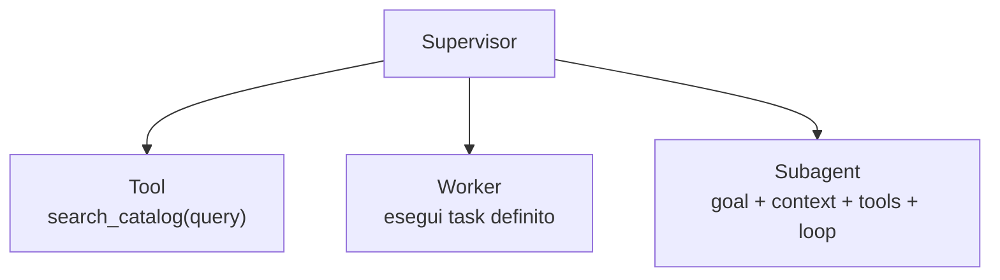
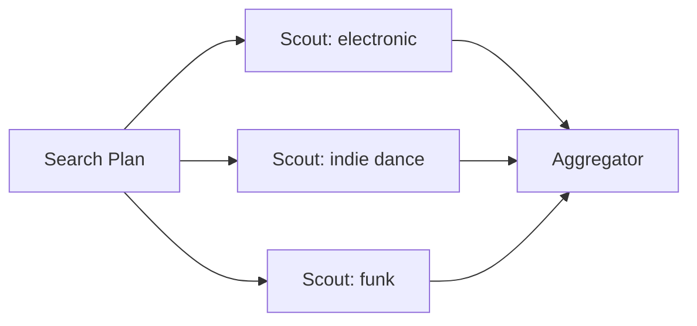
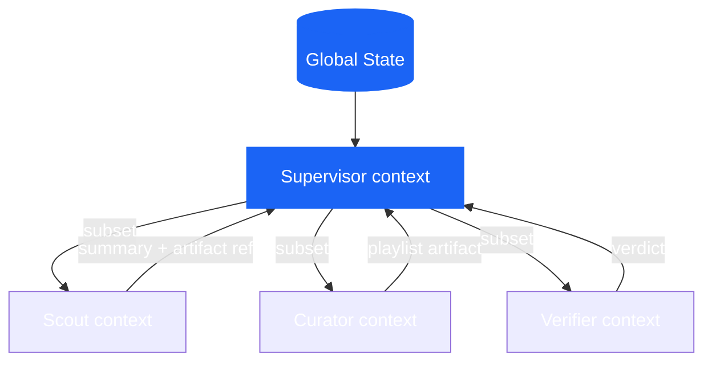
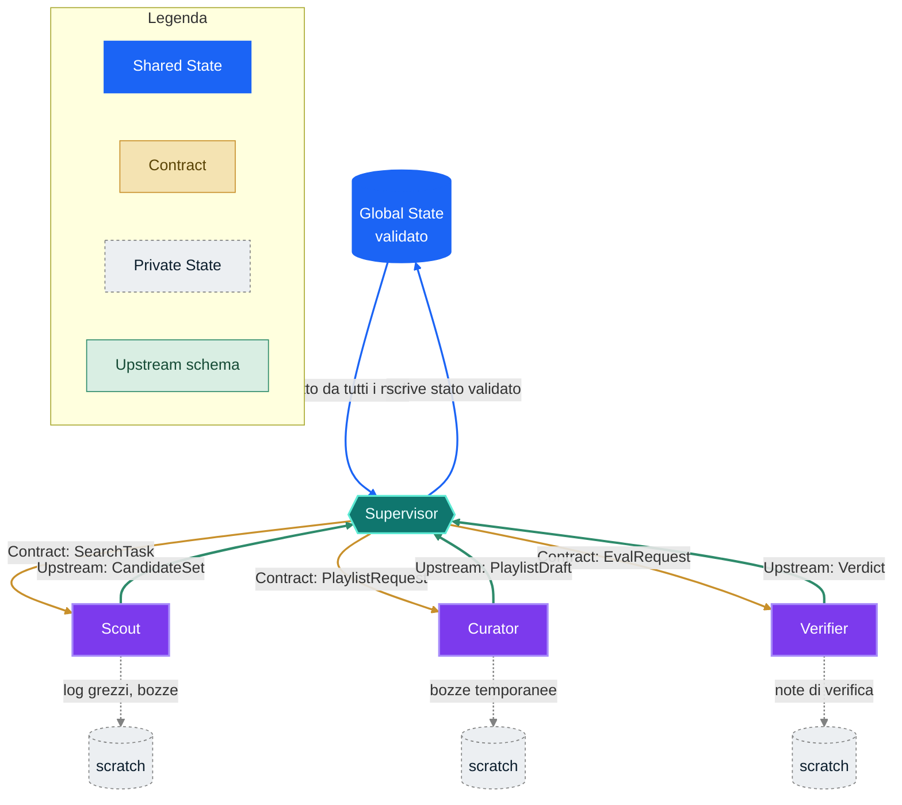
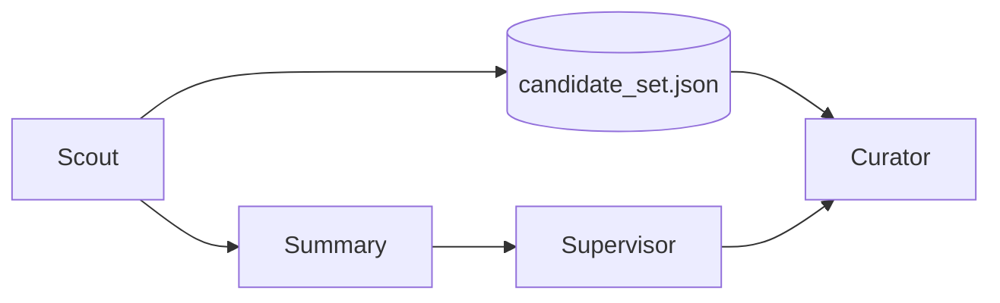
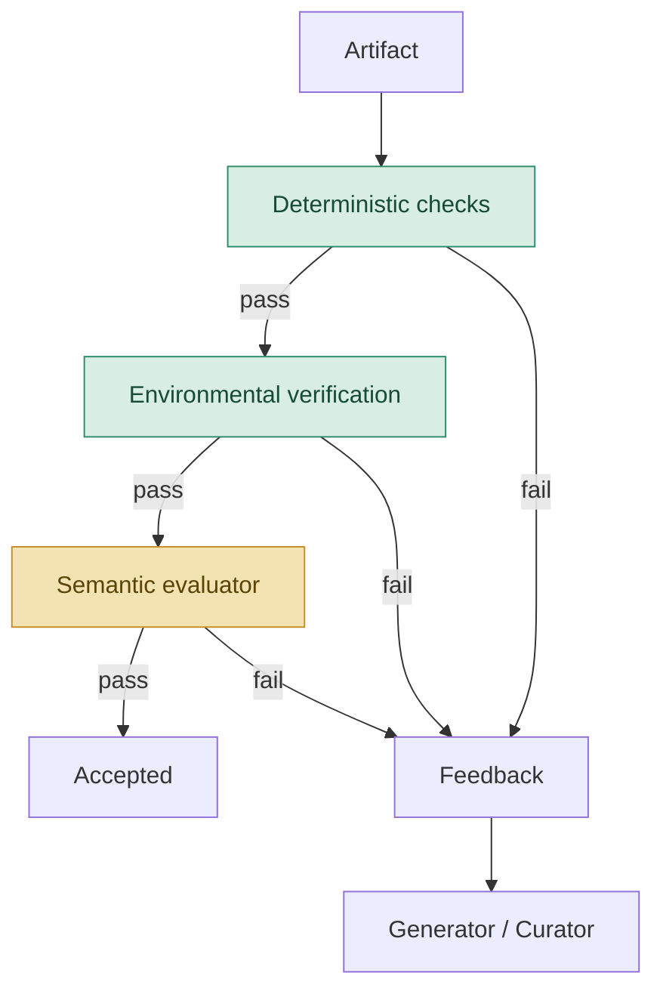
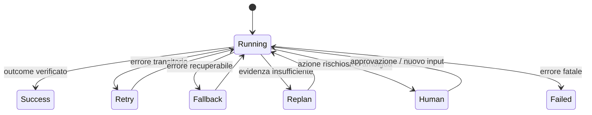
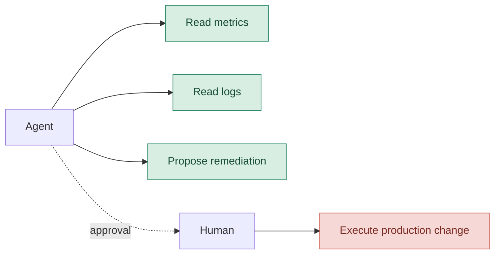

# Progettare sistemi multiagentici nel 2026 — Parte 2

Nel [primo capitolo](/blog/it/progettare-sistemi-multiagentici-nel-2026-parte-1/) abbiamo deciso quando un sistema merita davvero più agenti e chi debba possedere le decisioni. Ora rendiamo quel disegno operativo: distribuiamo ruoli, contesto e controlli senza trasformare l'orchestrazione in una conversazione indistinta fra modelli.

## Diamo un po' di ruoli

### Chi fa cosa?

Abbiamo più o meno capito ad alto livello cosa dobbiamo fare e a chi assenare le decisioni in base ai problemi. Resta ora da distribuire il lavoro!

#### Tool, worker, subagent

Diamo un po' di definizioni:

Un **tool** espone una capacità. Non possiede un obiettivo e non decide il passo successivo.

Un **worker** riceve un compito circoscritto e restituisce un risultato.

Un **subagent** è un worker con un proprio ciclo di ragionamento, un contesto locale e, spesso, strumenti propri.



La distinzione serve perché un tool non ha bisogno di una personalità. E un subagent non dovrebbe essere usato per mascherare una funzione che non abbiamo voglia di scrivere.

#### Parallelismo

Tre ricerche possono lavorare in parallelo soltanto se non dipendono l'una dall'altra.



```python
# [REFERENCE DESIGN]

results = await asyncio.gather(
    scout.run(SearchTask(genre="electronic", ...)),
    scout.run(SearchTask(genre="indie-dance", ...)),
    scout.run(SearchTask(genre="funk", ...)),
)

candidates = aggregate(results)
```

Lo scorso febbraio Anthropic ha raccontato un esperimento con sedici agenti Claude che lavoravano in parallelo su un compilatore C. Qui si può vedere un esempio in cui task lock, repository condiviso e test hanno permesso di dividere il lavoro. Penso sia inutile che lo dica, ma se leggete l'articolo sono riportati anche merge conflict frequenti, circa 2.000 sessioni e quasi 20.000 dollari di costo ([Anthropic — C compiler](https://www.anthropic.com/engineering/building-c-compiler))!

La domanda che dovrebbe sorgere ora è:

> **Quale struttura del problema ha reso possibile farli lavorare senza calpestarsi?**

Il mio caro Simon Willison scrive sull'articolo che ho menzionato prima, che il parallelismo aiuta quando i file o i sottocompiti sono indipendenti; i subagent restano soprattutto un meccanismo per proteggere il contesto principale e confinare operazioni verbose ([Willison — Subagents](https://simonwillison.net/guides/agentic-engineering-patterns/subagents/))!

### Chi sa cosa?

Qui arriviamo al trend che nel 2026 ha scavalcato il tema del prompt engineering: il **context engineering**.

L'ho detto prima, un errore classico, almeno all'inizio, consiste nel dare a ogni agente l'intera conversazione, l'intero stato e tutti gli strumenti. Per quanto sembri sensato, specialmente con modelli che gestiscono contesti incredibili, in realtà sposta il problema: invece di rischiare che manchi un'informazione, costringiamo ogni componente a distinguere ciò che conta da una massa di dettagli che non gli appartengono.



Nel nostro esempio:

```text
SUPERVISOR
──────────
richiesta utente
MoodProfile
piano corrente
riepiloghi dei worker
failure globali

SCOUT
──────────
SearchTask
range energetico
generi esclusi
catalog tools

CURATOR
──────────
PlaylistRequest
CandidateSet
criteri di composizione

VERIFIER
──────────
playlist prodotta
vincoli
rubrica di valutazione
```

La regola del «contesto minimo sufficiente» (abbastanza cacofonico in italiano, n.d.r.) significa riconoscere che il contesto è una forma di **memoria di lavoro**: limitata, costosa e sensibile al rumore.

Anthropic ha formalizzato questa idea nel 2025 parlando di context engineering: selezionare, mantenere e aggiornare l'insieme di token che massimizza la probabilità del comportamento desiderato ([Anthropic — Context engineering](https://www.anthropic.com/engineering/effective-context-engineering-for-ai-agents)). Nel resto dell'articolo applicheremo questo principio a subagent, sessioni persistenti, artefatti e harness long-running.

#### Il paradosso del contesto condiviso

Passare poco contesto produce omissioni. Passarne troppo produce interferenza.

Jason Liu, raccontando la posizione di Cognition sui sistemi multiagentici per il coding, usa l'immagine del telefono senza fili: ogni passaggio può perdere decisioni implicite e produrre componenti incompatibili. Per quanto sia vecchiotto come articolo (ha un anno esatto), rimane però una delle formulazioni più nitide del rischio di context loss fra agenti ([Jason Liu — Cognition e multi-agent](https://jxnl.co/writing/2025/09/11/why-cognition-does-not-use-multi-agent-systems/)).

Attenzione però, i worker paralleli possono comunque prendere decisioni incompatibili, e il contesto globale può diventare troppo grande.

La soluzione matura per gestirli è una rigorosa **architettura dei dati** che renda espliciti quattro confini:

- **Lo stato condiviso (Shared State):** l'unica sorgente di verità comune e validata a cui tutti i nodi abilitati possono attingere.
- **Le decisioni-contratto (Contracts):** i passaggi chiave strutturati (es. schemi Pydantic) che vincolano e normano i passaggi di consegna fra agenti.
- **Le informazioni locali (Private State):** tutto ciò che serve allo specialista per elaborare il task (es. log grezzi, bozze temporanee) e che non deve inquinare la memoria globale.
- **I formati di risalita (Upstream schemas):** lo schema rigido e tipizzato con cui i risultati dei sotto-task vengono aggregati e riportati al supervisor.

Applicati al nostro esempio, i quattro confini disegnano un flusso preciso: lo stato condiviso è l'unica cosa che entra ed esce validata dal centro, i contratti scendono verso gli specialisti, lo stato privato resta chiuso in ciascun worker, e solo uno schema di risalita tipizzato torna al supervisor.



Le frecce piene d'oro sono i contratti che scendono, quelle tratteggiate grigie restano confinate al worker che le genera, quelle verdi spesse sono l'unico canale con cui un risultato torna a monte.

### Stato, memoria e artefatti

Nel linguaggio degli agenti, la parola *memory* l'ho sentita per indicare troppe cose. Fermiamoci un attimo e facciamo chiarezza.

#### Conversation state

È ciò che serve a mantenere continuità nell'interazione: messaggi, turni, identità dell'agente attivo, richieste pendenti.

#### Task state

È lo stato operativo del lavoro:

```python
# [REFERENCE DESIGN]

class WorkflowState(BaseModel):
    request: PlaylistRequest
    search_plan: SearchPlan | None = None
    candidate_artifacts: list[str] = []
    playlist_artifact: str | None = None
    verification: VerificationResult | None = None
    retries: dict[str, int] = {}
    status: Literal["running", "waiting", "failed", "done"] = "running"
```

#### Local state

È ciò che appartiene a uno specialista e non deve per forza risalire:

```python
class ScoutLocalState(BaseModel):
    attempted_queries: list[str]
    visited_track_ids: set[str]
    raw_tool_outputs: list[str]
```

#### Artifact

È un prodotto persistente del lavoro: file, report, patch, tabella, playlist, dataset, piano.

Quando l'output è grande, passare un riferimento è spesso più sano che reiniettare tutto nel prompt.

```python
# [REFERENCE DESIGN]

return WorkerResult(
    summary="Trovati 84 candidati, 61 dopo i filtri.",
    artifact_ref="artifacts/run-284/candidate_set.json",
    warnings=["catalogo funk poco coperto"],
)
```



L'artefatto conserva fedeltà. Il riepilogo conserva spazio nel contesto.

È un equilibrio molto più solido del tentativo di trasformare ogni passaggio in un messaggio sempre più lungo.

### Chi controlla?

Fin qui abbiamo distribuito il lavoro. Ora dobbiamo evitare che il sistema confonda «ho prodotto qualcosa» con «ho finito».

La verifica moderna ha almeno tre strati.



### Controlli deterministici

Se una proprietà si può verificare in Python, non serve chiedere a un LLM.

```python
# [REFERENCE DESIGN]

def hard_checks(playlist: Playlist, request: PlaylistRequest) -> CheckResult:
    errors = []

    if len(playlist.track_ids) != len(set(playlist.track_ids)):
        errors.append("duplicate_tracks")

    forbidden = set(request.excluded_genres)
    if any(track.genre in forbidden for track in playlist.tracks):
        errors.append("excluded_genre")

    if not energy_curve_matches(
        playlist.tracks,
        start=request.current_energy,
        target=request.desired_energy,
    ):
        errors.append("energy_curve")

    return CheckResult(passed=not errors, errors=errors)
```

### Verifica nell'ambiente

Un agente può dire di aver creato una playlist. La domanda è se la playlist esista davvero nel sistema esterno.

```python
# [PSEUDOCODICE]

playlist_id = spotify.create_playlist(payload)

assert spotify.get_playlist(playlist_id).track_ids == payload.track_ids
```

Anthropic distingue con precisione transcript e outcome: il primo è ciò che l'agente ha detto e fatto; il secondo è lo stato finale dell'ambiente. Un eval robusto tende a preferire l'outcome quando è osservabile ([Anthropic — Evals per agenti](https://www.anthropic.com/engineering/demystifying-evals-for-ai-agents)).

### Valutazione semantica

Rimane poi ciò che non si lascia ridurre a un'asserzione netta:

- la playlist racconta una transizione coerente?
- la selezione è varia senza sembrare casuale?
- il risultato interpreta bene la tensione fra stanchezza e desiderio di ballare?

Qui un evaluator separato può aggiungere valore.

```python
# [REFERENCE DESIGN]

class SemanticEvaluation(BaseModel):
    mood_coherence: float
    transition_quality: float
    rationale: str
    passed: bool
```

Il principio non è «servono sempre due agenti». Nel suo case study del marzo 2026, Anthropic propone di separare generator ed evaluator perché è più facile rendere un valutatore autonomo severo che convincere un generatore a criticare il proprio output. Lo stesso case study mostra però che il beneficio dipende dal compito e dal modello, mentre costo e latenza possono crescere di un ordine di grandezza ([Anthropic — Harness long-running](https://www.anthropic.com/engineering/harness-design-long-running-apps)).

In uno degli esperimenti descritti, il sistema completo ha lavorato per circa sei ore e consumato circa 200 dollari, contro venti minuti e 9 dollari del singolo agente. La qualità era superiore, ma il conto ci ricorda che un evaluator deve guadagnarsi il proprio posto esattamente come gli altri agenti ([Anthropic — Harness long-running](https://www.anthropic.com/engineering/harness-design-long-running-apps)).

### Un ciclo ha bisogno di un freno

```python
# [REFERENCE DESIGN]

for revision in range(MAX_REVISIONS + 1):
    playlist = await curator.run(request, feedback=feedback)

    hard = hard_checks(playlist, request)
    if not hard.passed:
        feedback = hard.to_feedback()
        continue

    semantic = await evaluator.run(playlist, request)
    if semantic.passed:
        return playlist

    feedback = semantic.rationale

raise VerificationFailed("revision budget exhausted")
```

Senza criteri, budget e stop condition, evaluator-optimizer è soltanto una conversazione circolare fra modelli.


## Evals: il sistema va misurato intero

Gli eval per agenti non possono limitarsi alla risposta finale.

Anthropic propone una terminologia utile:

- **task**: il singolo caso di test;
- **trial**: un tentativo, da ripetere perché il sistema è stocastico;
- **grader**: la logica che assegna un giudizio;
- **transcript / trace / trajectory**: la storia completa del trial;
- **outcome**: lo stato finale dell'ambiente;
- **evaluation harness**: l'infrastruttura che esegue, registra e valuta ([Anthropic — Evals per agenti](https://www.anthropic.com/engineering/demystifying-evals-for-ai-agents)).

Nel running example, una suite sensata non dovrebbe chiedere soltanto «ha prodotto una playlist?». Dovrebbe definire una semantica diversa per ogni richiesta.

```yaml
# [REFERENCE DESIGN]

tasks:
  - id: E01
    prompt: "Sono stanco, ma voglio ballare."
    expected:
      - coherent_shift_or_clarification

  - id: E02
    prompt: "Sorprendimi."
    expected:
      - exploration_branch

  - id: E03
    prompt: "Fammi allenare, ma niente techno."
    expected:
      - no_excluded_genres

  - id: E04
    prompt: "Voglio una playlist energica per la palestra."
    expected:
      - valid_high_energy_playlist

  - id: E05
    prompt: "Che ore sono?"
    expected:
      - out_of_domain
```

Poi si osservano dimensioni differenti:

```text
OUTCOME
playlist creata?
vincoli rispettati?
side effect corretto?

TRAJECTORY
router corretto?
handoff necessario?
tool ridondanti?
loop terminato?

EFFICIENZA
latenza
costo
token
tool call
retry

AFFIDABILITÀ
pass@1
pass^k
tasso di recovery
fallimenti silenziosi
```

Hamel Husain insiste su una distinzione che vale la pena portarsi dietro: errori differenti richiedono tassonomie differenti. Chiamare tutto «hallucination» rende invisibili i guasti che contano. La pratica utile parte dalla lettura dei trace, costruisce un vocabolario degli errori e calibra gli evaluator contro giudizi umani ([Hamel Husain — Evals skills](https://hamelhusain.substack.com/p/evals-skills-for-coding-agents)).

### Non premiare un percorso rigido

Un eval troppo prescrittivo rischia di bocciare una soluzione valida soltanto perché il modello ha trovato una strada diversa. Quando possibile, verifica l'outcome e usa la traiettoria per individuare comportamenti rischiosi, sprechi o violazioni di policy, senza trasformare ogni tool call in un copione obbligatorio.


## Il mondo va storto

Un sistema multiagentico non è definito soltanto dal percorso felice. È definito da ciò che succede quando un nodo non fa il proprio dovere.



Conviene distinguere almeno queste famiglie.

### Output formalmente invalido

```python
# [PSEUDOCODICE]

try:
    profile = await mood_interpreter.run(prompt)
except ValidationError:
    if retry_budget.consume("mood_interpreter"):
        profile = await mood_interpreter.run(prompt, repair=True)
    else:
        return clarification_fallback()
```

### Output valido ma semanticamente incerto

Non è un'eccezione. È uno stato.

```python
if profile.needs_clarification:
    return transition_to("clarifier")
```

### Tool esterno non disponibile

```python
try:
    tracks = await remote_catalog.search(query)
except TransientToolError:
    tracks = local_catalog.search(query)
    state.warnings.append("remote_catalog_unavailable")
```

### Successo parziale

```text
Scout A ✓
Scout B timeout
Scout C ✓
```

Le opzioni non sono soltanto «tutto fallisce» o «facciamo finta di niente».

```python
# [REFERENCE DESIGN]

if successful_workers >= minimum_required:
    continue_with_partial_results(warnings=failed_workers)
elif retry_budget.available:
    retry(failed_workers)
else:
    escalate_or_abort()
```

### Idempotenza e side effect

Un retry innocuo su una ricerca read-only è diverso da un retry sulla creazione della playlist.

```python
# [REFERENCE DESIGN]

spotify.create_playlist(
    payload,
    idempotency_key=state.run_id,
)
```

Senza idempotenza, un errore di rete dopo il side effect può produrre due playlist identiche. Nei sistemi multiagentici il problema peggiora, perché più worker possono credere di essere autorizzati a scrivere.

Una policy semplice è il **single writer**: molti agenti possono proporre, uno soltanto può modificare lo stato esterno.


## Blast radius e human-in-the-loop

Quando un agente può soltanto leggere un catalogo musicale, il danno massimo è contenuto. Quando un agente può effettuare un rollback in produzione, la stessa architettura diventa un'altra faccenda.

Il rischio operativo può essere letto come:

```text
rischio ≈ probabilità di errore × danno massimo possibile
```

Migliorare il modello riduce, forse, il primo termine. Le permission e l'isolamento limitano il secondo.



Anthropic, nel maggio 2026, ha descritto il containment come un problema di limitazione del blast radius: non soltanto sorvegliare ciò che il modello tende a fare, ma restringere ciò che l'ambiente gli permette materialmente di fare. L'articolo segnala anche l'approvazione automatica o distratta come limite del semplice human-in-the-loop: troppi prompt di permesso producono approval fatigue ([Anthropic — Containment](https://www.anthropic.com/engineering/how-we-contain-claude)).

Microsoft Agent Framework tratta le richieste di approvazione e informazione come eventi sospendibili del workflow; lo stato pendente può essere incluso nei checkpoint e riemesso dopo il ripristino ([Microsoft — HITL nei workflow](https://learn.microsoft.com/en-us/agent-framework/workflows/human-in-the-loop)).

Da qui una regola pratica:

> **Il controllo umano va collocato nei punti di rischio, non distribuito come una pioggia di finestre modali.**

Nel capitolo conclusivo portiamo questa architettura oltre la singola conversazione: persistenza, harness, protocolli e reference architecture completa.

→ Continua con [Progettare sistemi multiagentici nel 2026 — Parte 3](/blog/it/progettare-sistemi-multiagentici-nel-2026-parte-3/).


## Fonti e note di lettura

Le fonti sono ordinate per funzione, non per prestigio. Gli engineering post e la documentazione ufficiale sostengono le descrizioni dei sistemi; i practitioner aggiungono esperienza sul campo; i lavori 2025 vengono usati quando introducono concetti ancora centrali nel 2026.

- [Anthropic — Building effective agents](https://www.anthropic.com/engineering/building-effective-agents): guida del 2024 ai pattern routing, chaining, parallelizzazione, orchestrator-workers ed evaluator-optimizer, con la raccomandazione di partire dalla soluzione più semplice.
- [Anthropic — Demystifying evals for AI agents](https://www.anthropic.com/engineering/demystifying-evals-for-ai-agents): definizioni di task, trial, grader, transcript, outcome ed evaluation harness.
- [Anthropic — Harness design for long-running application development](https://www.anthropic.com/engineering/harness-design-long-running-apps): planner, generator, evaluator e trade-off di costo e durata per task lunghi.
- [Anthropic — Scaling Managed Agents](https://www.anthropic.com/engineering/managed-agents): separazione fra sessione, harness, sandbox e ambienti di esecuzione.
- [Anthropic — How we contain Claude across products](https://www.anthropic.com/engineering/how-we-contain-claude): containment, permission e riduzione del blast radius.
- [Anthropic — Building a C compiler with a team of parallel Claudes](https://www.anthropic.com/engineering/building-c-compiler): esperimento con sedici agenti, ambiente condiviso e coordinamento del parallelismo.
- [Anthropic — Effective context engineering for AI agents](https://www.anthropic.com/engineering/effective-context-engineering-for-ai-agents): gestione del contesto, compaction, memoria e subagent.
- [OpenAI — Harness engineering](https://openai.com/index/harness-engineering/): harness, test, osservabilità e ambienti isolati per agenti Codex.
- [OpenAI — The next evolution of the Agents SDK](https://openai.com/index/the-next-evolution-of-the-agents-sdk/): evoluzione dell’SDK, sandbox e separazione fra harness e compute.
- [OpenAI Agents SDK — Agent orchestration](https://openai.github.io/openai-agents-python/multi_agent/): differenza fra orchestrazione via LLM e via codice, agents as tools e handoff.
- [OpenAI Agents SDK — Handoffs](https://openai.github.io/openai-agents-python/handoffs/): configurazione, input e filtri degli handoff.
- [Microsoft Agent Framework — Workflows](https://learn.microsoft.com/en-us/agent-framework/workflows/): workflow funzionali o graph-based, agenti come executor, orchestrazioni sequenziali/concorrenti, checkpoint e HITL.
- [Microsoft Agent Framework — Human in the loop](https://learn.microsoft.com/en-us/agent-framework/workflows/human-in-the-loop): richieste sospendibili, approvazioni e ripristino del workflow.
- [LangChain — Handoffs](https://docs.langchain.com/oss/python/langchain/multi-agent/handoffs): transizioni guidate dallo stato; nei subgraph il contesto trasferito va scelto esplicitamente.
- [LangGraph — Use subgraphs](https://docs.langchain.com/oss/python/langgraph/use-subgraphs): input, output e stato dei subgraph.
- [LangGraph — Persistence](https://docs.langchain.com/oss/python/langgraph/persistence): persistenza dello stato e checkpoint.
- [LangGraph — Interrupts](https://docs.langchain.com/oss/python/langgraph/interrupts): interruzioni controllate e ripresa dei grafi.
- [Model Context Protocol — specifica](https://modelcontextprotocol.io/specification/2026-07-28): protocollo per collegare agenti a tool, dati e risorse.
- [A2A Protocol — specifica](https://a2a-protocol.org/latest/): interoperabilità e comunicazione fra agenti indipendenti, senza imporre la condivisione di memoria, strumenti o logica proprietaria.
- [Simon Willison — Subagents](https://simonwillison.net/guides/agentic-engineering-patterns/subagents/): esperienza pratica su isolamento del contesto e parallelismo.
- [Hamel Husain — Evals Skills for Coding Agents](https://hamelhusain.substack.com/p/evals-skills-for-coding-agents): tassonomie di errore, trace ed evaluator calibrati con giudizi umani.
- [Jason Liu — Why Cognition does not use multi-agent systems](https://jxnl.co/writing/2025/09/11/why-cognition-does-not-use-multi-agent-systems/): critica pratica al context loss nei sistemi multi-agent.

### Altre letture utili

- [OpenAI — Symphony](https://openai.com/index/open-source-codex-orchestration-symphony/): specifica open source per l’orchestrazione di Codex.
- [Anthropic — AI Organizations](https://alignment.anthropic.com/2026/ai-organizations/): ricerca su efficacia e allineamento delle organizzazioni di agenti.
- [OpenAI Agents SDK — Tracing](https://openai.github.io/openai-agents-python/tracing/): trace e osservabilità dell’esecuzione.
- [LangChain — Multi-agent patterns](https://docs.langchain.com/oss/python/langchain/multi-agent/index): panoramica dei pattern multi-agent supportati dal framework.
