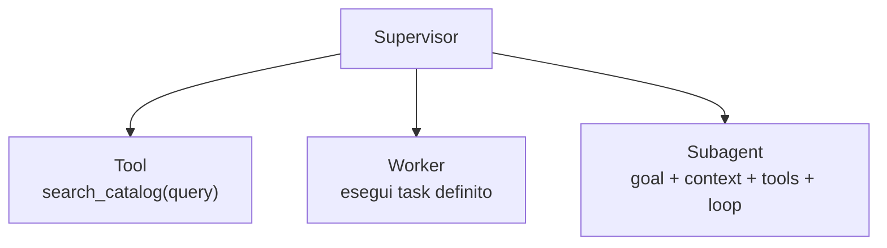
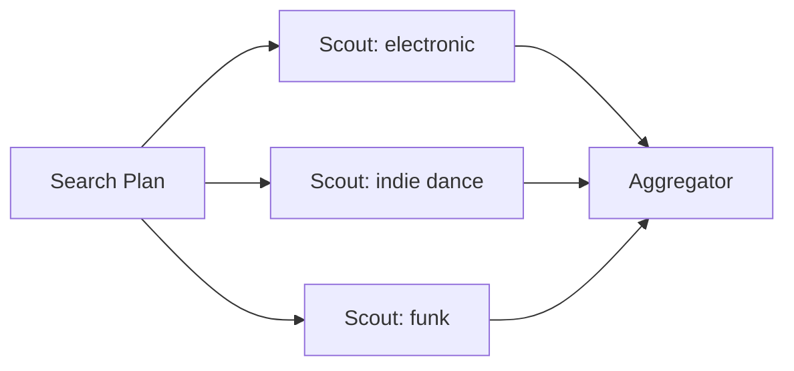
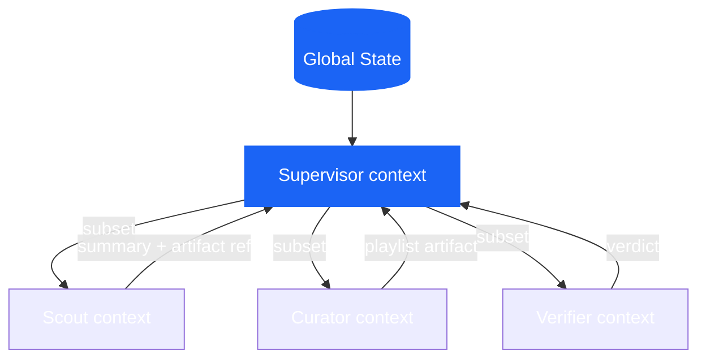
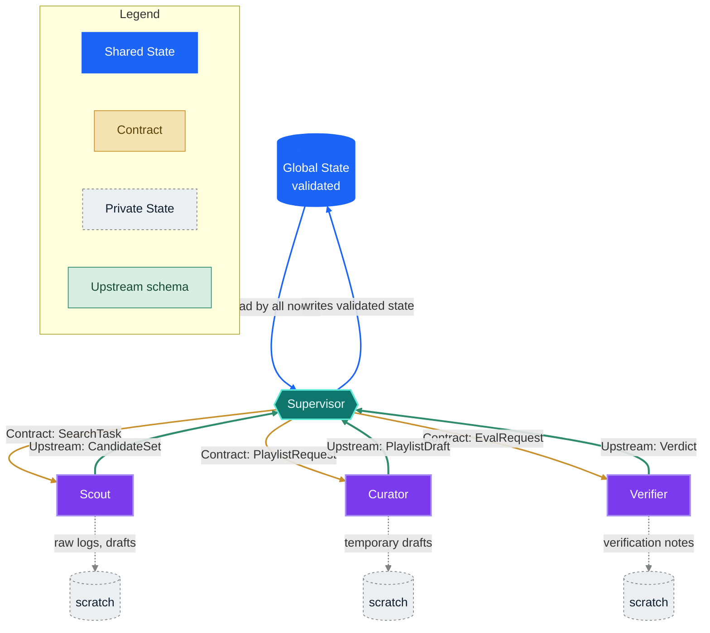
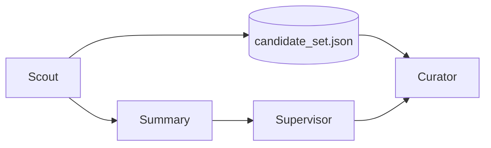
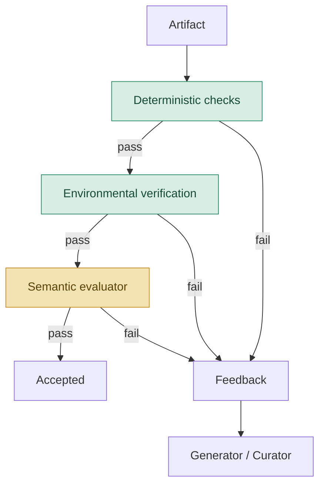
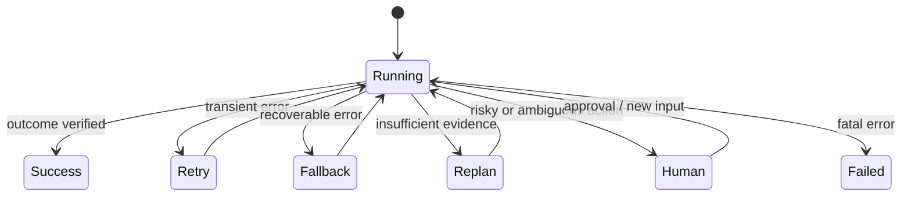
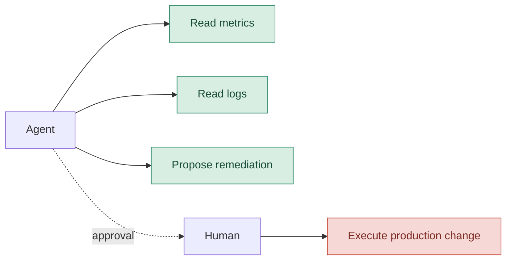

# Designing Multi-Agent Systems in 2026 — Part 2

In the [first chapter](/blog/it/progettare-sistemi-multiagentici-nel-2026-parte-1/), we determined when a system truly warrants multiple agents and who should hold the decision-making power. Now, let’s make that design operational: we will distribute roles, context, and controls without turning orchestration into an indistinguishable conversation between models.

## Assigning roles

### Who does what?

We have a high-level understanding of what needs to be done and who should make the decisions based on the problems at hand. Now, it’s time to distribute the work!

#### Tools, workers, and subagents

Let’s define our terms:

A **tool** exposes a capability. It has no goal and does not decide the next step.

A **worker** receives a specific task and returns a result.

A **subagent** is a worker with its own reasoning loop, local context, and, often, its own tools.



This distinction is important because a tool doesn't need a personality, and a subagent shouldn't be used to mask a function we’re just too lazy to write.

#### Parallelism

Three searches can work in parallel only if they do not depend on one another.



```python
# [REFERENCE DESIGN]

results = await asyncio.gather(
    scout.run(SearchTask(genre="electronic", ...)),
    scout.run(SearchTask(genre="indie-dance", ...)),
    scout.run(SearchTask(genre="funk", ...)),
)

candidates = aggregate(results)
```

Last February, Anthropic shared an experiment involving sixteen Claude agents working in parallel on a C compiler. You can see an example there of how task locks, a shared repository, and tests allowed them to divide the work. It goes without saying, but if you read the article, you'll see they encountered frequent merge conflicts, required about 2,000 sessions, and incurred nearly $20,000 in costs ([Anthropic — C compiler](https://www.anthropic.com/engineering/building-c-compiler))!

The question that should arise now is:

> **What problem structure made it possible for them to work without stepping on each other's toes?**

My dear friend Simon Willison writes in the article I mentioned earlier that parallelism helps when files or subtasks are independent; subagents remain, above all, a mechanism to protect the main context and confine verbose operations ([Willison — Subagents](https://simonwillison.net/guides/agentic-engineering-patterns/subagents/))!

### Who knows what?

This brings us to the trend that, by 2026, has overtaken prompt engineering: **context engineering**.

As I mentioned earlier, a classic mistake—at least in the beginning—is giving every agent the entire conversation, the entire state, and all the tools. While it might seem sensible, especially with models that handle massive contexts, it actually just shifts the problem: instead of risking missing information, we force every component to distinguish what matters from a mass of details that don't belong to it.



In our example:

```text
SUPERVISOR
──────────
user request
MoodProfile
current plan
worker summaries
global failures

SCOUT
──────────
SearchTask
energy range
excluded genres
catalog tools

CURATOR
──────────
PlaylistRequest
CandidateSet
composition criteria

VERIFIER
──────────
produced playlist
constraints
evaluation rubric
```

The rule of "minimum sufficient context" means recognizing that context is a form of **working memory**: limited, expensive, and sensitive to noise.

Anthropic formalized this idea in 2025 when discussing context engineering: selecting, maintaining, and updating the set of tokens that maximizes the probability of the desired behavior ([Anthropic — Context engineering](https://www.anthropic.com/engineering/effective-context-engineering-for-ai-agents)). In the rest of this article, we will apply this principle to subagents, persistent sessions, artifacts, and long-running harnesses.

#### The shared context paradox

Passing too little context leads to omissions. Passing too much leads to interference.

In discussing Cognition's stance on multi-agent coding systems, Jason Liu uses the analogy of the "telephone game": every hand-off risks losing implicit decisions and producing incompatible components. While the article is a bit dated (exactly one year old), it remains one of the clearest articulations of the risk of context loss between agents ([Jason Liu — Cognition and multi-agent](https://jxnl.co/writing/2025/09/11/why-cognition-does-not-use-multi-agent-systems/)).

Be careful, however: parallel workers can still make incompatible decisions, and the global context can easily become too large.

The mature solution for managing them is a rigorous **data architecture** that makes four boundaries explicit:

- **Shared State:** The single, validated source of truth that all authorized nodes can access.
- **Contracts:** Structured key hand-offs (e.g., Pydantic schemas) that constrain and regulate the transfer of information between agents.
- **Private State:** Everything a specialist needs to process a task (e.g., raw logs, temporary drafts) that should not pollute the global memory.
- **Upstream schemas:** The rigid, typed schema used to aggregate sub-task results and report them back to the supervisor.

Applied to our example, these four boundaries define a precise flow: the shared state is the only thing that enters and leaves the center validated, contracts flow down to the specialists, private state remains contained within each worker, and only a typed upstream schema returns to the supervisor.



The solid gold arrows represent the contracts flowing down, the dashed gray lines remain confined to the worker that generates them, and the thick green lines are the only channel through which a result returns upstream.

### State, memory, and artifacts

In agent terminology, I have heard the word *memory* used to mean too many things. Let’s pause and clarify.

#### Conversation state

This is the element required to ensure continuity in an interaction. It tracks messages, turns, the active agent's identity, and pending requests.

#### Task state

This defines the progress and the purely operational status of the work in progress:

```python
# [REFERENCE DESIGN]

class WorkflowState(BaseModel):
    request: PlaylistRequest
    search_plan: SearchPlan | None = None
    candidate_artifacts: list[str] = []
    playlist_artifact: str | None = None
    verification: VerificationResult | None = None
    retries: dict[str, int] = {}
    status: Literal["running", "waiting", "failed", "done"] = "running"
```

#### Local state

This represents service information confined to a single specialist, which **has no need to pollute the global context**:

```python
class ScoutLocalState(BaseModel):
    attempted_queries: list[str]
    visited_track_ids: set[str]
    raw_tool_outputs: list[str]
```

#### Artifact

This constitutes the persistent outcome of the work performed. It can be a file, a report, a patch, a playlist, a plan, or an entire dataset.

When the generated output is voluminous, passing a *reference* is a far better choice than re-injecting the entire content into the prompt!

```python

```python
return WorkerResult(
    summary="Found 84 candidates, 61 after filtering.",
    artifact_ref="artifacts/run-284/candidate_set.json",
    warnings=["funk catalog coverage low"],
)
```



The artifact preserves fidelity, while the summary saves context space.

This is a much more robust balance than trying to turn every step into an increasingly long message.

### Who is in control?

So far, we have distributed the work. Now we need to figure out how to signal when the task is finished (spoiler: it’s not when it has produced the items).

In my experience—and based on blogs I’ve read in the past—there are three phases, which we will look at in the following sections.



#### Deterministic checks

If a property can be verified in Python, there is no need to ask an LLM. This should be the first thing you check.

```python
# [REFERENCE DESIGN]

def hard_checks(playlist: Playlist, request: PlaylistRequest) -> CheckResult:
    errors = []

    if len(playlist.track_ids) != len(set(playlist.track_ids)):
        errors.append("duplicate_tracks")

    forbidden = set(request.excluded_genres)
    if any(track.genre in forbidden for track in playlist.tracks):
        errors.append("excluded_genre")

    if not energy_curve_matches(
        playlist.tracks,
        start=request.current_energy,
        target=request.desired_energy,
    ):
        errors.append("energy_curve")

    return CheckResult(passed=not errors, errors=errors)
```

#### Environmental verification

An agent might claim to have created a playlist. The question is whether that playlist actually exists in the external system... It sounds trivial, but it isn't 🧐...

```python
# [PSEUDOCODICE]

playlist_id = spotify.create_playlist(payload)

assert spotify.get_playlist(playlist_id).track_ids == payload.track_ids
```

Anthropic makes a precise distinction between *transcript* and *outcome*: the former is what the agent said and did; the latter is the final state of the environment. A robust eval tends to favor the outcome when it is observable ([Anthropic — Evals for agents](https://www.anthropic.com/engineering/demystifying-evals-for-ai-agents)). But we will discuss that later.

#### Semantic evaluation

Then there is what cannot be reduced to a precise rule:

- Does the playlist tell a coherent story through its transitions?
- Is the selection varied without seeming random?
- Does the result interpret the tension between fatigue and the desire to dance well?

Here, a separate evaluator can add value.

```python
# [REFERENCE DESIGN]

class SemanticEvaluation(BaseModel):
    mood_coherence: float
    transition_quality: float
    rationale: str
    passed: bool
```

Be careful: I am not saying that "you always need more agents." In its March 2026 case study, Anthropic (I swear I wasn't paid by Anthropic to write this article) proposes separating the generator and the evaluator because it is easier to make an autonomous evaluator strict enough to force a generator to critique its own output. However, the same case study shows that the benefit depends on the task and the model, while cost and latency can increase by an order of magnitude ([Anthropic — Harness long-running](https://www.anthropic.com/engineering/harness-design-long-running-apps)).

In one of the experiments described, the complete system ran for about six hours and consumed about $200, compared to twenty minutes and $9 for the single agent. The quality was superior, but the bill reminds us that an evaluator must earn its place just like any other agent ([Anthropic — Harness long-running](https://www.anthropic.com/engineering/harness-design-long-running-apps))!

### A loop needs a brake

You must stop an agentic loop, otherwise, the cost may end up outweighing the benefits.

```python
# [REFERENCE DESIGN]

for revision in range(MAX_REVISIONS + 1):
    playlist = await curator.run(request, feedback=feedback)

    hard = hard_checks(playlist, request)
    if not hard.passed:
        feedback = hard.to_feedback()
        continue

    semantic = await evaluator.run(playlist, request)
    if semantic.passed:
        return playlist

    feedback = semantic.rationale

raise VerificationFailed("revision budget exhausted")
```

Without criteria, budgets, and stop conditions, the evaluator-optimizer loop is just a circular conversation between models—potentially an infinite one!

## Evals

Agent evaluations cannot be limited to the final response; they must measure the system from every angle.

Anthropic proposes a useful terminology that I have personally adopted (from the same article I mentioned earlier):

- **task**: the individual test case;
- **trial**: a single attempt, which must be repeated because the system is stochastic;
- **grader**: the logic that assigns a judgment;
- **transcript / trace / trajectory**: the complete history of the trial;
- **outcome**: the final state of the environment;
- **evaluation harness**: the infrastructure that executes, records, and evaluates ([Anthropic — Evals for AI agents](https://www.anthropic.com/engineering/demystifying-evals-for-ai-agents)).

Applying these principles to our *running example*, a sensible eval suite cannot be limited to the trivial question: "Did the system produce a playlist?" Instead, it must define a rigorous and specific semantic expectation for every single intent.

```yaml
# [REFERENCE DESIGN]

tasks:
  - id: E01
    prompt: "Sono stanco, ma voglio ballare."
    expected:
      - coherent_shift_or_clarification

  - id: E02
    prompt: "Sorprendimi."
    expected:
      - exploration_branch

  - id: E03
    prompt: "Fammi allenare, ma niente techno."
    expected:
      - no_excluded_genres

  - id: E04
    prompt: "Voglio una playlist energica per la palestra."
    expected:
      - valid_high_energy_playlist

  - id: E05
    prompt: "Che ore sono?"
    expected:
      - out_of_domain
```

Based on these scenarios, the evaluation infrastructure does not just judge the outcome; it breaks down the system analysis across different, orthogonal dimensions:

```text
OUTCOME
playlist created?
constraints met?
correct side effects?

TRAJECTORY
correct router?
handoff necessary?
redundant tools?
loop terminated?

EFFICIENCY
latency
cost
tokens
tool calls
retries

RELIABILITY
pass@1
pass^k
recovery rate
silent failures
```

In one of my favorite Substack newsletters, Hamel Husain emphasizes a distinction that I find important: different errors require different taxonomies. Calling everything a "hallucination" makes failures invisible—or, more accurately, makes them difficult to isolate and resolve. You must start by reading the traces, building a vocabulary of errors, and calibrating your evaluators against human judgments ([Hamel Husain — Evals skills](https://hamelhusain.substack.com/p/evals-skills-for-coding-agents)).

> **Do not reward rigid paths**. An overly prescriptive eval might reject a valid solution simply because the agent took a different route. Whenever possible, verify the outcome and the final state of the environment first. Then, use the trajectory to detect policy violations, unauthorized actions, waste, fragility, or inefficiencies, without turning every tool call into a strictly enforced script. Only make steps prescriptive when necessary for safety, compliance, or correctness.

If the workflow is long and modifies the state, evaluate state checkpoints (e.g., "refund created," "notification sent") rather than every single click or call. It is a far better compromise between strategic freedom and control.

Finally, measuring tool calls, tokens, errors, and runtime remains valuable: it is used to find redundant flows and poorly designed tools, not necessarily to declare that the agent has failed.

### And when things go wrong?

A multi-agent system is not defined only by who does what when everything works. It MUST also be defined by what happens when a node returns a wrong, incomplete, or uncertain output, or returns nothing at all.

A good orchestrator does not treat all failures the same way:

- a timeout may require a retry;
- a formally invalid output may require a repair;
- a valid but uncertain output may require asking the user;
- an unavailable tool may require a fallback;
- a costly, irreversible, or ambiguous action may require human approval;
- a fatal error must stop the flow, not produce an invented result.


It is worth distinguishing at least these families.

#### Formally invalid output

Here, the node has responded, but it has violated the contract: malformed JSON, missing fields, invalid enums, or incompatible schemas. This is a TOTALLY technical error. We can ask the node to repair the output, but with a limited budget: it is scientifically proven that an agent that keeps producing invalid output will not become reliable on the fifth attempt 😜

```python
# [PSEUDOCODE]
```

```python
try:
    profile = await mood_interpreter.run(prompt)
except ValidationError:
    if retry_budget.consume("mood_interpreter"):
        profile = await mood_interpreter.run(prompt, repair=True)
    else:
        return clarification_fallback()
```

#### Valid output, but semantically uncertain

This case is more subtle, so let’s take it slowly. The output complies with the schema, so it doesn't trigger an exception. However, the agent expresses low confidence, finds conflicting evidence, or lacks sufficient information to proceed reliably. This uncertainty MUST travel within the workflow state and must be flagged immediately!

```python
if profile.needs_clarification:
    return transition_to("clarifier")
```

In other words: "I don't know" is a legitimate result. It is often better than a plausible but incorrect answer. I cannot stress this enough.

#### External tool unavailable

An external tool might time out, return a 503 error, or hit a rate limit. When the operation is not strictly essential, the orchestrator can implement *graceful degradation*—that is, falling back to a local data source, reducing the offered functionality, or transparently informing the user of the limitation.

```python
try:
    tracks = await remote_catalog.search(query)
except TransientToolError:
    tracks = local_catalog.search(query)
    state.warnings.append("remote_catalog_unavailable_using_local")
```

However, a fallback should never secretly alter the meaning or scope of the result. If the local catalog is less up-to-date or more limited than the remote one, the system must track this in the state to properly warn downstream nodes or the end user directly.

#### Partial success

In a system with parallel workers, an agent timeout does not automatically mean the entire request has failed.

```text
Scout A ✓
Scout B timeout
Scout C ✓
```

But be careful: it is not enough to simply say "two out of three agents responded." The system must understand which contribution is missing and whether the remaining output still satisfies the task contract.

For an exploratory search, losing one source might be acceptable if the available sources already cover the required points. For a compliance check, however, the failure of the agent tasked with verifying a mandatory requirement must block the flow.

```python
# [REFERENCE DESIGN]
coverage = assess_coverage(
    successful_results,
    required_capabilities=task.required_capabilities,
)

if coverage.satisfies_minimum:
    return partial_result(
        data=successful_results,
        missing=failed_workers,
        warnings=coverage.warnings,
    )
elif retry_budget.available:
    retry(failed_workers)
else:
    escalate_or_abort()
```

A partial result is an outcome that is usable within an explicit scope, with well-defined limits!

#### Idempotency and side effects

A harmless retry on a read-only search is fundamentally different from a retry on creating a playlist, sending an email, or processing a payment. If something happens after the side effect, the agent might not know if the action actually took place. Retrying blindly can duplicate it (think of a double payment—I don't think the user would be happy to see their money taken twice).

```python
# [REFERENCE DESIGN]

spotify.create_playlist(
    payload,
    idempotency_key=state.run_id,
)
```

Without idempotency, a network error after the side effect can produce two identical playlists. In multi-agent systems, the problem worsens because multiple workers might believe they are authorized to write.

A simple policy is the **single writer**: many agents can propose, but only one can modify the external state.

Before any side effect, it is therefore useful to ask three explicit questions:

1. Who is authorized to write?
2. How do we verify if the action has already occurred?
3. Can we repeat it without causing damage?

If we cannot answer these, we haven't truly designed our failure handling yet!

## Blast radius and human-in-the-loop

When an agent can only read a music catalog, the maximum damage is contained. When an agent can perform a rollback in production, it is obviously a different story.

Operational risk can be interpreted as:

```text
risk ≈ probability of error × maximum possible damage
```

Improving the model might reduce the first term. Permissions and isolation limit the second.



In May 2026, Anthropic described **containment** as a problem of limiting the **blast radius**: it is not just about monitoring what the model tends to do, but about restricting what the environment materially allows it to do. The article also points out that automatic or distracted approval is a limitation of simple human-in-the-loop systems, as too many permission prompts lead to approval fatigue ([Anthropic — Containment](https://www.anthropic.com/engineering/how-we-contain-claude)).

The Microsoft Agent Framework treats approval and information requests as suspendable workflow events; the pending state can be included in checkpoints and re-issued after a resume ([Microsoft — HITL in workflows](https://learn.microsoft.com/en-us/agent-framework/workflows/human-in-the-loop)).

This leads to a rule of thumb:

> **Human oversight should be inserted at high-risk points, not distributed as a barrage of modal windows.**

In the final chapter, we will take this architecture beyond the single conversation: we will discuss persistence, harnesses, protocols, and the complete reference architecture.

→ Continue to [Designing multi-agent systems in 2026 — Part 3](/blog/it/progettare-sistemi-multiagentici-nel-2026-parte-3/).


## Sources and reading notes

Sources are ordered by function, not by prestige. Engineering posts and official documentation support the system descriptions; practitioners add field experience; 2025 works are used when they introduce concepts that remain central in 2026.

- [Anthropic — Building effective agents](https://www.anthropic.com/engineering/building-effective-agents): 2024 guide to routing, chaining, parallelization, orchestrator-workers, and evaluator-optimizer patterns, with the recommendation to start with the simplest solution.
- [Anthropic — Demystifying evals for AI agents](https://www.anthropic.com/engineering/demystifying-evals-for-ai-agents): definitions of tasks, trials, graders, transcripts, outcomes, and evaluation harnesses.
- [Anthropic — Harness design for long-running application development](https://www.anthropic.com/engineering/harness-design-long-running-apps): planners, generators, evaluators, and cost/duration trade-offs for long-running tasks.
- [Anthropic — Scaling Managed Agents](https://www.anthropic.com/engineering/managed-agents): separation between sessions, harnesses, sandboxes, and execution environments.
- [Anthropic — How we contain Claude across products](https://www.anthropic.com/engineering/how-we-contain-claude): containment, permissions, and blast radius reduction.
- [Anthropic — Building a C compiler with a team of parallel Claudes](https://www.anthropic.com/engineering/building-c-compiler): experiment with sixteen agents, a shared environment, and coordination of parallelism.
- [Anthropic — Effective context engineering for AI agents](https://www.anthropic.com/engineering/effective-context-engineering-for-ai-agents): context management, compaction, memory, and subagents.
- [OpenAI — Harness engineering](https://openai.com/index/harness-engineering/): harnesses, testing, observability, and isolated environments for Codex agents.
- [OpenAI — The next evolution of the Agents SDK](https://openai.com/index/the-next-evolution-of-the-agents-sdk/): evolution of the SDK, sandboxes, and separation between harnesses and compute.
- [OpenAI Agents SDK — Agent orchestration](https://openai.github.io/openai-agents-python/multi_agent/): difference between orchestration via LLM vs. code, agents as tools, and handoffs.
- [OpenAI Agents SDK — Handoffs](https://openai.github.io/openai-agents-python/handoffs/): configuration, input, and handoff filters.
- [Microsoft Agent Framework — Workflows](https://learn.microsoft.com/en-us/agent-framework/workflows/): functional or graph-based workflows, agents as executors, sequential/concurrent orchestrations, checkpoints, and HITL.
- [Microsoft Agent Framework — Human in the loop](https://learn.microsoft.com/en-us/agent-framework/workflows/human-in-the-loop): suspendable requests, approvals, and workflow resumption.
- [LangChain — Handoffs](https://docs.langchain.com/oss/python/langchain/multi-agent/handoffs): state-driven transitions; in subgraphs, the transferred context must be explicitly chosen.
- [LangGraph — Use subgraphs](https://docs.langchain.com/oss/python/langgraph/use-subgraphs): input, output, and state of subgraphs.
- [LangGraph — Persistence](https://docs.langchain.com/oss/python/langgraph/persistence): state persistence and checkpoints.
- [LangGraph — Interrupts](https://docs.langchain.com/oss/python/langgraph/interrupts): controlled interruptions and graph resumption.
- [Model Context Protocol — specification](https://modelcontextprotocol.io/specification/2026-07-28): protocol for connecting agents to tools, data, and resources.
- [A2A Protocol — specification](https://a2a-protocol.org/latest/): interoperability and communication between independent agents, without requiring shared memory, tools, or proprietary logic.

- [Simon Willison — Subagents](https://simonwillison.net/guides/agentic-engineering-patterns/subagents/): practical experience with context isolation and parallelism.
- [Hamel Husain — Evals Skills for Coding Agents](https://hamelhusain.substack.com/p/evals-skills-for-coding-agents): error taxonomies, traces, and evaluators calibrated with human judgment.
- [Jason Liu — Why Cognition does not use multi-agent systems](https://jxnl.co/writing/2025/09/11/why-cognition-does-not-use-multi-agent-systems/): a practical critique of context loss in multi-agent systems.

### Further reading

- [OpenAI — Symphony](https://openai.com/index/open-source-codex-orchestration-symphony/): open source specification for Codex orchestration.
- [Anthropic — AI Organizations](https://alignment.anthropic.com/2026/ai-organizations/): research on the effectiveness and alignment of agent organizations.
- [OpenAI Agents SDK — Tracing](https://openai.github.io/openai-agents-python/tracing/): execution tracing and observability.
- [LangChain — Multi-agent patterns](https://docs.langchain.com/oss/python/langchain/multi-agent/index): overview of multi-agent patterns supported by the framework.