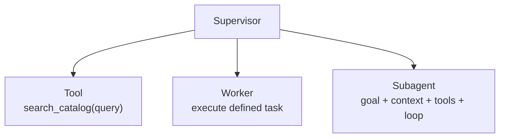
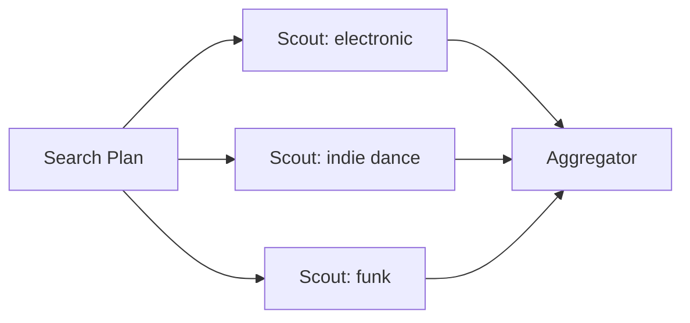
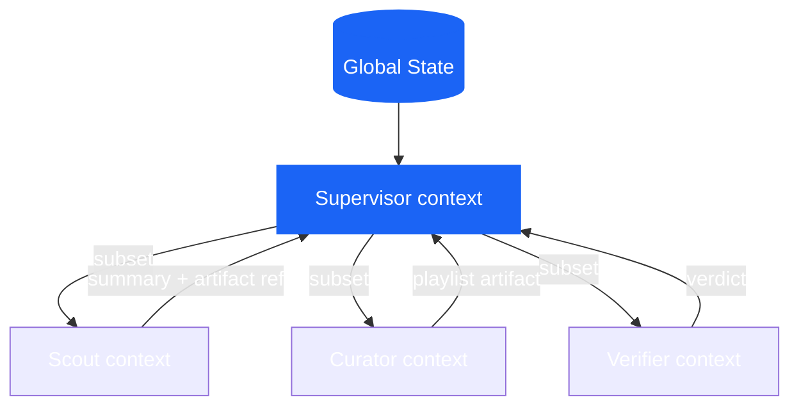
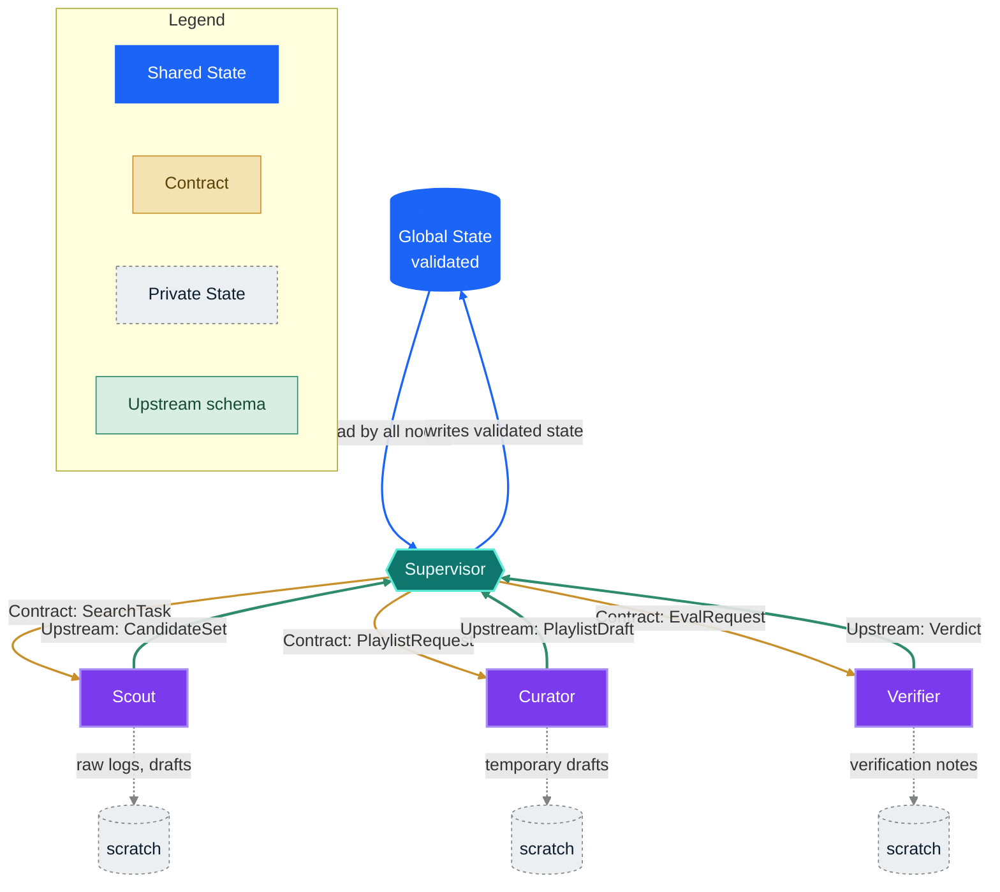
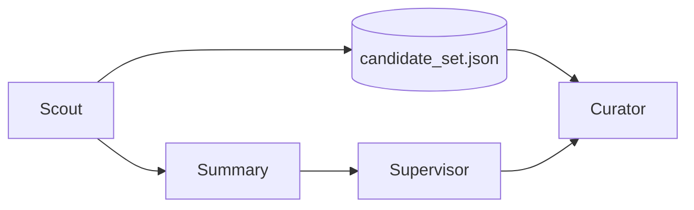
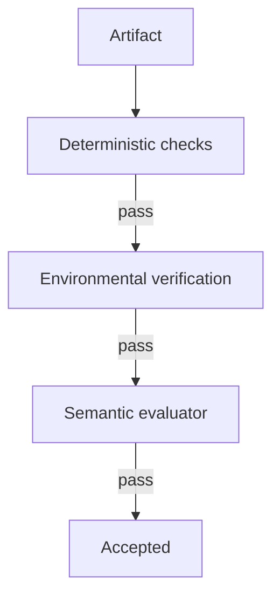
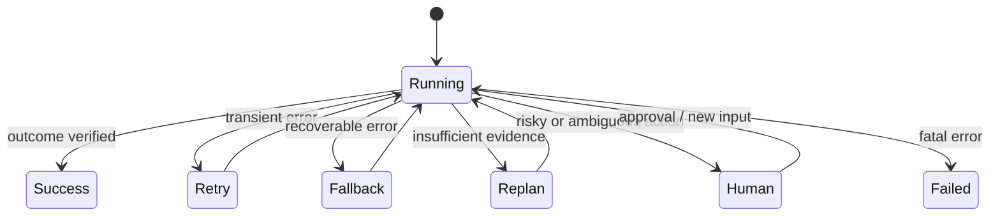
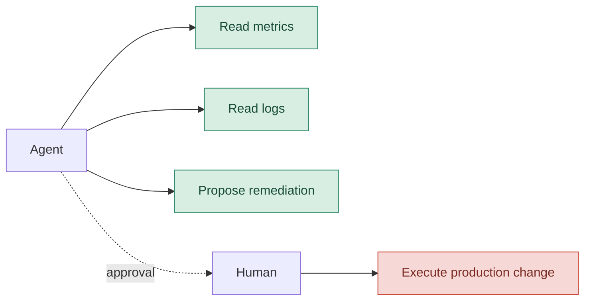

# Designing multi-agent systems in 2026 — Part 2

In the [first chapter](/blog/en/progettare-sistemi-multiagentici-nel-2026-parte-1/), we decided when a system truly earns the complexity of multiple agents and who should own its decisions. Now we turn that design into an operating system: we distribute roles, context, and controls without turning orchestration into an indistinct conversation between models.

## Defining roles

### Who does what?

We have a high-level understanding of what needs to be done and how to assign decisions based on the problems at hand. Now, we need to distribute the work.

#### Tool, worker, subagent

Let’s define our terms:

A **tool** exposes a capability. It has no goal of its own and does not decide the next step.

A **worker** receives a specific, bounded task and returns a result.

A **subagent** is a worker with its own reasoning loop, local context, and, often, its own set of tools.



This distinction is important because a tool doesn't need a personality, and a subagent shouldn't be used as a mask for a function you simply don't want to write.

#### Parallelism

Three searches can work in parallel only if they do not depend on one another.



```python
# [REFERENCE DESIGN]

results = await asyncio.gather(
    scout.run(SearchTask(genre="electronic", ...)),
    scout.run(SearchTask(genre="indie-dance", ...)),
    scout.run(SearchTask(genre="funk", ...)),
)

candidates = aggregate(results)
```

Last February, Anthropic shared an experiment involving sixteen Claude agents working in parallel on a C compiler. You can see an example there of how task locking, a shared repository, and testing allowed the work to be divided. It goes without saying, but if you read the article, you'll see they encountered frequent merge conflicts, required about 2,000 sessions, and cost nearly $20,000 ([Anthropic — C compiler](https://www.anthropic.com/engineering/building-c-compiler))!

The question that should arise now is:

> **What problem structure made it possible for them to work without stepping on each other's toes?**

My dear friend Simon Willison writes in the article I mentioned earlier that parallelism helps when files or subtasks are independent; subagents remain primarily a mechanism to protect the main context and contain verbose operations ([Willison — Subagents](https://simonwillison.net/guides/agentic-engineering-patterns/subagents/))!

### Who knows what?

This brings us to the trend that, in 2026, overtook prompt engineering: **context engineering**.

As I mentioned earlier, a classic mistake—at least in the beginning—is giving every agent the entire conversation, the full state, and every available tool. While this might seem logical, especially with models that handle massive context windows, it actually shifts the problem: instead of risking missing information, we force every component to distinguish what matters from a mass of details that don't belong to it.



In our example:

```text
SUPERVISOR
──────────
user request
MoodProfile
current plan
worker summaries
global failures

SCOUT
──────────
SearchTask
energy range
excluded genres
catalog tools

CURATOR
──────────
PlaylistRequest
CandidateSet
composition criteria

VERIFIER
──────────
produced playlist
constraints
evaluation rubric
```

The rule of "minimum sufficient context" means recognizing that context is a form of **working memory**: it is limited, expensive, and sensitive to noise.

Anthropic formalized this idea in 2025 under the term context engineering: selecting, maintaining, and updating the set of tokens that maximizes the probability of the desired behavior ([Anthropic — Context engineering](https://www.anthropic.com/engineering/effective-context-engineering-for-ai-agents)). Throughout the rest of this article, we will apply this principle to subagents, persistent sessions, artifacts, and long-running harnesses.

#### The shared context paradox

Passing too little context leads to omissions. Passing too much leads to interference.

Jason Liu, describing Cognition's stance on multi-agent systems for coding, uses the image of the "telephone game": every hand-off can lose implicit decisions and result in incompatible components. Even though the article is a bit dated (exactly one year old), it remains one of the clearest formulations of the risk of context loss between agents ([Jason Liu — Cognition and multi-agent](https://jxnl.co/writing/2025/09/11/why-cognition-does-not-use-multi-agent-systems/)).

However, be aware that parallel workers can still make incompatible decisions, and the global context can become bloated.

The mature solution for managing them is a rigorous **data architecture** that makes four boundaries explicit:

- **Shared State:** The single, validated source of truth that all enabled nodes can draw from.
- **Contracts:** Structured key steps (e.g., Pydantic schemas) that bind and regulate handoffs between agents.
- **Private State:** Everything a specialist needs to process a task (e.g., raw logs, temporary drafts) that must not pollute the global memory.
- **Upstream schemas:** The rigid, typed schema used to aggregate sub-task results and report them back to the supervisor.

Applied to our example, these four boundaries define a precise flow: the shared state is the only thing that enters and leaves the center validated, contracts flow down to the specialists, private state remains confined to each worker, and only a typed upstream schema returns to the supervisor.



The solid gold arrows represent the contracts flowing down, the dashed gray arrows remain confined to the worker that generates them, and the thick green arrows are the only channel through which a result returns upstream.

### State, memory, and artifacts

In agent terminology, "memory" is used to mean too many things. It is worth organizing them.

#### Conversation state

This is what is needed to maintain continuity in the interaction: messages, turns, active agent identity, and pending requests.

#### Task state

This is the operational state of the work:

```python
# [REFERENCE DESIGN]

class WorkflowState(BaseModel):
    request: PlaylistRequest
    search_plan: SearchPlan | None = None
    candidate_artifacts: list[str] = []
    playlist_artifact: str | None = None
    verification: VerificationResult | None = None
    retries: dict[str, int] = {}
    status: Literal["running", "waiting", "failed", "done"] = "running"
```

#### Local state

This belongs to a specialist and does not necessarily need to be propagated upstream:

```python
class ScoutLocalState(BaseModel):
    attempted_queries: list[str]
    visited_track_ids: set[str]
    raw_tool_outputs: list[str]
```

#### Artifact

This is a persistent product of the work: files, reports, patches, tables, playlists, datasets, or plans.

When the output is large, passing a reference is often healthier than re-injecting everything into the prompt.

```python
# [REFERENCE DESIGN]

return WorkerResult(
    summary="Found 84 candidates, 61 after filtering.",
    artifact_ref="artifacts/run-284/candidate_set.json",
    warnings=["funk catalog poorly covered"],
)
```



The artifact preserves fidelity. The summary preserves context space.

This is a much more robust balance than attempting to turn every step into an increasingly long message.

### Who is in control?

So far, we have distributed the work. Now we must prevent the system from confusing "I produced something" with "I am finished."

Modern verification has at least three layers.



D -->|fail| F[Feedback]
    E -->|fail| F
    J -->|fail| F
    F --> G[Generator / Curator]

    classDef hard fill:#D9EEE3,stroke:#2E8B6B,color:#164B36;
    classDef soft fill:#F4E3B2,stroke:#C8902B,color:#5A4405;
    class D,E hard;
    class J soft;
```

### Deterministic checks

If a property can be verified in Python, there is no need to ask an LLM.

```python
# [REFERENCE DESIGN]

def hard_checks(playlist: Playlist, request: PlaylistRequest) -> CheckResult:
    errors = []

    if len(playlist.track_ids) != len(set(playlist.track_ids)):
        errors.append("duplicate_tracks")

    forbidden = set(request.excluded_genres)
    if any(track.genre in forbidden for track in playlist.tracks):
        errors.append("excluded_genre")

    if not energy_curve_matches(
        playlist.tracks,
        start=request.current_energy,
        target=request.desired_energy,
    ):
        errors.append("energy_curve")

    return CheckResult(passed=not errors, errors=errors)
```

### Environment verification

An agent might claim to have created a playlist. The real question is whether that playlist actually exists in the external system.

```python
# [PSEUDOCODICE]

playlist_id = spotify.create_playlist(payload)

assert spotify.get_playlist(playlist_id).track_ids == payload.track_ids
```

Anthropic makes a precise distinction between *transcript* and *outcome*: the former is what the agent said and did, while the latter is the final state of the environment. Robust evals tend to favor the outcome when it is observable ([Anthropic — Evals for agents](https://www.anthropic.com/engineering/demystifying-evals-for-ai-agents)).

### Semantic evaluation

Then there is everything that cannot be reduced to a clear-cut assertion:

- Does the playlist tell a coherent story?
- Is the selection varied without feeling random?
- Does the result interpret the tension between fatigue and the desire to dance well?

This is where a separate evaluator can add value.

```python
# [REFERENCE DESIGN]

class SemanticEvaluation(BaseModel):
    mood_coherence: float
    transition_quality: float
    rationale: str
    passed: bool
```

The principle is not that "you always need two agents." In its March 2026 case study, Anthropic suggests separating the generator and the evaluator because it is easier to make an autonomous evaluator strict than it is to convince a generator to critique its own output. However, the same case study shows that the benefit depends on the task and the model, while costs and latency can increase by an order of magnitude ([Anthropic — Harness long-running](https://www.anthropic.com/engineering/harness-design-long-running-apps)).

In one of the described experiments, the complete system ran for about six hours and cost roughly $200, compared to twenty minutes and $9 for a single agent. The quality was superior, but the bill serves as a reminder that an evaluator must earn its place just like any other agent ([Anthropic — Harness long-running](https://www.anthropic.com/engineering/harness-design-long-running-apps)).

### A loop needs a brake

```python
# [REFERENCE DESIGN]

for revision in range(MAX_REVISIONS + 1):
    playlist = await curator.run(request, feedback=feedback)

    hard = hard_checks(playlist, request)
    if not hard.passed:
        feedback = hard.to_feedback()
        continue

    semantic = await evaluator.run(playlist, request)
    if semantic.passed:
        return playlist

    feedback = semantic.rationale

raise VerificationFailed("revision budget exhausted")
```

Without criteria, budgets, and stop conditions, an evaluator-optimizer is just a circular conversation between models.

## Evals: the system must be measured as a whole

Agent evals cannot be limited to the final response.

Anthropic proposes a useful terminology:

- **task**: the individual test case;
- **trial**: an attempt, which must be repeated because the system is stochastic;
- **grader**: the logic that assigns a judgment;
- **transcript / trace / trajectory**: the complete history of the trial;
- **outcome**: the final state of the environment;
- **evaluation harness**: the infrastructure that executes, records, and evaluates ([Anthropic — Evals for agents](https://www.anthropic.com/engineering/demystifying-evals-for-ai-agents)).

In our running example, a sensible suite should not just ask, "Did it produce a playlist?" It should define different semantics for every request.

```yaml
# [REFERENCE DESIGN]

tasks:
  - id: E01
    prompt: "I'm tired, but I want to dance."
    expected:
      - coherent_shift_or_clarification

  - id: E02
    prompt: "Surprise me."
    expected:
      - exploration_branch

  - id: E03
    prompt: "Help me work out, but no techno."
    expected:
      - no_excluded_genres

  - id: E04
    prompt: "I want an energetic playlist for the gym."
    expected:
      - valid_high_energy_playlist

  - id: E05
    prompt: "What time is it?"
    expected:
      - out_of_domain
```

Then, you observe different dimensions:

OUTCOME
playlist created?
constraints met?
side effect correct?

TRAJECTORY
router correct?
handoff necessary?
redundant tools?
loop terminated?

EFFICIENCY
latency
cost
tokens
tool calls
retries

RELIABILITY
pass@1
pass@k
recovery rate
silent failures

Hamel Husain insists on a distinction worth keeping in mind: different errors require different taxonomies. Calling everything an "hallucination" makes the failures that actually matter invisible. Useful practice starts with reading traces, building an error vocabulary, and calibrating evaluators against human judgment ([Hamel Husain — Evals skills](https://hamelhusain.substack.com/p/evals-skills-for-coding-agents)).

### Do not reward rigid paths

An overly prescriptive eval risks rejecting a valid solution simply because the model found a different way to reach it. Whenever possible, verify the outcome and use the trajectory to identify risky behaviors, waste, or policy violations, without turning every tool call into a mandatory script.

## When things go wrong

A multi-agent system is defined not just by the "happy path," but by what happens when a node fails to do its job.



It is useful to distinguish at least these families of failure.

### Formally invalid output

```python
# [PSEUDOCODE]

try:
    profile = await mood_interpreter.run(prompt)
except ValidationError:
    if retry_budget.consume("mood_interpreter"):
        profile = await mood_interpreter.run(prompt, repair=True)
    else:
        return clarification_fallback()
```

### Valid but semantically uncertain output

This is not an exception; it is a state.

```python
if profile.needs_clarification:
    return transition_to("clarifier")
```

### External tool unavailable

```python
try:
    tracks = await remote_catalog.search(query)
except TransientToolError:
    tracks = local_catalog.search(query)
    state.warnings.append("remote_catalog_unavailable")
```

### Partial success

```text
Scout A ✓
Scout B timeout
Scout C ✓
```

The options are not just "everything fails" or "pretend nothing happened."

```python
# [REFERENCE DESIGN]

if successful_workers >= minimum_required:
    continue_with_partial_results(warnings=failed_workers)
elif retry_budget.available:
    retry(failed_workers)
else:
    escalate_or_abort()
```

### Idempotency and side effects

An innocuous retry on a read-only search is different from a retry on a playlist creation.

```python
# [REFERENCE DESIGN]

spotify.create_playlist(
    payload,
    idempotency_key=state.run_id,
)
```

Without idempotency, a network error after a side effect can produce two identical playlists. In multi-agent systems, the problem worsens because multiple workers may believe they are authorized to write.

A simple policy is the **single writer**: many agents can propose, but only one can modify the external state.

## Blast radius and human-in-the-loop

When an agent can only read a music catalog, the maximum damage is contained. When an agent can perform a rollback in production, the same architecture becomes a different matter entirely.

Operational risk can be read as:

```text
risk ≈ probability of error × maximum possible damage
```

Improving the model might reduce the first term. Permissions and isolation limit the second.



In May 2026, Anthropic described containment as a problem of limiting the blast radius: not just monitoring what the model tends to do, but restricting what the environment materially allows it to do. The article also notes that automatic or distracted approval is a limitation of simple human-in-the-loop setups: too many permission prompts lead to approval fatigue ([Anthropic — Containment](https://www.anthropic.com/engineering/how-we-contain-claude)).

The Microsoft Agent Framework treats approval and information requests as suspendable workflow events; the pending state can be included in checkpoints and resumed after recovery ([Microsoft — HITL in workflows](https://learn.microsoft.com/en-us/agent-framework/workflows/human-in-the-loop)).

This leads to a rule of thumb:

> **Human oversight should be placed at critical risk points, not scattered like a shower of modal windows.**

In the concluding chapter, we take this architecture beyond a single conversation: persistence, harnesses, protocols, and the complete reference architecture.

→ Continue with [Designing multi-agent systems in 2026 — Part 3](/blog/en/progettare-sistemi-multiagentici-nel-2026-parte-3/).


## Sources and reading notes

Sources are ordered by function, not by prestige. Engineering posts and official documentation support the system descriptions; practitioners add field experience; 2025 works are used when they introduce concepts that remain central in 2026.

- [Anthropic — Building effective agents](https://www.anthropic.com/engineering/building-effective-agents): A 2024 guide to routing, chaining, parallelization, orchestrator-workers, and evaluator-optimizer patterns, with the recommendation to start with the simplest solution.
- [Anthropic — Demystifying evals for AI agents](https://www.anthropic.com/engineering/demystifying-evals-for-ai-agents): Definitions of tasks, trials, graders, transcripts, outcomes, and evaluation harnesses.
- [Anthropic — Harness design for long-running application development](https://www.anthropic.com/engineering/harness-design-long-running-apps): Planner, generator, evaluator, and the cost/duration trade-offs for long tasks.
- [Anthropic — Scaling Managed Agents](https://www.anthropic.com/engineering/managed-agents): Separation between sessions, harnesses, sandboxes, and execution environments.
- [Anthropic — How we contain Claude across products](https://www.anthropic.com/engineering/how-we-contain-claude): Containment, permissions, and blast radius reduction.
- [Anthropic — Building a C compiler with a team of parallel Claudes](https://www.anthropic.com/engineering/building-c-compiler): An experiment with sixteen agents, a shared environment, and parallel coordination.
- [Anthropic — Effective context engineering for AI agents](https://www.anthropic.com/engineering/effective-context-engineering-for-ai-agents): Context management, compaction, memory, and subagents.
- [OpenAI — Harness engineering](https://openai.com/index/harness-engineering/): Harnesses, testing, observability, and isolated environments for Codex agents.
- [OpenAI — The next evolution of the Agents SDK](https://openai.com/index/the-next-evolution-of-the-agents-sdk/): SDK evolution, sandboxes, and the separation between harness and compute.
- [OpenAI Agents SDK — Agent orchestration](https://openai.github.io/openai-agents-python/multi_agent/): The difference between LLM-based and code-based orchestration, agents as tools, and handoffs.
- [OpenAI Agents SDK — Handoffs](https://openai.github.io/openai-agents-python/handoffs/): Configuration, input, and handoff filters.
- [Microsoft Agent Framework — Workflows](https://learn.microsoft.com/en-us/agent-framework/workflows/): Functional or graph-based workflows, agents as executors, sequential/concurrent orchestrations, checkpoints, and HITL.
- [Microsoft Agent Framework — Human in the loop](https://learn.microsoft.com/en-us/agent-framework/workflows/human-in-the-loop): Suspendable requests, approvals, and workflow resumption.
- [LangChain — Handoffs](https://docs.langchain.com/oss/python/langchain/multi-agent/handoffs): State-driven transitions; in subgraphs, the transferred context must be chosen explicitly.

- [LangGraph — Use subgraphs](https://docs.langchain.com/oss/python/langgraph/use-subgraphs): subgraph input, output, and state.
- [LangGraph — Persistence](https://docs.langchain.com/oss/python/langgraph/persistence): state persistence and checkpointing.
- [LangGraph — Interrupts](https://docs.langchain.com/oss/python/langgraph/interrupts): controlled interruptions and resuming graphs.
- [Model Context Protocol — Specification](https://modelcontextprotocol.io/specification/2026-07-28): a protocol for connecting agents to tools, data, and resources.
- [A2A Protocol — Specification](https://a2a-protocol.org/latest/): interoperability and communication between independent agents, without requiring shared memory, tools, or proprietary logic.
- [Simon Willison — Subagents](https://simonwillison.net/guides/agentic-engineering-patterns/subagents/): practical experience with context isolation and parallelism.
- [Hamel Husain — Evals Skills for Coding Agents](https://hamelhusain.substack.com/p/evals-skills-for-coding-agents): error taxonomies, traces, and evaluators calibrated with human judgment.
- [Jason Liu — Why Cognition does not use multi-agent systems](https://jxnl.co/writing/2025/09/11/why-cognition-does-not-use-multi-agent-systems/): a practical critique of context loss in multi-agent systems.

### Further reading

- [OpenAI — Symphony](https://openai.com/index/open-source-codex-orchestration-symphony/): open-source specification for Codex orchestration.
- [Anthropic — AI Organizations](https://alignment.anthropic.com/2026/ai-organizations/): research on the effectiveness and alignment of agent organizations.
- [OpenAI Agents SDK — Tracing](https://openai.github.io/openai-agents-python/tracing/): execution tracing and observability.
- [LangChain — Multi-agent patterns](https://docs.langchain.com/oss/python/langchain/multi-agent/index): an overview of multi-agent patterns supported by the framework.
