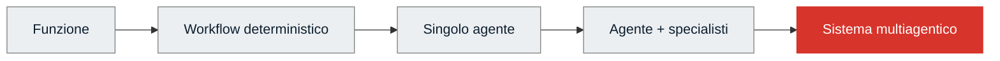
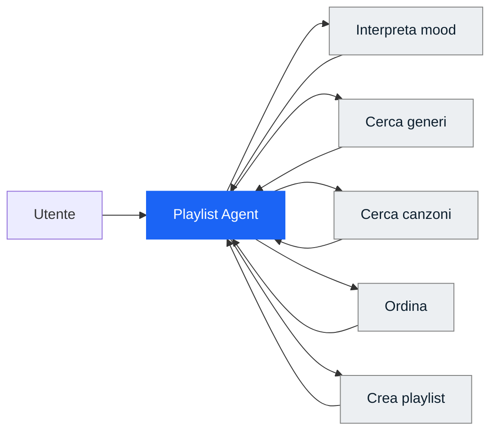
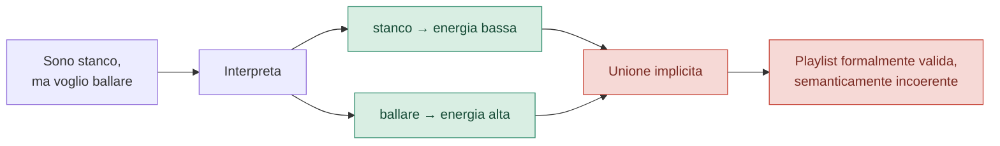
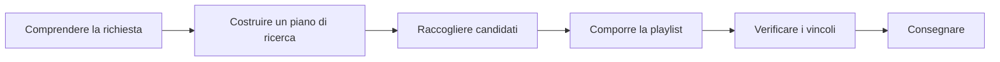
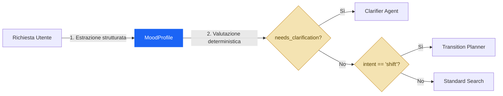
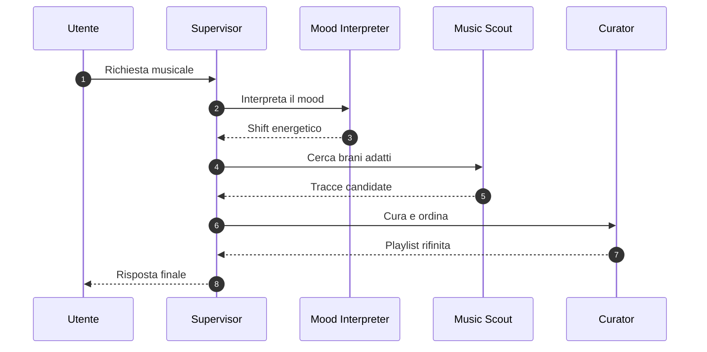
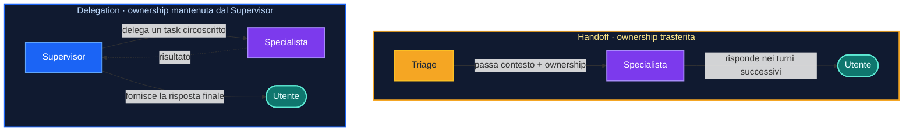
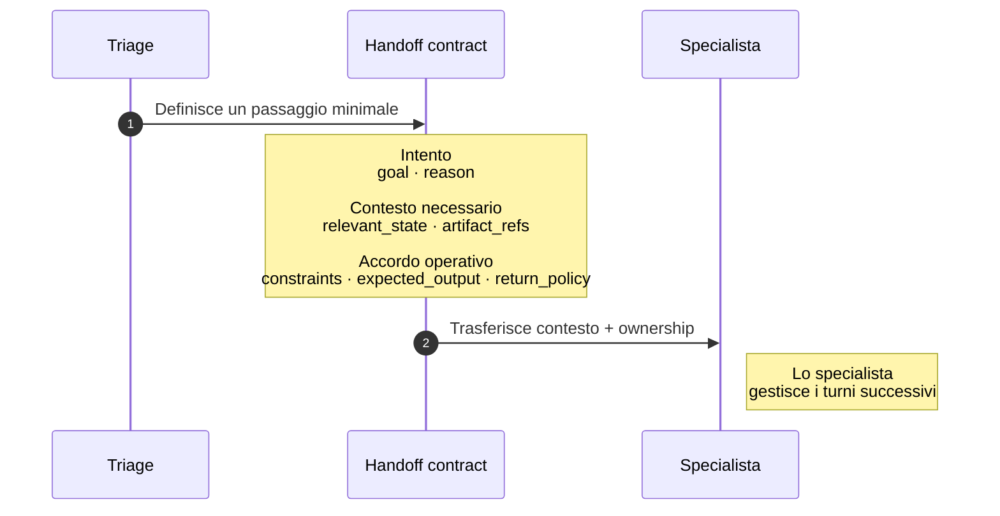

# Progettare sistemi multiagentici nel 2026 — Parte 1

Ho sentito sviluppatori vantarsi di aver progettato sistemi multiagentici solo per farsi figo davanti ai colleghi o per vendere la propria soluzione con "temi di moda". Ecco, in questo articolo voglio andare deep su questo e non fermarmi al come costruirli. Perché prima di progettare un sistema così complesso, ha senso chiedersi se ha senso definirlo!

Per questo motivo, prima di parlare di swarm, supervisor e handoff, conviene fare un passo indietro.

Un sistema multiagentico non nasce quando metti due modelli uno accanto all'altro. Non nasce nemmeno quando un agente chiama un secondo agente come se fosse un tool. Nasce quando decidi di **distribuire responsabilità, contesto e controllo** fra componenti che possono prendere decisioni parzialmente autonome.

La parola importante, qui, è *decidi*. Perché aggiungere agenti non è un obiettivo. È una **scelta architetturale** che deve ripagare il proprio costo.

Per tenere insieme il discorso useremo un esempio che mi è arrivato direttamente da un percorso che sto costruendo con Datapizza. Un sistema multiagentico in grado di intercettare il mood dell'utente e di proporre una playlist di conseguenza (a tal proposito ora sto ascoltando [radio Suno](https://suno.com/labs/live-radio)). Partiamo da una richiesta molto semplice e vaga di un possibile utente:

> **«Sono stanco, ma voglio ballare.»**

È una frase piccola, ma contiene in poche parole una tensione fra due stati e una decisione da prendere.

Questo articolo può essere condensato in cinque domande:

1. **Chi decide?**
2. **Chi sa cosa?**
3. **Chi fa cosa?**
4. **Chi controlla che il lavoro sia stato svolto bene?**
5. **Chi tiene in piedi il sistema quando ci sono problemi?**

Nel 2024 Anthropic descriveva soprattutto routing, chaining, parallelizzazione, orchestrator-workers ed evaluator-optimizer ([Anthropic — Building effective agents](https://www.anthropic.com/engineering/building-effective-agents)). Lungi da me dire che sono obsoleti quei pattern, anzi restano assolutamente validi.

Nel 2026, le documentazioni e i case study che cito tra poco dedicano invece molta attenzione a context lifecycle, contratti, artefatti, checkpoint, eval di traiettoria, sandbox, containment e harness ([Anthropic — Managed Agents](https://www.anthropic.com/engineering/managed-agents), [OpenAI — Agents SDK](https://openai.com/index/the-next-evolution-of-the-agents-sdk/), [Microsoft — Workflows](https://learn.microsoft.com/en-us/agent-framework/workflows/)). 

> Sia chiaro, questa è una sintesi generale di quanto ho letto finora sui vari substack e blog ufficiali delle fonti, non è una tassonomia ufficiale condivisa.


## Il sistema più semplice che può funzionare

Partiamo dalla prima domanda (probabillmente la più scomoda):

> **Perché un singolo agente non basta?**

Se il percorso è noto in anticipo, spesso basta un **workflow**. Se una trasformazione è deterministica, basta magari solo una funzione. Se un solo agente può mantenere il contesto e usare bene gli strumenti, dividere il lavoro crea soltanto nuovi punti di rottura.



Andare verso destra significa guadagnare flessibilità, ma anche pagare in latenza, costo, non determinismo, coordinamento e osservabilità.

Una regola di partenza può essere scritta così:

```python
# [PSEUDOCODICE]

def choose_architecture(problem):
    if problem.is_deterministic:
        return "function_or_workflow"

    if problem.path_is_known:
        return "graph_workflow"

    if problem.fits_one_context and problem.needs_one_owner:
        return "single_agent"

    return "consider_multi_agent"
```

Chiaramente non è una formula universale, non sono un oracolo dell'AI. Però è quanto basta per evitare l'errore di scambiare la complessità di un sistema per maturità. Fidatevi che non è così

Mi metto nei panni di un lettore che arrivato a questo punto si chiede:

> Ok Mirko ma quindi questi sistemi quando mi servono? Quando ha senso definire dei sottoagenti?

Simon Willison cerca di rispondere a questa domanda nel suo blog: i subagent sono preziosi soprattutto perché preservano il contesto principale e assorbono operazioni pesanti in token. Dall'altra parte avverte però che è facile frammentare inutilmente un task in molti specialisti ([Willison — Subagents](https://simonwillison.net/guides/agentic-engineering-patterns/subagents/)).

### Un agente deve guadagnarsi il posto

Prima di complicare la tua soluzione in una agentica, prova a completare questa frase:

> «Ora introduco un agente perché questa componente deve ____________.»

Le risposte plausibili riguardano giudizio, pianificazione aperta, uso dinamico di strumenti, esplorazione o interazione. Se la risposta è «deve ordinare una lista», «deve verificare i duplicati» o «deve scegliere un ramo leggendo un booleano», probabilmente stai esagerando.

Avete presente quando andate al supermercato e comprate più cose rispetto a quello di cui avete realmente bisogno? Ecco è esattamente quello che sto notando nel mondo agentico!

Sia chiaro non voglio dire che i sistemi multiagentici non hanno senso, sto solo mettendo gli svlippatori sull'attenti perché non è una soluzione a tutto. Però ora vediamo un caso d'uso interessante.


## Il monolite Spotify

Torniamo al nostro esempio di Spotify. Partiamo dal sistema più naturale. Un agente riceve la richiesta e possiede cinque strumenti:

- interpretare il mood;
- cercare generi;
- cercare canzoni;
- ordinare i risultati;
- generare la playlist.

> Nella lezione che ho proposto questo si è tradotto in un codice vero e proprio

```python
# Ecco un bell'agente monolite

return Agent(
    name="playlist_monolith",
    client=client,
    system_prompt=SYSTEM_PROMPT,
    tools=[
        interpreta_umore,
        cerca_generi_per_mood,
        cerca_canzoni_per_genere,
        ordina_canzoni,
        genera_playlist,
    ],
    max_steps=8,
)
```

Vediamo con uno schemino cosa fa questo agente:



A prima vista sembra tutto a posto. Il modello legge «stanco» e «ballare», trova due famiglie di generi compatibili, recupera i brani e costruisce una playlist.

Poi sposti il focus e compare la crepa.

In alcuni run l'agente tratta i due segnali come due ricerche indipendenti, unisce i risultati e consegna una playlist che contiene brani da festa e brani rilassanti senza aver deciso quale relazione esista fra lo stato attuale e quello desiderato.

Il problema non è che il modello non abbia interpretato bene le parole. Le ha capite entrambe. E non ha nemmeno scelto un tool palesemente sbagliato. Il fallimento sta altrove: **una decisione importante è rimasta implicita**! O meglio non si è fermato a chiedere all'utente "Ok bro ma quindi che vuoi? Scegli una via altrimenti viene un mezzo pasticcio!"



Ok focalizziamoci meglio su queste due ambiguità diverse che non sono state viste dall'agente.

### Decision ambiguity

Chi stabilisce se la richiesta descrive:

- una contraddizione da chiarire;
- una transizione da energia bassa a energia alta;
- una combinazione volutamente ibrida?

### Acceptance ambiguity

Chi stabilisce che la playlist prodotta sia abbastanza coerente da poter essere consegnata?

L'agente monolite (ovvero con solo tool a disposizione) possiede una condizione di arresto tecnica: `max_steps=8` e un tool finale. Quello che gli manca è una **definition of done esterna**.

Ed è qui che iniziano a valutare i sistemi multiagentici. Non perché cinque tool siano troppi in assoluto (o troppo pochi, potrebbero comunque fare confusione), ma perché l'azione di comprendere, di decidere, di eseguire e valutare convivono nello stesso centro decisionale, che è "la testa" di un singolo agente!

## Divide et impera

Chiudi gli occhi e dimmi a che soluzione stai pensando. Ok riapri gli occhi. Penso che la tentazione naturale sia, a questo punto, creare quattro agenti:

```text
Mood Agent
Decision Agent
Search Agent
Evaluation Agent
```

Sembra ordinato. Ma come gestiamo l'architettura, che ordine diamo? Prima bisogna scomporre il **lavoro**!



Poi, per ogni passaggio, chiediamo:

```python
# [PSEUDOCODICE]

Task(
    goal=...,
    inputs=...,
    outputs=...,
    tools=...,
    context=...,
    side_effects=...,
    failure_policy=...,
    verification=...,
)
```

Soltanto dopo decidiamo quale componente debba svolgerlo.

```text
Interpretare l'intento       → LLM / agente
Leggere un booleano          → codice
Cercare nel catalogo         → tool o worker
Ordinare per energia         → funzione
Comporre una playlist        → agente, se serve giudizio
Controllare duplicati        → funzione
Giudicare la coerenza        → evaluator, se resta soggettività
```

Questa distinzione vale la pena di fissarla:

> **Task decomposition e agent decomposition non sono la stessa cosa!!**

Microsoft Agent Framework presenta gli agenti come possibili partecipanti ed esecutori di workflow funzionali o basati su un grafo ([Microsoft — Workflows](https://learn.microsoft.com/en-us/agent-framework/workflows/)). 

Una volta che abbiamo capito cosa vogliamo, vediamo a chi assegnare cosa ogni compito. Penso sia fondamentale che **ogni nodo abbia una responsabilità chiara**.

## Chi decide?

Una volta rappresentato il lavoro, dobbiamo assegnare il controllo.

Nella mia esperienza ho visto che ci sono tre pattern che vengono confusi, o meglio pensati come equivalenti: routing, supervisor e handoff. In realtà rispondono a domande differenti!

### Routing: sai già cosa vuoi?

> **Quando usarlo:** Usa il routing quando la scelta del prossimo passo può essere ricondotta a una classificazione esplicita o a uno stato ben definito (un campo tipizzato, una soglia, una policy booleana). L'LLM si limita ad analizzare l'input ed estrarre i parametri; poi, un semplice algoritmo deterministico in codice (es. `if/else`) smista l'esecuzione verso il nodo corretto.

> **Quando NON usarlo:** Se la decisione sul passo successivo richiede di valutare dinamicamente trade-off, negoziare tra agenti o rivalutare la strategia in base a risultati parziali, usa un **Supervisor**.

Il routing è il pattern più efficiente in assoluto: massimizza la prevedibilità, minimizza la latenza e riduce i costi di chiamata LLM, spostando la logica di controllo dal prompt al codice applicativo.

Prendiamo il nostro utente che dice: *«Sono stanco, ma voglio ballare.»*

Anziché chiedere a un agente di "decidere cosa fare", usiamo uno schema di estrazione strutturata (**Structured Outputs**):

```python
# [REFERENCE IMPLEMENTATION - PYTHON]
from pydantic import BaseModel, Field
from typing import Literal

class MoodProfile(BaseModel):
    current_energy: float = Field(..., description="Livello di energia stimato dell'utente (1-10)")
    desired_energy: float = Field(..., description="Livello di energia desiderato (1-10)")
    intent: Literal["maintain", "shift", "explore"] = Field(
        ..., description="Mantenere lo stato, cambiarlo attivamente (shift) o esplorare cose nuove"
    )
    needs_clarification: bool = Field(
        ..., description="True se la richiesta è troppo vaga o contraddittoria e richiede domande di chiarimento"
    )
```

Una volta che l'LLM ha estratto e validato questo schema, il passaggio successivo viene deciso da una funzione Python deterministica. Non c'è alcun bisogno di un'altra inferenza generativa:

```python
# Il router è codice, puro e semplice. 100% deterministico e testabile con pytest.
def determine_next_node(profile: MoodProfile) -> str:
    if profile.needs_clarification:
        return "clarifier_agent"
    if profile.intent == "shift":
        return "energy_transition_planner"
    return "standard_search_agent"
```



#### Perché questo approccio è formidabile?
1. **Zero latenza decisionale**: Il calcolo del percorso successivo richiede frazioni di millisecondo.
2. **Facilità di test**: Puoi scrivere unit test tradizionali (`pytest`) per verificare la logica di routing su centinaia di profili d'uso, senza doverti preoccupare di allucinazioni o non-determinismo del modello in questa fase.
3. **Meno sovraccarico nel prompt**: Gli agenti a valle ricevono un input pulito e pre-strutturato (`MoodProfile`), liberandoli dal dover re-interpretare le intenzioni iniziali dell'utente.

### Supervisor: la decisione resta labile

> **Quando usarlo:** Usa un supervisor quando il prossimo passo non è deducibile da una regola deterministica e richiede **giudizio continuo**. Il supervisor agisce come un "Project Manager" o un "Direttore d'Orchestra": valuta lo stato corrente, sceglie dinamicamente quale specialista (worker) attivare, riceve l'output, aggiorna lo stato e decide il passo successivo. Conserva l'ownership globale del contesto e della conversazione.

> **Quando NON usarlo:** Se la sequenza dei passaggi è fissa (A -> B -> C) o se la scelta del ramo dipende da una variabile nota (es. un boolean nel database), usa un workflow deterministico o un Router basato su codice. Eviterai latenza, costi di chiamata LLM e non-determinismo inutile.

In pratica, il Supervisor serve quando dobbiamo coordinare diversi agenti specialisti le cui interazioni non sono prevedibili a priori. 

Prendiamo il nostro esempio di Spotify:
1. L'utente dice: *«Sono stanco, ma voglio ballare.»*
2. Il **Supervisor** riceve la richiesta e decide di interpellare il `Mood Interpreter`.
3. Il `Mood Interpreter` restituisce una diagnosi: *"L'utente è affaticato ma cerca una transizione attiva (shift) verso l'energia alta"*.
4. Il **Supervisor** legge questa diagnosi e decide dinamicamente che il prossimo passo non è ancora creare la playlist, ma chiedere al `Music Scout` di cercare generi di transizione (es. Deep House soft).
5. Se lo `Scout` restituisce pochi risultati, il **Supervisor** non fallisce: decide di cambiare strategia e attivare un secondo Scout su generi alternativi (es. Funk ritmico).

Questo flusso dinamico e adattivo non può essere mappato facilmente con un semplice `if/else`.



#### Perché è importante l'Ownership del Contesto?
A differenza di un "handoff" (dove il controllo passa definitivamente a un altro agente e la conversazione continua lì), nel pattern **Supervisor** gli specialisti sono "ciechi" rispetto alla storia passata della conversazione globale. Ricevono solo un task circoscritto (*context minimization*) e restituiscono un risultato strutturato al Supervisor.
Questo impedisce che il contesto dei sotto-agenti si saturi di informazioni inutili (rumore) e che l'utente debba interagire con entità diverse, mantenendo l'esperienza fluida e centralizzata sul Supervisor.

```python
# [REFERENCE IMPLEMENTATION - PSEUDOCODICE]

while not state.done:
    # Il supervisor valuta lo stato e decide la mossa successiva
    decision = await supervisor.decide(
        goal=state.goal,
        current_state=state.summary, # Mantiene una sintesi pulita del lavoro fatto finora
        available_workers=registry.list_tools(),
    )

    if decision.is_final:
        state.done = True
        break

    # Delega il compito specifico allo specialista prescelto
    worker_output = await registry[decision.worker].run(decision.task_parameters)
    
    # Registra l'esito nello stato globale (senza passare l'intera trascrizione della sotto-chat)
    state.record_step(
        worker=decision.worker,
        task=decision.task_parameters,
        output=worker_output.summary
    )
```

Il costo di questo pattern è evidente: ogni decisione del Supervisor richiede un'inferenza LLM aggiuntiva (latenza e costo in token). Perciò, prima di implementarlo, poniti questa domanda:

> **C'è una reale negoziazione o ambiguità da gestire tra i passaggi?**

Se la risposta è no, e i passaggi sono sequenziali o guidati da regole fisse, usa il **Routing** o un **Workflow a grafo deterministico**.

### Handoff: una conversazione tra agenti

> **Quando usarlo:** Usa un handoff quando, oltre al lavoro da svolgere, deve cambiare chi possiede il dialogo nel turno successivo. 

> **Quando non usarlo:** Se un agente deve solo eseguire un sotto-compito e restituirne l'esito, mantieni il controllo nell'orchestratore e usa una delegation o un agente come tool.

Nella fase di delegazione, il manager resta l'interlocutore. Nell'handoff il controllo passa allo specialista.



OpenAI Agents SDK distingue esplicitamente queste due topologie: *agents as tools* quando il manager mantiene il controllo; *handoffs* quando lo specialista prende in carico la parte successiva dell'interazione ([OpenAI Agents SDK — orchestrazione](https://openai.github.io/openai-agents-python/multi_agent/), [handoff](https://openai.github.io/openai-agents-python/handoffs/)).

La differenza si può ricordare così:

```text
Delegation → cambia chi lavora.
Handoff    → cambia chi possiede il controllo.
```

Riassumendo:
- **Delegation**: il Supervisor assegna un task a uno specialista, lo specialista lo esegue e restituisce un risultato, ma il Supervisor resta l'unico che parla con l'utente. Cambia solo chi esegue il lavoro; il controllo della conversazione (chi risponde al turno successivo) resta al Supervisor.

- **Handoff**: non è solo il lavoro a passare allo specialista, ma anche il diritto/dovere di gestire i turni successivi della conversazione. Da quel momento l'utente parla direttamente con lo specialista, non più tramite il Supervisor.

#### Un handoff è un contratto a tutti gli effetti

Nei diagrammi architetturali l'handoff viene spesso liquidato come una semplice freccia direzionale. Nella realtà, tuttavia, esso rappresenta un vero e proprio **confine di isolamento (boundary)**.

Per strutturare un passaggio di consegne robusto, non possiamo affidarci a scambi di messaggi destrutturati. Dobbiamo definire un contratto formale, modellabile ad esempio tramite Pydantic:

```python
class HandoffContract(BaseModel):
    goal: str
    reason: str
    relevant_state: dict
    constraints: list[str]
    artifact_refs: list[str]
    expected_output: str
    return_policy: Literal["return_to_supervisor", "own_conversation"]
```



La formalizzazione di questo schema evidenzia due responsabilità architetturali distinte, vediamole insieme:

1. **La governance del flusso (Control Ownership):** Chi ha l'autorità di decidere quale azione compiere in seguito?
2. **La minimizzazione del contesto (Information Boundary):** Quali dati devono realmente superare la barriera dell'agente?

Sia LangChain che LangGraph supportano nativamente questo livello di astrazione. LangGraph, ad esempio, permette di definire subgraph indipendenti dotati di schemi di stato (state schemas) dedicati, incapsulando la memoria locale dello specialista e mappando in modo esplicito solo gli input e gli output concordati ([LangChain — handoff](https://docs.langchain.com/oss/python/langchain/multi-agent/handoffs), [LangGraph — subgraph](https://docs.langchain.com/oss/python/langgraph/use-subgraphs)).

> Vale la seguente regola per disegnare un handoff con criteri moderni: **evitare di passare tutto "per sicurezza"**. L'agente ricevente deve disporre **esclusivamente** del contesto minimo necessario per compiere il proprio dovere, senza l'onere computazionale e cognitivo di dover ricostruire l'intero storico del sistema.

Nel prossimo capitolo trasformiamo queste scelte di orchestrazione in un design operativo: ruoli, stato, verifiche, eval e confini di rischio.

→ Continua con [Progettare sistemi multiagentici nel 2026 — Parte 2](/blog/it/progettare-sistemi-multiagentici-nel-2026-parte-2/).

## Fonti e note di lettura

Le fonti sono ordinate per funzione, non per prestigio. Gli engineering post e la documentazione ufficiale sostengono le descrizioni dei sistemi; i practitioner aggiungono esperienza sul campo; i lavori 2025 vengono usati quando introducono concetti ancora centrali nel 2026.

- [Anthropic — Building effective agents](https://www.anthropic.com/engineering/building-effective-agents): guida del 2024 ai pattern routing, chaining, parallelizzazione, orchestrator-workers ed evaluator-optimizer, con la raccomandazione di partire dalla soluzione più semplice.
- [Anthropic — Demystifying evals for AI agents](https://www.anthropic.com/engineering/demystifying-evals-for-ai-agents): definizioni di task, trial, grader, transcript, outcome ed evaluation harness.
- [Anthropic — Harness design for long-running application development](https://www.anthropic.com/engineering/harness-design-long-running-apps): planner, generator, evaluator e trade-off di costo e durata per task lunghi.
- [Anthropic — Scaling Managed Agents](https://www.anthropic.com/engineering/managed-agents): separazione fra sessione, harness, sandbox e ambienti di esecuzione.
- [Anthropic — How we contain Claude across products](https://www.anthropic.com/engineering/how-we-contain-claude): containment, permission e riduzione del blast radius.
- [Anthropic — Building a C compiler with a team of parallel Claudes](https://www.anthropic.com/engineering/building-c-compiler): esperimento con sedici agenti, ambiente condiviso e coordinamento del parallelismo.
- [Anthropic — Effective context engineering for AI agents](https://www.anthropic.com/engineering/effective-context-engineering-for-ai-agents): gestione del contesto, compaction, memoria e subagent.
- [OpenAI — Harness engineering](https://openai.com/index/harness-engineering/): harness, test, osservabilità e ambienti isolati per agenti Codex.
- [OpenAI — The next evolution of the Agents SDK](https://openai.com/index/the-next-evolution-of-the-agents-sdk/): evoluzione dell’SDK, sandbox e separazione fra harness e compute.
- [OpenAI Agents SDK — Agent orchestration](https://openai.github.io/openai-agents-python/multi_agent/): differenza fra orchestrazione via LLM e via codice, agents as tools e handoff.
- [OpenAI Agents SDK — Handoffs](https://openai.github.io/openai-agents-python/handoffs/): configurazione, input e filtri degli handoff.
- [Microsoft Agent Framework — Workflows](https://learn.microsoft.com/en-us/agent-framework/workflows/): workflow funzionali o graph-based, agenti come executor, orchestrazioni sequenziali/concorrenti, checkpoint e HITL.
- [Microsoft Agent Framework — Human in the loop](https://learn.microsoft.com/en-us/agent-framework/workflows/human-in-the-loop): richieste sospendibili, approvazioni e ripristino del workflow.
- [LangChain — Handoffs](https://docs.langchain.com/oss/python/langchain/multi-agent/handoffs): transizioni guidate dallo stato; nei subgraph il contesto trasferito va scelto esplicitamente.
- [LangGraph — Use subgraphs](https://docs.langchain.com/oss/python/langgraph/use-subgraphs): input, output e stato dei subgraph.
- [LangGraph — Persistence](https://docs.langchain.com/oss/python/langgraph/persistence): persistenza dello stato e checkpoint.
- [LangGraph — Interrupts](https://docs.langchain.com/oss/python/langgraph/interrupts): interruzioni controllate e ripresa dei grafi.
- [Model Context Protocol — specifica](https://modelcontextprotocol.io/specification/2026-07-28): protocollo per collegare agenti a tool, dati e risorse.
- [A2A Protocol — specifica](https://a2a-protocol.org/latest/): interoperabilità e comunicazione fra agenti indipendenti, senza imporre la condivisione di memoria, strumenti o logica proprietaria.
- [Simon Willison — Subagents](https://simonwillison.net/guides/agentic-engineering-patterns/subagents/): esperienza pratica su isolamento del contesto e parallelismo.
- [Hamel Husain — Evals Skills for Coding Agents](https://hamelhusain.substack.com/p/evals-skills-for-coding-agents): tassonomie di errore, trace ed evaluator calibrati con giudizi umani.
- [Jason Liu — Why Cognition does not use multi-agent systems](https://jxnl.co/writing/2025/09/11/why-cognition-does-not-use-multi-agent-systems/): critica pratica al context loss nei sistemi multi-agent.

### Altre letture utili

- [OpenAI — Symphony](https://openai.com/index/open-source-codex-orchestration-symphony/): specifica open source per l’orchestrazione di Codex.
- [Anthropic — AI Organizations](https://alignment.anthropic.com/2026/ai-organizations/): ricerca su efficacia e allineamento delle organizzazioni di agenti.
- [OpenAI Agents SDK — Tracing](https://openai.github.io/openai-agents-python/tracing/): trace e osservabilità dell’esecuzione.
- [LangChain — Multi-agent patterns](https://docs.langchain.com/oss/python/langchain/multi-agent/index): panoramica dei pattern multi-agent supportati dal framework.
