# Progettare sistemi multiagentici nel 2026

> **Nota editoriale.** Questo articolo distingue deliberatamente tre livelli. Gli esempi marcati **[VERIFICATO NEL REPO]** corrispondono al running example Spotify della lezione. Gli esempi marcati **[REFERENCE DESIGN]** descrivono l'architettura verso cui quel sistema può evolvere. Gli esempi marcati **[PSEUDOCODICE]** servono a rendere visibile una scelta di progettazione e non vanno letti come API di un framework specifico.

Prima di parlare di swarm, supervisor e handoff, conviene fare un passo indietro. Su questo punto si inciampa spesso, e il resto del discorso ne risente...

Un sistema multiagentico non nasce quando metti due modelli uno accanto all'altro. Non nasce nemmeno quando un agente chiama un secondo agente come se fosse un tool. Nasce quando decidi di **distribuire responsabilità, contesto e controllo** fra componenti che possono prendere decisioni parzialmente autonome.

La parola importante, qui, è *decidi*. Perché aggiungere agenti non è un obiettivo. È una scelta architetturale che deve ripagare il proprio costo.

Per tenere insieme il discorso useremo un esempio che mi è arrivato direttamente da un percorso che sto costruendo con Datapizza. Un sistema multiagentico in grado di intercettare il mood dell'utente e di proporre una playlist di conseguenza (a tal proposito ora sto ascoltando [radio Suno](https://suno.com/labs/live-radio)). Partiamo da una richiesta molto semplice:

> **«Sono stanco, ma voglio ballare.»**

È una frase piccola, ma contiene già quasi tutto. Uno stato attuale, uno stato desiderato, una tensione fra i due e una decisione da prendere. La useremo come una lente: ogni volta che il sistema si incrina, introdurremo soltanto il meccanismo necessario a risolvere quella crepa.

Il filo rosso dell'articolo può essere condensato in cinque domande:

1. **Chi decide?**
2. **Chi sa cosa?**
3. **Chi fa cosa?**
4. **Chi controlla che il lavoro sia stato svolto bene?**
5. **Chi tiene in piedi il sistema quando il lavoro dura, qualcosa fallisce o il modello cambia?**

Nel 2024 la tassonomia più utile parlava soprattutto di routing, chaining, parallelizzazione, orchestrator-workers ed evaluator-optimizer. Quei pattern restano validi. Nel 2026, però, il punto interessante si è spostato un livello più in alto: context lifecycle, contratti, artefatti, checkpoint, eval di traiettoria, sandbox, containment e harness. Anthropic, OpenAI e Microsoft stanno convergendo proprio su questa fascia del problema, pur usando vocabolari e astrazioni differenti.[^anthropic-engineering][^openai-sdk-2026][^microsoft-workflows]

---

## 1. Il sistema più semplice che può funzionare

La prima domanda non è «quanti agenti servono?». È più scomoda:

> **Perché un singolo agente non basta?**

Se il percorso è noto in anticipo, spesso basta un workflow. Se una trasformazione è deterministica, basta una funzione. Se un solo agente può mantenere il contesto e usare bene gli strumenti, dividere il lavoro crea soltanto nuovi punti di rottura.

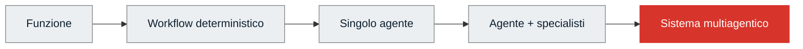

Salire verso destra significa guadagnare flessibilità, ma anche pagare in latenza, costo, non determinismo, coordinamento e osservabilità.

Una regola di partenza può essere scritta così:

```python
# [PSEUDOCODICE]

def choose_architecture(problem):
    if problem.is_deterministic:
        return "function_or_workflow"

    if problem.path_is_known:
        return "graph_workflow"

    if problem.fits_one_context and problem.needs_one_owner:
        return "single_agent"

    return "consider_multi_agent"
```

Non è una formula universale. È un freno. Serve a evitare l'errore più comune: scambiare la complessità per maturità.

Simon Willison lo formula da una prospettiva molto pratica: i subagent sono preziosi soprattutto perché preservano il contesto principale e assorbono operazioni pesanti in token; suddividere ogni attività in decine di specialisti, invece, può diventare un vezzo costoso.[^simon-subagents]

### Un agente deve guadagnarsi il posto

Prima di aggiungere un agente, prova a completare questa frase:

> «Questo componente deve essere un agente perché deve ____________.»

Le risposte plausibili riguardano giudizio, pianificazione aperta, uso dinamico di strumenti, esplorazione o interazione. Se la risposta è «deve ordinare una lista», «deve verificare i duplicati» o «deve scegliere un ramo leggendo un booleano», probabilmente stai promuovendo a collega ciò che dovrebbe restare una funzione.

---

## 2. Il monolite Spotify

Partiamo dal sistema più naturale. Un agente riceve la richiesta e possiede cinque strumenti:

- interpretare il mood;
- cercare generi;
- cercare canzoni;
- ordinare i risultati;
- generare la playlist.

Nel repository della lezione questa versione esiste ed è eseguibile.

```python
# [VERIFICATO NEL REPO] - monolith.py

return Agent(
    name="playlist_monolith",
    client=client,
    system_prompt=SYSTEM_PROMPT,
    tools=[
        interpreta_umore,
        cerca_generi_per_mood,
        cerca_canzoni_per_genere,
        ordina_canzoni,
        genera_playlist,
    ],
    max_steps=8,
)
```

Il disegno è quasi disarmante:

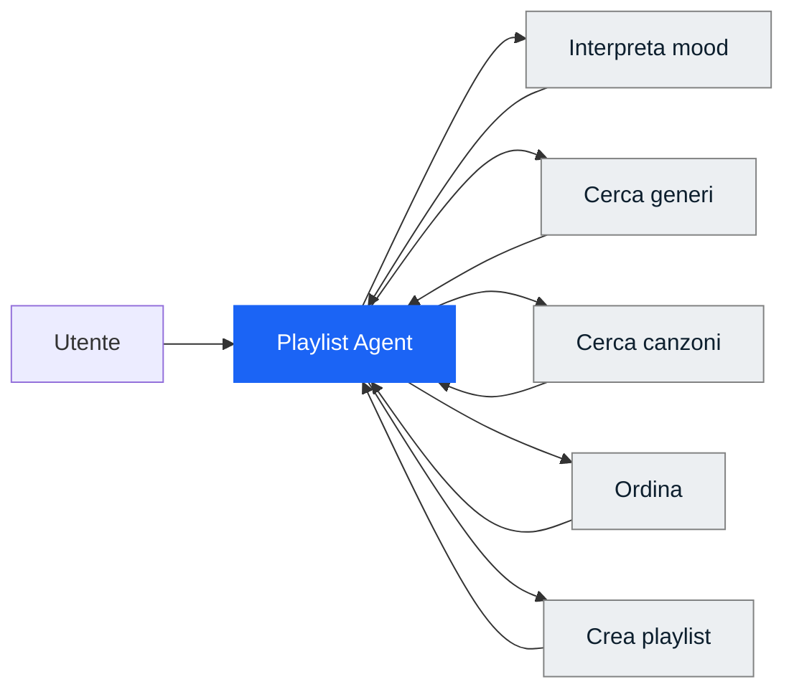

A prima vista sembra tutto a posto. Il modello legge «stanco» e «ballare», trova due famiglie di generi compatibili, recupera i brani e costruisce una playlist.

Poi sposti il focus e compare la crepa.

In alcuni run l'agente tratta i due segnali come due ricerche indipendenti, unisce i risultati e consegna una playlist che contiene brani da festa e brani rilassanti senza aver deciso quale relazione esista fra lo stato attuale e quello desiderato.

Il problema non è che il modello non abbia capito le parole. Le ha capite entrambe. Non ha nemmeno scelto un tool palesemente sbagliato. Il fallimento sta altrove: **una decisione importante è rimasta implicita**.

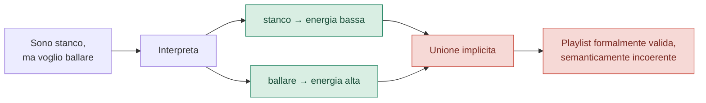

Qui si vedono due ambiguità diverse.

### Decision ambiguity

Chi stabilisce se la richiesta descrive:

- una contraddizione da chiarire;
- una transizione da energia bassa a energia alta;
- una combinazione volutamente ibrida?

### Acceptance ambiguity

Chi stabilisce che la playlist prodotta sia abbastanza coerente da poter essere consegnata?

Il monolite possiede una condizione di arresto tecnica: `max_steps=8` e un tool finale. Quello che gli manca è una **definition of done esterna al proprio entusiasmo**.

Ed è qui che iniziano i sistemi multiagentici. Non perché cinque tool siano troppi in assoluto, ma perché comprendere, decidere, eseguire e valutare convivono nello stesso centro decisionale.

---

## 3. Scomporre il problema prima dell'agente

La tentazione, a questo punto, è creare quattro agenti:

```text
Mood Agent
Decision Agent
Search Agent
Evaluation Agent
```

Sembra ordinato. Però l'ordine visivo non garantisce una buona architettura.

Prima bisogna scomporre il **lavoro**.

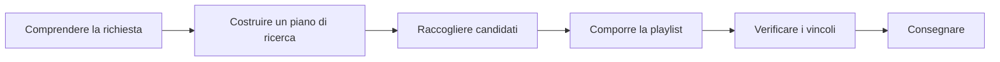

Poi, per ogni passaggio, chiediamo:

```python
# [PSEUDOCODICE]

Task(
    goal=...,
    inputs=...,
    outputs=...,
    tools=...,
    context=...,
    side_effects=...,
    failure_policy=...,
    verification=...,
)
```

Soltanto dopo decidiamo quale componente debba svolgerlo.

```text
Interpretare l'intento       → LLM / agente
Leggere un booleano          → codice
Cercare nel catalogo         → tool o worker
Ordinare per energia         → funzione
Comporre una playlist        → agente, se serve giudizio
Controllare duplicati        → funzione
Giudicare la coerenza        → evaluator, se resta soggettività
```

Questa distinzione vale la pena di fissarla:

> **Task decomposition e agent decomposition non sono la stessa cosa.**

Nel 2026 Microsoft Agent Framework rende questa scelta esplicita: gli executor di un workflow possono essere agenti oppure normale logica applicativa. Il grafo non pretende che ogni nodo ragioni; pretende che ogni nodo abbia una responsabilità chiara.[^microsoft-workflows]

---

## 4. Chi decide?

Una volta rappresentato il lavoro, dobbiamo assegnare il controllo.

Tre pattern vengono spesso messi sullo stesso scaffale: routing, supervisor e handoff. In realtà rispondono a domande differenti.

### Routing: la decisione è già nello stato

Il primo passo del running example consiste nel chiedere al modello di produrre uno stato semantico tipizzato.

```python
# [VERIFICATO NEL REPO] - mood_interpreter.py

class MoodProfile(BaseModel):
    current_energy: float
    desired_energy: float
    intent: Literal["maintain", "shift", "explore"]
    needs_clarification: bool
```

A quel punto il ramo non richiede un'altra inferenza.

```python
# [VERIFICATO NEL REPO]

def route(profile: MoodProfile) -> Literal["clarification", "search"]:
    return "clarification" if profile.needs_clarification else "search"
```

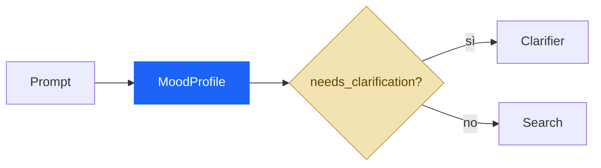

La mossa importante non è «usare Pydantic». È **rendere la decisione rappresentabile**.

Finché la differenza fra «sono stanco» e «voglio ballare» vive soltanto nel testo, il control flow resta affidato al ragionamento del modello. Quando diventa `current_energy != desired_energy` e `intent="shift"`, una parte del controllo può uscire dal prompt ed entrare nel codice.

### Supervisor: la decisione richiede ancora giudizio

Un supervisor serve quando non basta leggere un campo.

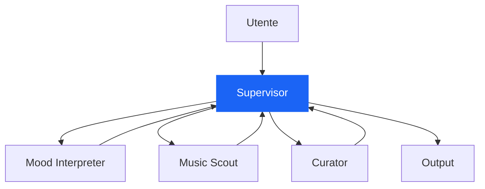

Il supervisor conserva il filo della conversazione, decide quale specialista chiamare, riceve il risultato e può delegare di nuovo.

```python
# [PSEUDOCODICE]

while not state.done:
    decision = supervisor.decide(
        goal=state.goal,
        current_state=state.summary,
        pending=state.pending,
        available_workers=registry,
    )

    result = await registry[decision.worker].run(decision.task)
    state.record(result)
```

Il costo è evidente: un'altra inferenza, un altro punto di non determinismo, più latenza. Perciò la domanda corretta non è «posso usare un supervisor?», ma:

> **C'è ancora qualcosa da negoziare?**

Se la risposta è già dentro uno schema, il supervisor è un modo costoso per leggere un campo.

### Handoff: cambia il proprietario del prossimo turno

Nella delegation il manager resta l'interlocutore. Nell'handoff il controllo passa allo specialista.

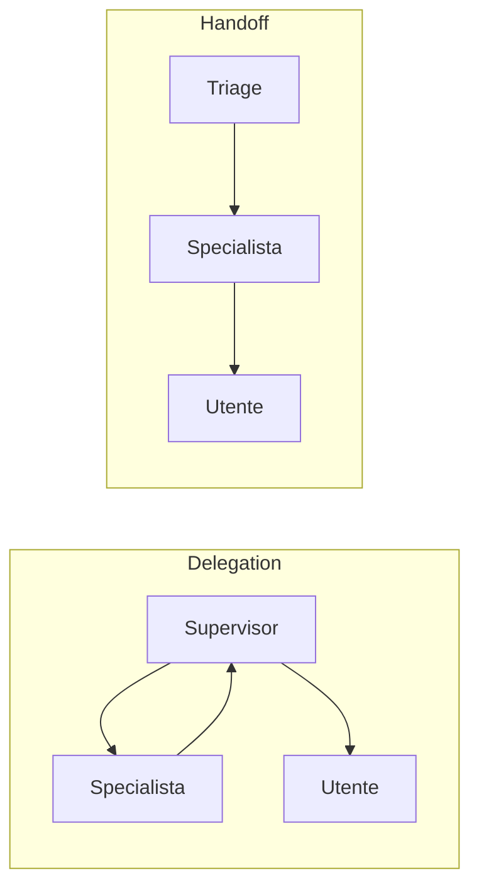

OpenAI Agents SDK distingue esplicitamente queste due topologie: *agents as tools* quando il manager mantiene il controllo; *handoffs* quando lo specialista prende in carico la parte successiva dell'interazione.[^openai-multi-agent][^openai-handoffs]

La differenza si può ricordare così:

```text
Delegation → cambia chi lavora.
Handoff    → cambia chi possiede il controllo.
```

---

## 5. Un handoff è un contratto

Nei diagrammi l'handoff è una freccia. Nei sistemi veri è un confine.

Il passaggio ingenuo è questo:

```python
# [ANTI-PATTERN]
await specialist.run(full_history)
```

Il passaggio progettato assomiglia di più a questo:

```python
# [REFERENCE DESIGN]

class HandoffContract(BaseModel):
    goal: str
    reason: str
    relevant_state: dict
    constraints: list[str]
    artifact_refs: list[str]
    expected_output: str
    return_policy: Literal["return_to_supervisor", "own_conversation"]
```

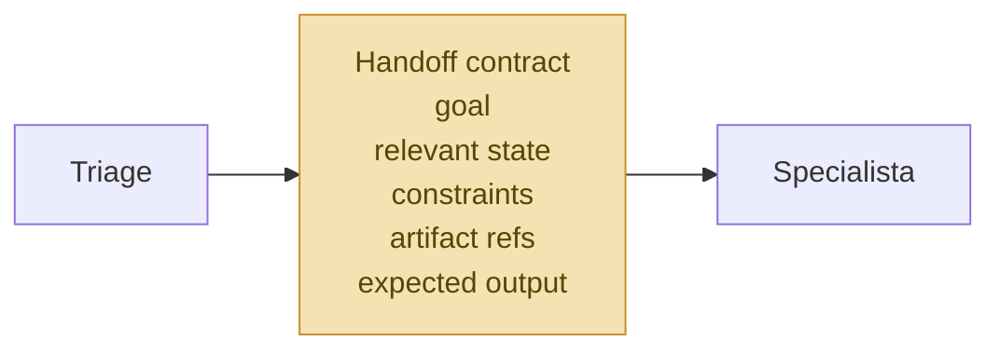

Qui diventano visibili due decisioni che spesso vengono confuse:

1. **chi possiede il controllo;**
2. **quale informazione attraversa il confine.**

LangChain/LangGraph tratta gli handoff come transizioni guidate dallo stato e permette di filtrare ciò che il nuovo agente riceve. Anche i subgraph hanno schemi di input e output separabili dallo stato del parent graph.[^langchain-handoffs][^langgraph-subgraphs]

La conseguenza è importante: un handoff non dovrebbe passare «tutto, per sicurezza». Dovrebbe passare ciò che serve a lavorare senza costringere lo specialista a ricostruire il mondo.

---

## 6. Chi fa cosa?

A questo punto sappiamo chi prende le decisioni. Resta da distribuire il lavoro.

### Tool, worker, subagent

Sono tre cose diverse.

Un **tool** espone una capacità. Non possiede un obiettivo e non decide il passo successivo.

Un **worker** riceve un compito circoscritto e restituisce un risultato.

Un **subagent** è un worker con un proprio ciclo di ragionamento, un contesto locale e, spesso, strumenti propri.

```mermaid
flowchart TB
    S[Supervisor]
    S --> T[Tool<br/>search_catalog(query)]
    S --> W[Worker<br/>esegui task definito]
    S --> A[Subagent<br/>goal + context + tools + loop]
```

La distinzione serve perché un tool non ha bisogno di una personalità. E un subagent non dovrebbe essere usato per mascherare una funzione che non abbiamo voglia di scrivere.

### Parallelismo: prima le dipendenze

Tre ricerche possono lavorare in parallelo soltanto se non dipendono l'una dall'altra.

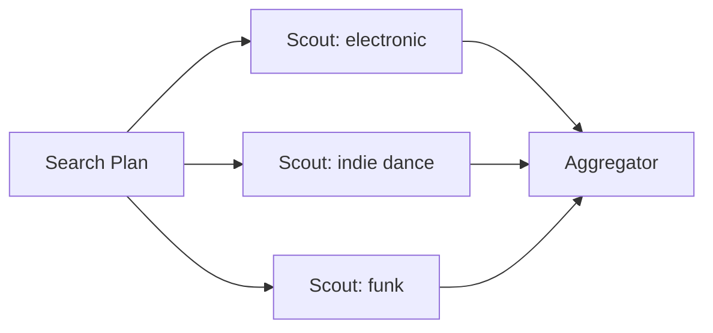

```python
# [REFERENCE DESIGN]

results = await asyncio.gather(
    scout.run(SearchTask(genre="electronic", ...)),
    scout.run(SearchTask(genre="indie-dance", ...)),
    scout.run(SearchTask(genre="funk", ...)),
)

candidates = aggregate(results)
```

Se invece B richiede l'output di A, il fan-out è soltanto un disegno piacevole.

```text
A → B → C        dipendenza: sequenza

A → {B, C, D}    indipendenza: parallelismo possibile
```

Nel febbraio 2026 Anthropic ha raccontato un esperimento con sedici agenti Claude che lavoravano in parallelo su un compilatore C. L'esperimento mostra quanto può crescere la capacità quando il lavoro è divisibile e l'ambiente condiviso rende visibili progressi e test; mostra anche quanto rapidamente salgano costo e complessità operativa.[^anthropic-c-compiler]

La lettura giusta non è «sedici agenti funzionano». È:

> **Quale struttura del problema ha reso possibile farli lavorare senza calpestarsi?**

Simon Willison propone una cautela simile: il parallelismo aiuta quando i file o i sottocompiti sono indipendenti; i subagent restano soprattutto un meccanismo per proteggere il contesto principale e confinare operazioni verbose.[^simon-subagents]

---

## 7. Chi sa cosa?

Qui arriviamo al nodo che nel 2026 pesa quasi quanto l'orchestrazione stessa: il **context engineering**.

L'errore più comodo consiste nel dare a ogni agente l'intera conversazione, l'intero stato e tutti gli strumenti. Sembra prudente. In realtà sposta il problema: invece di rischiare che manchi un'informazione, costringiamo ogni componente a distinguere ciò che conta da una massa di dettagli che non gli appartengono.

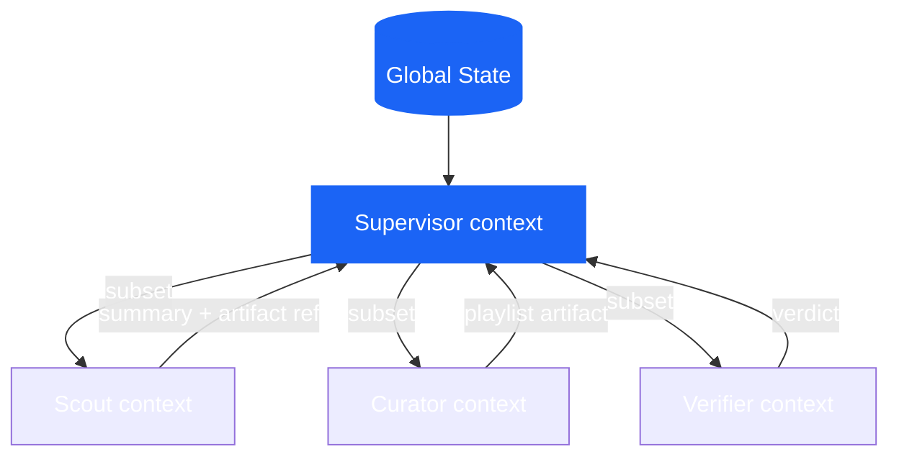

Nel nostro esempio:

```text
SUPERVISOR
──────────
richiesta utente
MoodProfile
piano corrente
riepiloghi dei worker
failure globali

SCOUT
──────────
SearchTask
range energetico
generi esclusi
catalog tools

CURATOR
──────────
PlaylistRequest
CandidateSet
criteri di composizione

VERIFIER
──────────
playlist prodotta
vincoli
rubrica di valutazione
```

La regola «contesto minimo sufficiente» non significa amputare informazione a caso. Significa riconoscere che il contesto è una forma di **memoria di lavoro**: limitata, costosa e sensibile al rumore.

Anthropic ha formalizzato questa idea nel 2025 parlando di context engineering: selezionare, mantenere e aggiornare l'insieme di token che massimizza la probabilità del comportamento desiderato. Nel 2026 quel principio si ritrova dentro subagent, sessioni persistenti, artefatti e harness long-running.[^anthropic-context]

### Il paradosso del contesto condiviso

Passare poco contesto produce omissioni. Passarne troppo produce interferenza.

Jason Liu, raccontando la posizione di Cognition sui multi-agent per il coding, usa l'immagine del telefono senza fili: ogni passaggio può perdere decisioni implicite e produrre componenti incompatibili. È una fonte del 2025, quindi non la userei per descrivere da sola lo stato dell'arte; rimane però una delle formulazioni più nitide del rischio di context loss fra agenti.[^jason-cognition]

Il punto non si risolve con «passiamo tutto a tutti». I worker paralleli possono comunque prendere decisioni incompatibili, e il contesto globale può diventare troppo grande. La soluzione matura consiste nel rendere espliciti:

- lo stato che deve essere condiviso;
- le decisioni che devono diventare contratti;
- le informazioni che possono restare locali;
- il formato con cui i risultati risalgono.

---

## 8. Stato, memoria e artefatti

Nel linguaggio degli agenti, *memory* viene usato per indicare troppe cose. Conviene rimetterle in fila.

### Conversation state

È ciò che serve a mantenere continuità nell'interazione: messaggi, turni, identità dell'agente attivo, richieste pendenti.

### Task state

È lo stato operativo del lavoro:

```python
# [REFERENCE DESIGN]

class WorkflowState(BaseModel):
    request: PlaylistRequest
    search_plan: SearchPlan | None = None
    candidate_artifacts: list[str] = []
    playlist_artifact: str | None = None
    verification: VerificationResult | None = None
    retries: dict[str, int] = {}
    status: Literal["running", "waiting", "failed", "done"] = "running"
```

### Local state

È ciò che appartiene a uno specialista e non deve per forza risalire:

```python
class ScoutLocalState(BaseModel):
    attempted_queries: list[str]
    visited_track_ids: set[str]
    raw_tool_outputs: list[str]
```

### Artifact

È un prodotto persistente del lavoro: file, report, patch, tabella, playlist, dataset, piano.

Quando l'output è grande, passare un riferimento è spesso più sano che reiniettare tutto nel prompt.

```python
# [REFERENCE DESIGN]

return WorkerResult(
    summary="Trovati 84 candidati, 61 dopo i filtri.",
    artifact_ref="artifacts/run-284/candidate_set.json",
    warnings=["catalogo funk poco coperto"],
)
```

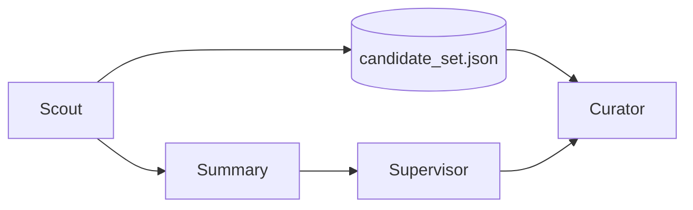

L'artefatto conserva fedeltà. Il riepilogo conserva spazio nel contesto.

È un equilibrio molto più solido del tentativo di trasformare ogni passaggio in un messaggio sempre più lungo.

---

## 9. Chi controlla?

Fin qui abbiamo distribuito il lavoro. Ora dobbiamo evitare che il sistema confonda «ho prodotto qualcosa» con «ho finito».

La verifica moderna ha almeno tre strati.

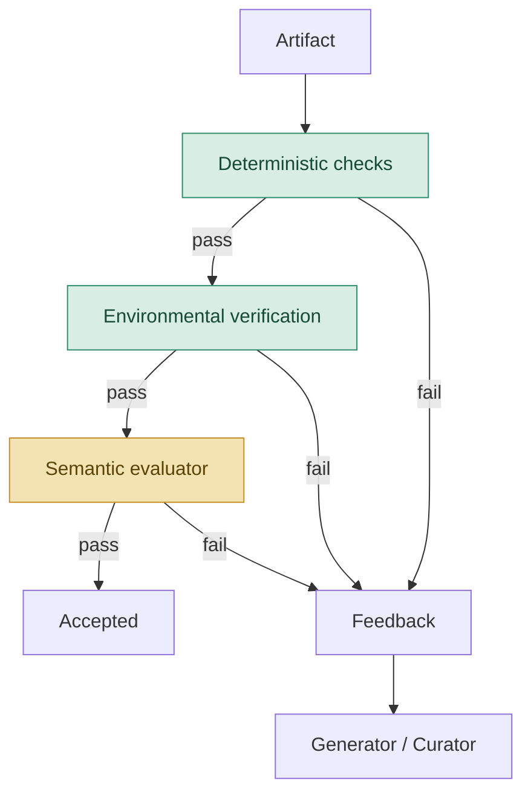

### 9.1 Controlli deterministici

Se una proprietà si può verificare in Python, non serve chiedere a un LLM.

```python
# [REFERENCE DESIGN]

def hard_checks(playlist: Playlist, request: PlaylistRequest) -> CheckResult:
    errors = []

    if len(playlist.track_ids) != len(set(playlist.track_ids)):
        errors.append("duplicate_tracks")

    forbidden = set(request.excluded_genres)
    if any(track.genre in forbidden for track in playlist.tracks):
        errors.append("excluded_genre")

    if not energy_curve_matches(
        playlist.tracks,
        start=request.current_energy,
        target=request.desired_energy,
    ):
        errors.append("energy_curve")

    return CheckResult(passed=not errors, errors=errors)
```

### 9.2 Verifica nell'ambiente

Un agente può dire di aver creato una playlist. La domanda è se la playlist esista davvero nel sistema esterno.

```python
# [PSEUDOCODICE]

playlist_id = spotify.create_playlist(payload)

assert spotify.get_playlist(playlist_id).track_ids == payload.track_ids
```

Anthropic distingue con precisione transcript e outcome: il primo è ciò che l'agente ha detto e fatto; il secondo è lo stato finale dell'ambiente. Un eval robusto tende a preferire l'outcome quando è osservabile.[^anthropic-evals]

### 9.3 Valutazione semantica

Rimane poi ciò che non si lascia ridurre a un'asserzione netta:

- la playlist racconta una transizione coerente?
- la selezione è varia senza sembrare casuale?
- il risultato interpreta bene la tensione fra stanchezza e desiderio di ballare?

Qui un evaluator separato può aggiungere valore.

```python
# [REFERENCE DESIGN]

class SemanticEvaluation(BaseModel):
    mood_coherence: float
    transition_quality: float
    rationale: str
    passed: bool
```

Il principio non è «servono sempre due agenti». Anthropic, nel lavoro del marzo 2026 su planner, generator ed evaluator, mostra che separare chi produce da chi giudica può correggere la tendenza all'autocompiacimento. Lo stesso articolo mostra però anche un'altra cosa: il beneficio dipende dal compito e dal modello, mentre costo e latenza possono crescere di un ordine di grandezza.[^anthropic-harness-2026]

In uno degli esperimenti descritti, il sistema completo ha lavorato per circa sei ore e consumato circa 200 dollari, contro venti minuti e 9 dollari del singolo agente. La qualità era superiore, ma il conto ci ricorda che un evaluator deve guadagnarsi il proprio posto esattamente come gli altri agenti.[^anthropic-harness-2026]

### Un ciclo ha bisogno di un freno

```python
# [REFERENCE DESIGN]

for revision in range(MAX_REVISIONS + 1):
    playlist = await curator.run(request, feedback=feedback)

    hard = hard_checks(playlist, request)
    if not hard.passed:
        feedback = hard.to_feedback()
        continue

    semantic = await evaluator.run(playlist, request)
    if semantic.passed:
        return playlist

    feedback = semantic.rationale

raise VerificationFailed("revision budget exhausted")
```

Senza criteri, budget e stop condition, evaluator-optimizer è soltanto una conversazione circolare fra modelli.

---

## 10. Evals: il sistema va misurato intero

Gli eval per agenti non possono limitarsi alla risposta finale.

Anthropic propone una terminologia utile:

- **task**: il singolo caso di test;
- **trial**: un tentativo, da ripetere perché il sistema è stocastico;
- **grader**: la logica che assegna un giudizio;
- **transcript / trace / trajectory**: la storia completa del trial;
- **outcome**: lo stato finale dell'ambiente;
- **evaluation harness**: l'infrastruttura che esegue, registra e valuta.[^anthropic-evals]

Nel running example, una suite sensata non dovrebbe chiedere soltanto «ha prodotto una playlist?». Dovrebbe definire una semantica diversa per ogni richiesta.

```yaml
# [REFERENCE DESIGN]

tasks:
  - id: E01
    prompt: "Sono stanco, ma voglio ballare."
    expected:
      - coherent_shift_or_clarification

  - id: E02
    prompt: "Sorprendimi."
    expected:
      - exploration_branch

  - id: E03
    prompt: "Fammi allenare, ma niente techno."
    expected:
      - no_excluded_genres

  - id: E04
    prompt: "Voglio una playlist energica per la palestra."
    expected:
      - valid_high_energy_playlist

  - id: E05
    prompt: "Che ore sono?"
    expected:
      - out_of_domain
```

Poi si osservano dimensioni differenti:

```text
OUTCOME
playlist creata?
vincoli rispettati?
side effect corretto?

TRAJECTORY
router corretto?
handoff necessario?
tool ridondanti?
loop terminato?

EFFICIENZA
latenza
costo
token
tool call
retry

AFFIDABILITÀ
pass@1
pass^k
tasso di recovery
fallimenti silenziosi
```

Hamel Husain insiste su una distinzione che vale la pena portarsi dietro: errori differenti richiedono tassonomie differenti. Chiamare tutto «hallucination» rende invisibili i guasti che contano. La pratica utile parte dalla lettura dei trace, costruisce un vocabolario degli errori e calibra gli evaluator contro giudizi umani.[^hamel-evals]

### Non premiare un percorso rigido

Un eval troppo prescrittivo rischia di bocciare una soluzione valida soltanto perché il modello ha trovato una strada diversa. Quando possibile, verifica l'outcome e usa la traiettoria per individuare comportamenti rischiosi, sprechi o violazioni di policy, senza trasformare ogni tool call in un copione obbligatorio.

---

## 11. Il mondo va storto

Un sistema multiagentico non è definito soltanto dal percorso felice. È definito da ciò che succede quando un nodo non fa il proprio dovere.

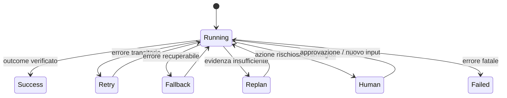

Conviene distinguere almeno queste famiglie.

### Output formalmente invalido

```python
# [PSEUDOCODICE]

try:
    profile = await mood_interpreter.run(prompt)
except ValidationError:
    if retry_budget.consume("mood_interpreter"):
        profile = await mood_interpreter.run(prompt, repair=True)
    else:
        return clarification_fallback()
```

### Output valido ma semanticamente incerto

Non è un'eccezione. È uno stato.

```python
if profile.needs_clarification:
    return transition_to("clarifier")
```

### Tool esterno non disponibile

```python
try:
    tracks = await remote_catalog.search(query)
except TransientToolError:
    tracks = local_catalog.search(query)
    state.warnings.append("remote_catalog_unavailable")
```

### Successo parziale

```text
Scout A ✓
Scout B timeout
Scout C ✓
```

Le opzioni non sono soltanto «tutto fallisce» o «facciamo finta di niente».

```python
# [REFERENCE DESIGN]

if successful_workers >= minimum_required:
    continue_with_partial_results(warnings=failed_workers)
elif retry_budget.available:
    retry(failed_workers)
else:
    escalate_or_abort()
```

### Idempotenza e side effect

Un retry innocuo su una ricerca read-only è diverso da un retry sulla creazione della playlist.

```python
# [REFERENCE DESIGN]

spotify.create_playlist(
    payload,
    idempotency_key=state.run_id,
)
```

Senza idempotenza, un errore di rete dopo il side effect può produrre due playlist identiche. Nei sistemi multiagentici il problema peggiora, perché più worker possono credere di essere autorizzati a scrivere.

Una policy semplice è il **single writer**: molti agenti possono proporre, uno soltanto può modificare lo stato esterno.

---

## 12. Blast radius e human-in-the-loop

Quando un agente può soltanto leggere un catalogo musicale, il danno massimo è contenuto. Quando un agente può effettuare un rollback in produzione, la stessa architettura diventa un'altra faccenda.

Il rischio operativo può essere letto come:

```text
rischio ≈ probabilità di errore × danno massimo possibile
```

Migliorare il modello riduce, forse, il primo termine. Le permission e l'isolamento limitano il secondo.

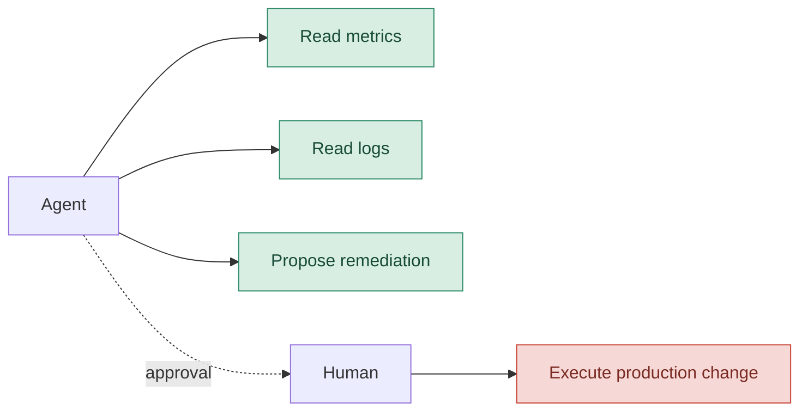

Anthropic, nel maggio 2026, ha descritto il containment come un problema di limitazione del blast radius: non soltanto sorvegliare ciò che il modello tende a fare, ma restringere ciò che l'ambiente gli permette materialmente di fare. L'articolo segnala anche l'approvazione automatica o distratta come limite del semplice human-in-the-loop: troppi prompt di permesso producono approval fatigue.[^anthropic-containment]

Microsoft Agent Framework tratta le richieste di approvazione e informazione come eventi sospendibili del workflow; lo stato pendente può essere incluso nei checkpoint e riemesso dopo il ripristino.[^microsoft-hitl]

Da qui una regola pratica:

> **Il controllo umano va collocato nei punti di rischio, non distribuito come una pioggia di finestre modali.**

---

## 13. Quando il lavoro dura più della conversazione

I task brevi possono vivere in una singola context window. I task lunghi no.

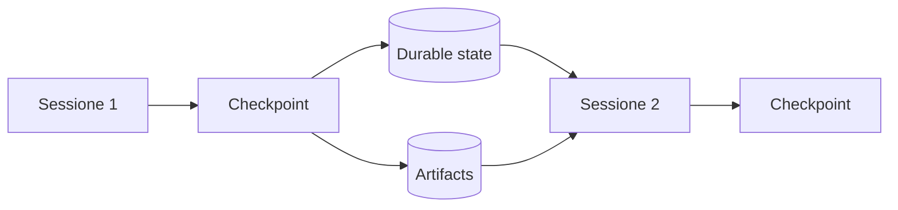

Qui entrano quattro tecniche differenti.

### Compaction

La storia precedente viene riassunta e la stessa sessione continua. Conserva continuità, ma il riepilogo può perdere dettagli e il contesto resta una stratificazione di decisioni vecchie.

### Context reset

Si avvia un contesto pulito e si passa uno structured handoff. Costa di più, ma elimina residui e «ansia da contesto» osservata in alcuni modelli.

### Checkpoint

Si salva lo stato operativo in modo da poter riprendere dopo crash, pausa umana o manutenzione.

### Artifact persistence

Il lavoro non viene affidato soltanto alla memoria conversazionale. File, test, piani e risultati restano disponibili fuori dal prompt.

```python
# [REFERENCE DESIGN]

checkpoint = Checkpoint(
    goal=state.goal,
    completed=state.completed_tasks,
    pending=state.pending_tasks,
    decisions=state.key_decisions,
    artifact_refs=state.artifact_refs,
    failures=state.failure_log,
    active_requests=state.pending_human_requests,
)

checkpoint_store.save(checkpoint)
```

Anthropic ha mostrato nel marzo 2026 un harness a tre agenti per applicazioni long-running: planner, generator ed evaluator, con contratti e file usati come artefatti di comunicazione. Un dettaglio istruttivo è che, con modelli successivi, alcune parti del vecchio harness sono diventate zavorra e sono state rimosse. L'harness non è una cattedrale: è un'ipotesi sui limiti del modello corrente.[^anthropic-harness-2026]

---

## 14. Dal sistema di agenti all'harness

Nel 2026 la parola più interessante non è forse *multi-agent*. È *harness*.

L'harness è ciò che circonda il modello e trasforma un'inferenza in un sistema operativo:

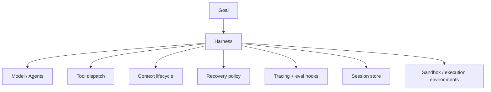

OpenAI, nel proprio lavoro sull'harness engineering, racconta un prodotto costruito con agenti Codex, test automatizzati, osservabilità leggibile dal modello e ambienti isolati per task. Il punto interessante non è il numero di righe prodotte; è il cambio di mestiere: gli esseri umani progettano ambiente, intenti e feedback loop, mentre gli agenti eseguono.[^openai-harness]

Ad aprile 2026 OpenAI ha esteso Agents SDK con un harness più capace per lavori su file e tool, sandbox native e separazione fra harness e compute per sicurezza, durabilità e scala.[^openai-sdk-2026]

Anthropic, con Managed Agents, propone una separazione molto nitida:

```text
SESSION
append-only log di ciò che è accaduto

HARNESS
loop che chiama il modello e instrada i tool

SANDBOX
ambiente in cui il lavoro viene eseguito
```

La separazione consente a ciascun elemento di fallire, cambiare o scalare indipendentemente. È la versione infrastrutturale della stessa domanda che ci accompagna dall'inizio: chi possiede quale responsabilità?[^anthropic-managed]

### Molti cervelli, molte mani

La metafora usata da Anthropic è efficace. Il «cervello» è modello più harness; le «mani» sono sandbox e strumenti. Disaccoppiarli consente a più harness di usare ambienti diversi, o allo stesso harness di inviare lavoro a più execution environment, senza trasformare ogni sessione in un server indivisibile.[^anthropic-managed]

Questo non implica che ogni applicazione debba costruire un meta-harness. Significa che, appena il lavoro diventa lungo e operativo, il confine fra ragionamento, stato ed esecuzione smette di essere un dettaglio.

---

## 15. MCP e A2A: due problemi differenti

Nel rumore dei protocolli è facile confondere le sigle.

### MCP

Model Context Protocol collega un modello o un agente a strumenti, dati e risorse. La relazione tipica è:[^mcp]

```text
agent ↔ tool / data source
```

### A2A

Agent2Agent riguarda l'interoperabilità fra agenti o servizi agentici separati, con capability discovery, task e scambio di artefatti.

```text
agent service ↔ agent service
```

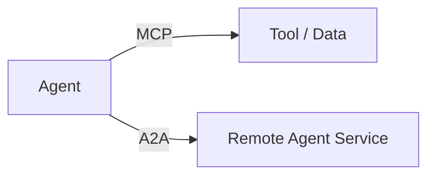

A2A non rende più intelligente un sistema nello stesso processo. Risolve un confine organizzativo e infrastrutturale: agenti remoti, stack differenti, ownership separata, memoria non condivisa.[^a2a]

Nel running example Spotify, introdurlo ora sarebbe complessità pagata in anticipo. Diventerebbe pertinente se il catalogo, il curator e il sistema di creazione playlist fossero servizi autonomi gestiti da team o vendor differenti.

---

## 16. Quando una decisione diventa un edge

A un certo punto il sistema contiene:

- stato tipizzato;
- nodi;
- transizioni condizionali;
- fan-out e fan-in;
- loop di revisione;
- checkpoint;
- richieste umane;
- condizioni di arresto.

Non serve più cercare una metafora. Abbiamo costruito un grafo.

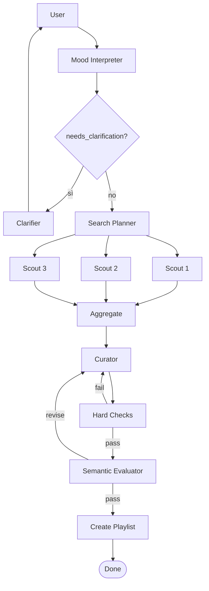

La transizione concettuale è questa:

```text
Agent thinking:
«Quale strumento dovrei chiamare?»

Graph thinking:
«Quale nodo è eseguibile, dato lo stato corrente?»
```

Le due cose convivono. Un nodo del grafo può contenere un agente, una funzione, un tool wrapper o una richiesta umana.

Microsoft Agent Framework espone workflow graph-based con executor, edge condizionali, parallelismo, checkpoint e HITL. LangGraph costruisce attorno a `State`, node, edge, reducer, subgraph, interrupt e persistence. Le API cambiano; la grammatica resta.[^microsoft-workflows][^langgraph-persistence][^langgraph-interrupts]

---

## 17. La reference architecture Spotify

Ora possiamo rimettere insieme i pezzi.

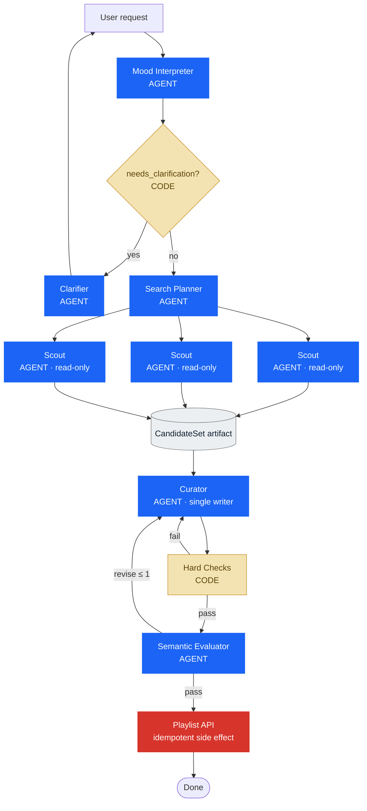

La cosa più importante del diagramma non è il numero di agenti.

È che **non tutti i riquadri sono agenti**.

Il gate è codice. I controlli duri sono codice. L'artefatto è stato persistente. Gli scout sono read-only. Il curator è l'unico writer. Il side effect ha un confine e una policy di idempotenza.

Ogni componente si è guadagnato il proprio posto perché risolve un problema che avevamo già incontrato.

### Il runtime, in pseudocodice

```python
# [REFERENCE DESIGN - PSEUDOCODICE]

async def build_playlist(user_request: str) -> Playlist:
    profile = await mood_interpreter.run(user_request)

    if profile.needs_clarification:
        return await clarifier.run(profile)

    request = PlaylistRequest.from_profile(profile)
    plan = await search_planner.run(request)

    worker_results = await gather_with_policy(
        tasks=[scout.run(task) for task in plan.independent_tasks],
        minimum_successes=2,
        retry_budget=1,
    )

    candidate_artifact = persist(
        aggregate(worker_results)
    )

    feedback = None
    for revision in range(2):
        playlist = await curator.run(
            request=request,
            candidates=candidate_artifact,
            feedback=feedback,
        )

        hard = hard_checks(playlist, request)
        if not hard.passed:
            feedback = hard.to_feedback()
            continue

        semantic = await evaluator.run(playlist, request)
        if semantic.passed:
            return await create_playlist_idempotently(playlist)

        feedback = semantic.rationale

    raise VerificationFailed()
```

Questa implementazione completa **non è ancora presente nel repository della lezione**. Il repository verificato copre il monolite e lo structured routing; il resto è una reference architecture coerente con il percorso didattico.

---

## 18. Cosa sta convergendo nel 2026

Fonti e framework non concordano su un'unica architettura vincente. Sarebbe sospetto il contrario. Stanno però convergendo su alcuni principi.

### 1. La semplicità viene prima della decomposizione

Il multi-agent non è un premio di complessità. Anthropic continua a raccomandare la soluzione più semplice che migliori gli outcome; il lavoro 2026 sugli harness mostra persino componenti rimossi quando modelli più capaci li hanno resi superflui.[^anthropic-harness-2026]

### 2. Il contesto è un oggetto di progetto

Subagent, state schema, artifact e handoff non sono decorazioni. Sono modi per controllare ciò che ogni componente vede e ciò che viene perso nei passaggi.[^anthropic-context][^simon-subagents]

### 3. Il controllo deve essere localizzato

Router, supervisor e handoff non sono sinonimi. Il primo legge uno stato, il secondo ragiona e conserva ownership, il terzo trasferisce ownership.

### 4. La verifica deve toccare l'ambiente

Runtime evidence, unit test, stato del database, browser, metriche e log valgono più di una dichiarazione del modello. OpenAI descrive agenti che interrogano trace e metriche per verificare il proprio lavoro; Anthropic distingue nettamente transcript e outcome.[^openai-harness][^anthropic-evals]

### 5. Lo stato deve sopravvivere al prompt

Checkpoint, sessioni append-only e artefatti persistenti rendono possibile riprendere, ispezionare e correggere il lavoro long-running.[^anthropic-managed][^microsoft-hitl]

### 6. Il rischio si gestisce con confini deterministici

Permission, read-only worker, single writer, sandbox ed egress control limitano il danno anche quando il modello sbaglia o viene ingannato.[^anthropic-containment]

### 7. Il modello e l'harness vanno valutati insieme

Quando diciamo «l'agente ha ottenuto questo risultato», stiamo misurando modello, prompt, tool, memoria, orchestrazione e ambiente. Cambiare il modello senza riesaminare l'harness è tanto ingenuo quanto cambiare l'harness senza rieseguire gli eval.[^anthropic-evals][^anthropic-managed]

---

## 19. Una grammatica per progettare

Alla fine, i pattern servono meno delle domande.

### Chi decide?

- La decisione è già rappresentata nello stato? Usa codice o routing deterministico.
- Richiede giudizio sul contesto? Valuta un supervisor.
- Deve cambiare l'interlocutore? Usa un handoff.

### Chi sa cosa?

- Qual è il contesto minimo sufficiente?
- Quali decisioni devono diventare campi tipizzati?
- Quali dettagli possono restare locali?
- Quali risultati devono risalire come summary e quali come artifact?

### Chi fa cosa?

- Questa responsabilità richiede autonomia?
- Può essere una funzione?
- Può essere un tool?
- I sottocompiti sono indipendenti?
- Esiste un solo writer per i side effect?

### Chi controlla?

- Quali proprietà sono verificabili in codice?
- Quale stato dell'ambiente prova il successo?
- Dove serve un giudizio semantico?
- Il ciclo di revisione ha un budget?

### Chi tiene in piedi il sistema?

- Come si salva lo stato?
- Come si riprende dopo un crash o un'approvazione umana?
- Quali retry sono idempotenti?
- Qual è il blast radius di ogni agente?
- Posso ricostruire l'intera traiettoria?

Una checklist minimale può stare in poche righe:

```text
[ ] Ogni agente ha una responsabilità che richiede autonomia.
[ ] Le decisioni deterministiche sono fuori dal prompt.
[ ] Gli handoff hanno un contratto.
[ ] Lo stato globale e quello locale sono separati.
[ ] Il parallelismo segue le dipendenze, non l'entusiasmo.
[ ] I side effect hanno ownership e idempotenza.
[ ] Gli outcome sono verificati nell'ambiente.
[ ] Retry, fallback, escalation e stop sono espliciti.
[ ] Trace ed eval misurano il sistema, non solo l'ultima risposta.
[ ] L'harness viene semplificato ogni volta che il modello cambia.
```

---

## 20. Un laboratorio interattivo

Per rendere visibili i compromessi ho preparato anche un simulatore didattico separato. Permette di modificare prevedibilità del percorso, ambiguità semantica, parallelizzabilità, rischio dei side effect, durata e presenza di confini remoti.

Il simulatore non è un benchmark. Usa un modello trasparente e volutamente semplice per mostrare come alcune scelte spostino costo, latenza, osservabilità e blast radius.

```html
<iframe
  src="./simulatore_architetture_multiagent.html"
  title="Architecture Lab: dove mettere l'autonomia?"
  width="100%"
  height="900"
  loading="lazy"
  style="border:0;border-radius:16px;overflow:hidden"
></iframe>
```

Fallback statico:

```mermaid
flowchart LR
    P[Problema] --> Q1{Percorso noto?}
    Q1 -->|sì| W[Workflow]
    Q1 -->|no| Q2{Decisione rappresentabile?}
    Q2 -->|sì| R[Router + graph]
    Q2 -->|no| S[Supervisor]
    S --> Q3{Ownership cambia?}
    Q3 -->|sì| H[Handoff]
    Q3 -->|no| D[Delegation]
```

---

## Conclusione

Siamo partiti da un agente con cinque tool. Non era una cattiva architettura. Era semplicemente un'architettura nella quale troppe decisioni rimanevano implicite.

Abbiamo separato lo stato dal testo, il controllo dal lavoro, la verifica dalla generazione e l'esecuzione dalla sessione. Ogni volta abbiamo aggiunto struttura soltanto quando il sistema precedente mostrava una crepa.

Questo, secondo me, è il modo più sano di pensare ai sistemi multiagentici nel 2026.

La domanda non è «quanti agenti posso far collaborare?». È:

> **Dove deve stare l'intelligenza, e dove invece serve struttura?**

Quando la decisione è nota, scrivila. Quando il risultato è verificabile, testalo. Quando il lavoro è indipendente, parallelizzalo. Quando il contesto deve attraversare un confine, dagli una forma. Quando un agente può fare danni, restringi ciò che gli è concesso. E quando un componente non aggiunge più valore, toglilo.

Il resto è orchestrazione. E, come spesso accade, i nodi vengono al pettine proprio nei passaggi fra una scatola e l'altra.

---

## Fonti e note di lettura

Le fonti sono ordinate per funzione, non per prestigio. Gli engineering post e la documentazione ufficiale sostengono le descrizioni dei sistemi; i practitioner aggiungono esperienza sul campo; i lavori 2025 vengono usati quando introducono concetti ancora centrali nel 2026.

[^anthropic-engineering]: Anthropic, **Engineering at Anthropic**, indice aggiornato degli articoli 2024-2026: <https://www.anthropic.com/engineering>
[^anthropic-evals]: Anthropic, **Demystifying evals for AI agents**, 9 gennaio 2026: <https://www.anthropic.com/engineering/demystifying-evals-for-ai-agents>
[^anthropic-harness-2026]: Anthropic, **Harness design for long-running application development**, 24 marzo 2026: <https://www.anthropic.com/engineering/harness-design-long-running-apps>
[^anthropic-managed]: Anthropic, **Scaling Managed Agents: Decoupling the brain from the hands**, 8 aprile 2026: <https://www.anthropic.com/engineering/managed-agents>
[^anthropic-containment]: Anthropic, **How we contain Claude across products**, 25 maggio 2026: <https://www.anthropic.com/engineering/how-we-contain-claude>
[^anthropic-c-compiler]: Anthropic, **Building a C compiler with a team of parallel Claudes**, 5 febbraio 2026: <https://www.anthropic.com/engineering/building-c-compiler>
[^anthropic-context]: Anthropic, **Effective context engineering for AI agents**, 29 settembre 2025: <https://www.anthropic.com/engineering/effective-context-engineering-for-ai-agents>
[^openai-harness]: OpenAI, **Harness engineering: leveraging Codex in an agent-first world**, 11 febbraio 2026: <https://openai.com/index/harness-engineering/>
[^openai-sdk-2026]: OpenAI, **The next evolution of the Agents SDK**, 15 aprile 2026: <https://openai.com/index/the-next-evolution-of-the-agents-sdk/>
[^openai-multi-agent]: OpenAI Agents SDK, **Orchestrating multiple agents**: <https://openai.github.io/openai-agents-python/multi_agent/>
[^openai-handoffs]: OpenAI Agents SDK, **Handoffs**: <https://openai.github.io/openai-agents-python/handoffs/>
[^microsoft-workflows]: Microsoft Learn, **Microsoft Agent Framework Workflows**, aggiornato nel 2026: <https://learn.microsoft.com/en-us/agent-framework/workflows/>
[^microsoft-hitl]: Microsoft Learn, **Human-in-the-loop with Agent Framework Workflows**, aggiornato il 17 luglio 2026: <https://learn.microsoft.com/en-us/agent-framework/workflows/human-in-the-loop>
[^langchain-handoffs]: LangChain, **Handoffs**, documentazione multi-agent: <https://docs.langchain.com/oss/python/langchain/multi-agent/handoffs>
[^langgraph-subgraphs]: LangGraph, **Use subgraphs**: <https://docs.langchain.com/oss/python/langgraph/use-subgraphs>
[^langgraph-persistence]: LangGraph, **Persistence**: <https://docs.langchain.com/oss/python/langgraph/persistence>
[^langgraph-interrupts]: LangGraph, **Interrupts**: <https://docs.langchain.com/oss/python/langgraph/interrupts>
[^mcp]: Model Context Protocol, specifica ufficiale **2026-07-28**: <https://modelcontextprotocol.io/specification/2026-07-28>
[^a2a]: A2A Protocol, specifica ufficiale **v1.0**: <https://a2a-protocol.org/latest/>
[^simon-subagents]: Simon Willison, **Subagents - Agentic Engineering Patterns**, 17 marzo 2026: <https://simonwillison.net/guides/agentic-engineering-patterns/subagents/>
[^hamel-evals]: Hamel Husain, **Evals Skills for Coding Agents**, 3 marzo 2026: <https://hamelhusain.substack.com/p/evals-skills-for-coding-agents>
[^jason-cognition]: Jason Liu, **Why Cognition does not use multi-agent systems**, 11 settembre 2025: <https://jxnl.co/writing/2025/09/11/why-cognition-does-not-use-multi-agent-systems/>

### Altre letture utili

- OpenAI, **An open-source spec for Codex orchestration: Symphony**, 27 aprile 2026: <https://openai.com/index/open-source-codex-orchestration-symphony/>
- Anthropic, **AI Organizations Can Be More Effective but Less Aligned than Individual Agents**, 2026: <https://alignment.anthropic.com/2026/ai-organizations/>
- OpenAI Agents SDK, **Tracing**: <https://openai.github.io/openai-agents-python/tracing/>
- LangChain, **Multi-agent patterns**: <https://docs.langchain.com/oss/python/langchain/multi-agent/index>
