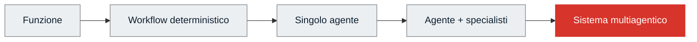
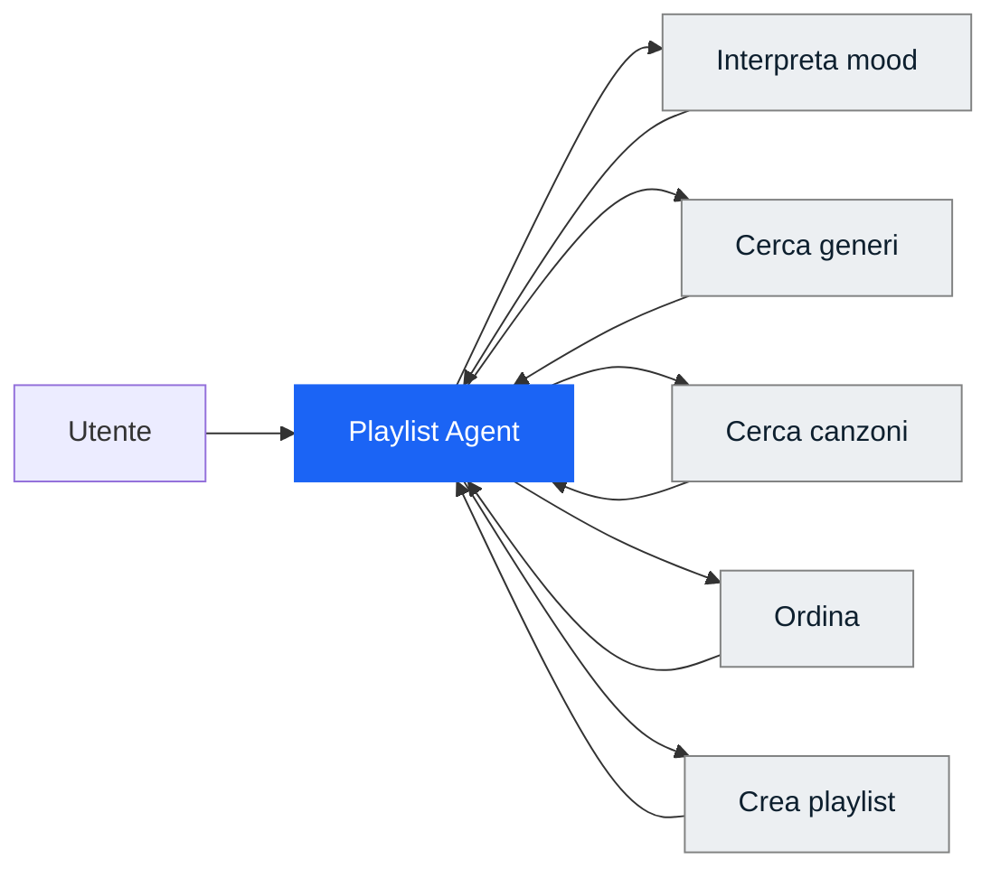
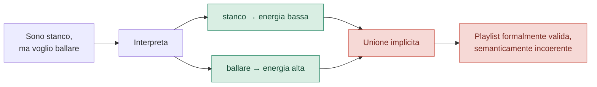
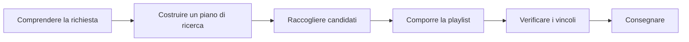
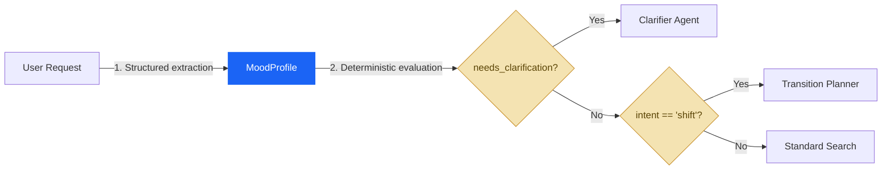
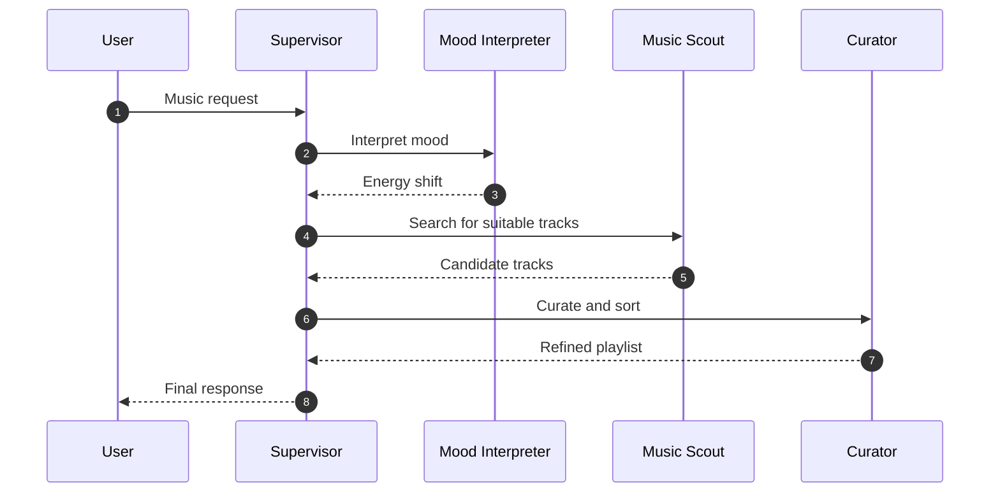
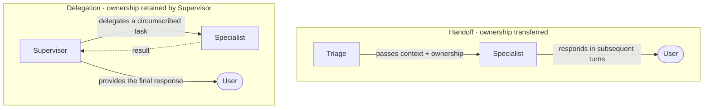
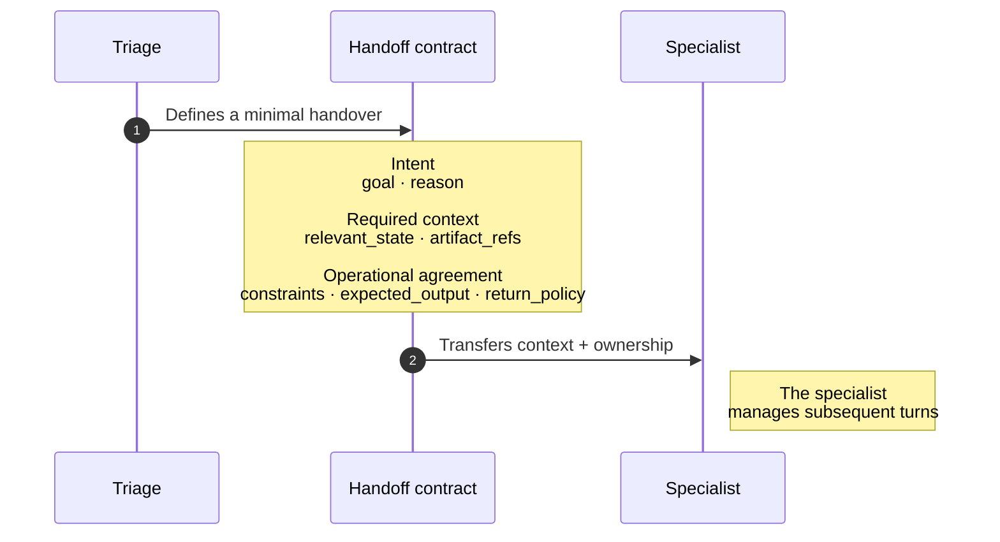

# Designing multi-agent systems in 2026 — Part 1

I’ve heard developers brag about designing multi-agent systems just to show off to their colleagues or to sell their solutions using "buzzwords." In this article, I want to dive deep into this topic rather than just stopping at how to build them. Because before designing such a complex system, it makes sense to ask whether it’s even worth defining it as one!

For this reason, before talking about swarms, supervisors, and handoffs, it’s worth taking a step back.

A multi-agent system isn't born when you put two models side-by-side. It isn't born when one agent calls another as if it were a tool. It is born when you decide to **distribute responsibility, context, and control** among components that can make partially autonomous decisions.

The important word here is *decide*. Because adding agents is not a goal. It is an **architectural choice** that must justify its own cost.

To keep the discussion grounded, we will use an example from a project I am building with Datapizza: a multi-agent system capable of detecting a user's mood and suggesting a playlist accordingly (incidentally, I’m listening to [radio Suno](https://suno.com/labs/live-radio) right now). Let’s start with a very simple and vague request from a potential user:

> **"I'm tired, but I want to dance."**

It’s a short sentence, but in just a few words, it contains a tension between two states and a decision to be made.

This article can be condensed into five questions:

1. **Who decides?**
2. **Who knows what?**
3. **Who does what?**
4. **Who checks that the work was done well?**
5. **Who keeps the system running when problems arise?**

In 2024, Anthropic primarily described routing, chaining, parallelization, orchestrator-workers, and evaluator-optimizer patterns ([Anthropic — Building effective agents](https://www.anthropic.com/engineering/building-effective-agents)). Far be it from me to say those patterns are obsolete; on the contrary, they remain absolutely valid.

In 2026, however, the documentation and case studies I’ll cite shortly dedicate much more attention to context lifecycle, contracts, artifacts, checkpoints, trajectory evals, sandboxes, containment, and harnesses ([Anthropic — Managed Agents](https://www.anthropic.com/engineering/managed-agents), [OpenAI — Agents SDK](https://openai.com/index/the-next-evolution-of-the-agents-sdk/), [Microsoft — Workflows](https://learn.microsoft.com/en-us/agent-framework/workflows/)).

> To be clear, this is a general synthesis of what I have read so far on various Substacks and official blogs; it is not an official, shared taxonomy.

## The simplest system that could work

Let’s start with the first question (probably the most uncomfortable one):

> **Why isn't a single agent enough?**

If the path is known in advance, a **workflow** is often sufficient. If a transformation is deterministic, a simple function might be enough. If a single agent can maintain context and use tools effectively, splitting the work only creates new points of failure.



Moving to the right means gaining flexibility, but also paying in terms of latency, cost, non-determinism, coordination, and observability.

A starting rule can be written like this:

```python
# [PSEUDOCODE]

def choose_architecture(problem):
    if problem.is_deterministic:
        return "function_or_workflow"

    if problem.path_is_known:
        return "graph_workflow"

    if problem.fits_one_context and problem.needs_one_owner:
        return "single_agent"

    return "consider_multi_agent"
```

Clearly, this isn't a universal formula—I’m no AI oracle. But it is enough to avoid the mistake of confusing system complexity with maturity. Believe me, they are not the same thing.

I’ll put myself in the shoes of a reader who, at this point, is asking:

> Okay Mirko, but when do I actually need these systems? When does it make sense to define sub-agents?

Simon Willison tries to answer this question on his blog: sub-agents are valuable primarily because they preserve the main context and absorb token-heavy operations. On the other hand, he warns that it is easy to unnecessarily fragment a task into many specialists ([Willison — Subagents](https://simonwillison.net/guides/agentic-engineering-patterns/subagents/)).

### An agent must earn its place

Before complicating your solution with an agentic approach, try to complete this sentence:

> "I am introducing an agent now because this component must ____________."

Plausible responses involve judgment, open-ended planning, dynamic tool usage, exploration, or interaction. If the response is "it must sort a list," "it must check for duplicates," or "it must choose a branch by reading a boolean," you are likely overcomplicating things.

You know that feeling when you go to the supermarket and buy more than you actually need? That is exactly what I am noticing in the agentic world!

To be clear, I am not saying that multi-agent systems don't make sense; I am just putting developers on alert because it is not a solution for everything. However, let's look at an interesting use case now.

## The Spotify monolith

Let's go back to our Spotify example. Let's start with the most natural system. An agent receives the request and has five tools at its disposal:

- interpret the mood;
- search for genres;
- search for songs;
- sort the results;
- generate the playlist.

> In the lesson I proposed, this translated into actual code:

```python
# Here is a nice monolith agent

return Agent(
    name="playlist_monolith",
    client=client,
    system_prompt=SYSTEM_PROMPT,
    tools=[
        interpreta_umore,
        cerca_generi_per_mood,
        cerca_canzoni_per_genere,
        ordina_canzoni,
        genera_playlist,
    ],
    max_steps=8,
)
```

Let's see what this agent does with a simple diagram:



At first glance, everything seems fine. The model reads "tired" and "dancing," finds two compatible genre families, retrieves the tracks, and builds a playlist.

Then you shift your focus, and the crack appears.

In some runs, the agent treats the two signals as independent searches, merges the results, and delivers a playlist containing both party tracks and relaxing tracks without having decided what relationship exists between the current state and the desired state.

The problem is not that the model failed to interpret the words well. It understood both of them. And it didn't choose a blatantly wrong tool, either. The failure lies elsewhere: **an important decision remained implicit!** Or rather, it didn't stop to ask the user, "Okay bro, but what do you actually want? Choose a path, otherwise it's going to be a bit of a mess!"



Okay, let's focus better on these two different ambiguities that the agent failed to see.

### Decision ambiguity

Who determines if the request describes:

- a contradiction to be clarified;
- a transition from low energy to high energy;
- a deliberately hybrid combination?

### Acceptance ambiguity

Who determines that the produced playlist is coherent enough to be delivered?

The monolith agent (i.e., one with only tools at its disposal) has a technical stopping condition: `max_steps=8` and a final tool. What it lacks is an **external definition of done**.

And this is where you start evaluating multi-agent systems. Not because five tools are too many in absolute terms (or too few—they could still get confused), but because the act of understanding, deciding, executing, and evaluating all coexist in the same decision-making center, which is "the head" of a single agent!

## Divide and conquer

Close your eyes and tell me what solution you are thinking of. Okay, open your eyes. I think the natural temptation at this point is to create four agents:

```text
Mood Agent
Decision Agent
Search Agent
Evaluation Agent
```

It seems orderly. But how do we manage the architecture, and what order do we set? First, you need to break down the **work**!



Then, for each step, we ask:

```python
# [PSEUDOCODE]

Task(
    goal=...,
    inputs=...,
    outputs=...,
    tools=...,
    context=...,
    side_effects=...,
    failure_policy=...,
    verification=...,
)
```

Only then do we decide which component should perform it.

Interpret intent           → LLM / agent
Read a boolean             → code
Search the catalog         → tool or worker
Sort by energy             → function
Compose a playlist         → agent, if judgment is required
Check for duplicates       → function
Judge coherence            → evaluator, if subjectivity remains

It is worth establishing this distinction:

> **Task decomposition and agent decomposition are not the same thing!!**

The Microsoft Agent Framework presents agents as potential participants and executors of functional or graph-based workflows ([Microsoft — Workflows](https://learn.microsoft.com/en-us/agent-framework/workflows/)).

Once we understand what we want, we need to determine who to assign each task to. I believe it is essential that **every node has a clear responsibility**.

## Who decides?

Once the work is mapped out, we must assign control.

In my experience, I have seen three patterns that are often confused, or rather, thought of as equivalent: routing, supervisor, and handoff. In reality, they answer different questions!

### Routing: do you already know what you want?

> **When to use it:** Use routing when the choice of the next step can be traced back to an explicit classification or a well-defined state (a typed field, a threshold, a boolean policy). The LLM simply analyzes the input and extracts the parameters; then, a simple deterministic algorithm in code (e.g., `if/else`) routes execution to the correct node.

> **When NOT to use it:** If the decision regarding the next step requires dynamically evaluating trade-offs, negotiating between agents, or re-evaluating the strategy based on partial results, use a **Supervisor**.

Routing is the most efficient pattern of all: it maximizes predictability, minimizes latency, and reduces LLM call costs by shifting control logic from the prompt to the application code.

Take our user who says: *«I'm tired, but I want to dance.»*

Instead of asking an agent to "decide what to do," we use a structured extraction schema (**Structured Outputs**):

```python
# [REFERENCE IMPLEMENTATION - PYTHON]
from pydantic import BaseModel, Field
from typing import Literal

class MoodProfile(BaseModel):
    current_energy: float = Field(..., description="Estimated user energy level (1-10)")
    desired_energy: float = Field(..., description="Desired user energy level (1-10)")
    intent: Literal["maintain", "shift", "explore"] = Field(
        ..., description="Maintain state, actively change it (shift), or explore new things"
    )
    needs_clarification: bool = Field(
        ..., description="True if the request is too vague or contradictory and requires clarifying questions"
    )
```

Once the LLM has extracted and validated this schema, the next step is decided by a deterministic Python function. There is no need for another generative inference:

```python
# The router is code, pure and simple. 100% deterministic and testable with pytest.
def determine_next_node(profile: MoodProfile) -> str:
    if profile.needs_clarification:
        return "clarifier_agent"
    if profile.intent == "shift":
        return "energy_transition_planner"
    return "standard_search_agent"
```



#### Why is this approach formidable?
1. **Zero decision latency**: Calculating the next path takes fractions of a millisecond.
2. **Ease of testing**: You can write traditional unit tests (`pytest`) to verify the routing logic across hundreds of user profiles without having to worry about hallucinations or model non-determinism at this stage.
3. **Less prompt overhead**: Downstream agents receive clean, pre-structured input (`MoodProfile`), freeing them from having to re-interpret the user's initial intentions.

### Supervisor: the decision remains fluid

> **When to use it:** Use a supervisor when the next step cannot be deduced from a deterministic rule and requires **continuous judgment**. The supervisor acts as a "Project Manager" or "Conductor": it evaluates the current state, dynamically chooses which specialist (worker) to activate, receives the output, updates the state, and decides the next step. It retains global ownership of the context and the conversation.

> **When NOT to use it:** If the sequence of steps is fixed (A -> B -> C) or if the branching choice depends on a known variable (e.g., a boolean in the database), use a deterministic workflow or a code-based Router. This will help you avoid latency, LLM call costs, and unnecessary non-determinism.

In practice, the Supervisor is useful when we need to coordinate various specialist agents whose interactions are not predictable in advance.

Let's take our Spotify example:
1. The user says: *"I'm tired, but I want to dance."*
2. The **Supervisor** receives the request and decides to consult the `Mood Interpreter`.
3. The `Mood Interpreter` returns a diagnosis: *"The user is fatigued but is looking for an active shift toward high energy."*
4. The **Supervisor** reads this diagnosis and dynamically decides that the next step is not yet to create the playlist, but to ask the `Music Scout` to search for transitional genres (e.g., soft Deep House).
5. If the `Scout` returns few results, the **Supervisor** does not fail: it decides to change strategy and activate a second Scout for alternative genres (e.g., rhythmic Funk).

This dynamic and adaptive flow cannot be easily mapped with a simple `if/else`.



#### Why is Context Ownership important?
Unlike a "handoff" (where control passes permanently to another agent and the conversation continues there), in the **Supervisor** pattern, the specialists are "blind" to the global conversation history. They receive only a circumscribed task (*context minimization*) and return a structured result to the Supervisor.
This prevents the sub-agents' context from becoming saturated with useless information (noise) and prevents the user from having to interact with different entities, keeping the experience fluid and centralized on the Supervisor.

```python
# [REFERENCE IMPLEMENTATION - PSEUDOCODE]

while not state.done:
    # The supervisor evaluates the state and decides the next move
    decision = await supervisor.decide(
        goal=state.goal,
        current_state=state.summary, # Maintains a clean summary of work done so far
        available_workers=registry.list_tools(),
    )

    if decision.is_final:
        state.done = True
        break

    # Delegate the specific task to the chosen specialist
    worker_output = await registry[decision.worker].run(decision.task_parameters)

    # Record the outcome in the global state (without passing the entire sub-chat transcript)
    state.record_step(
        worker=decision.worker,
        task=decision.task_parameters,
        output=worker_output.summary
    )
```

The cost of this pattern is evident: every decision by the Supervisor requires an additional LLM inference (latency and token cost). Therefore, before implementing it, ask yourself this question:

> **Is there a real negotiation or ambiguity to manage between the steps?**

If the answer is no, and the steps are sequential or guided by fixed rules, use **Routing** or a **deterministic graph workflow**.

### Handoff: a conversation between agents

> **When to use it:** Use a handoff when, in addition to the work to be performed, the entity owning the dialogue needs to change for the next turn.

> **When not to use it:** If an agent only needs to execute a sub-task and return the result, keep control within the orchestrator and use delegation or an agent as a tool.

In the delegation phase, the manager remains the interlocutor. In a handoff, control passes to the specialist.



```mermaid
classDef triage fill:#F5A623,stroke:#FBBF24,color:#1F2937,stroke-width:2px;
    classDef owner fill:#1B64F5,stroke:#60A5FA,color:#FFFFFF,stroke-width:2px;
    classDef specialist fill:#7C3AED,stroke:#A78BFA,color:#FFFFFF,stroke-width:2px;
    classDef user fill:#0F766E,stroke:#5EEAD4,color:#ECFEFF,stroke-width:2px;
    class T triage;
    class S1 owner;
    class A1,A2 specialist;
    class U1,U2 user;
    style H fill:#101A30,stroke:#F5A623,stroke-width:2px,color:#FDE68A
    style D fill:#101A30,stroke:#1B64F5,stroke-width:2px,color:#BFDBFE
```

The OpenAI Agents SDK explicitly distinguishes between these two topologies: *agents as tools*, where the manager retains control, and *handoffs*, where the specialist takes over the next part of the interaction ([OpenAI Agents SDK — orchestration](https://openai.github.io/openai-agents-python/multi_agent/), [handoff](https://openai.github.io/openai-agents-python/handoffs/)).

You can remember the difference this way:

```text
Delegation → changes who does the work.
Handoff    → changes who has the control.
```

In summary:
- **Delegation**: The Supervisor assigns a task to a specialist; the specialist executes it and returns a result, but the Supervisor remains the only one communicating with the user. Only the executor of the work changes; control of the conversation (who responds to the next turn) remains with the Supervisor.

- **Handoff**: It is not just the work that passes to the specialist, but also the right/duty to manage subsequent turns of the conversation. From that moment on, the user speaks directly with the specialist, no longer through the Supervisor.

#### A handoff is a full-fledged contract

In architectural diagrams, a handoff is often dismissed as a simple directional arrow. In reality, however, it represents a true **isolation boundary**.

To structure a robust handover, we cannot rely on unstructured message exchanges. We must define a formal contract, which can be modeled using Pydantic, for example:

```python
class HandoffContract(BaseModel):
    goal: str
    reason: str
    relevant_state: dict
    constraints: list[str]
    artifact_refs: list[str]
    expected_output: str
    return_policy: Literal["return_to_supervisor", "own_conversation"]
```



Formalizing this schema highlights two distinct architectural responsibilities:

1. **Flow governance (Control Ownership):** Who has the authority to decide which action to take next?
2. **Context minimization (Information Boundary):** What data actually needs to cross the agent barrier?

Both LangChain and LangGraph natively support this level of abstraction. LangGraph, for instance, allows you to define independent subgraphs equipped with dedicated state schemas, encapsulating the specialist's local memory and explicitly mapping only the agreed-upon inputs and outputs ([LangChain — handoff](https://docs.langchain.com/oss/python/langchain/multi-agent/handoffs), [LangGraph — subgraph](https://docs.langchain.com/oss/python/langgraph/use-subgraphs)).

> The following rule applies when designing a handoff with modern criteria: **avoid passing everything "just in case."** The receiving agent must have **exclusively** the minimum context necessary to perform its duty, without the computational and cognitive burden of having to reconstruct the entire system history.

In the next chapter, we turn these orchestration choices into an operating design: roles, state, verification, evals, and risk boundaries.

→ Continue with [Designing multi-agent systems in 2026 — Part 2](/blog/en/progettare-sistemi-multiagentici-nel-2026-parte-2/).

## Sources and reading notes

The sources are ordered by function, not by prestige. Engineering posts and official documentation support the system descriptions; practitioners add field experience; 2025 works are used when they introduce concepts that remain central in 2026.

- [Anthropic — Building effective agents](https://www.anthropic.com/engineering/building-effective-agents): A 2024 guide to routing, chaining, parallelization, orchestrator-worker, and evaluator-optimizer patterns, with a recommendation to start with the simplest solution.
- [Anthropic — Demystifying evals for AI agents](https://www.anthropic.com/engineering/demystifying-evals-for-ai-agents): Definitions of tasks, trials, graders, transcripts, outcomes, and evaluation harnesses.
- [Anthropic — Harness design for long-running application development](https://www.anthropic.com/engineering/harness-design-long-running-apps): Planners, generators, evaluators, and the trade-offs between cost and duration for long-running tasks.
- [Anthropic — Scaling Managed Agents](https://www.anthropic.com/engineering/managed-agents): Separation of sessions, harnesses, sandboxes, and execution environments.
- [Anthropic — How we contain Claude across products](https://www.anthropic.com/engineering/how-we-contain-claude): Containment, permissions, and blast radius reduction.
- [Anthropic — Building a C compiler with a team of parallel Claudes](https://www.anthropic.com/engineering/building-c-compiler): An experiment involving sixteen agents, a shared environment, and parallel coordination.
- [Anthropic — Effective context engineering for AI agents](https://www.anthropic.com/engineering/effective-context-engineering-for-ai-agents): Context management, compaction, memory, and subagents.
- [OpenAI — Harness engineering](https://openai.com/index/harness-engineering/): Harnesses, testing, observability, and isolated environments for Codex agents.
- [OpenAI — The next evolution of the Agents SDK](https://openai.com/index/the-next-evolution-of-the-agents-sdk/): Evolution of the SDK, sandboxing, and the separation of harnesses from compute.
- [OpenAI Agents SDK — Agent orchestration](https://openai.github.io/openai-agents-python/multi_agent/): Differences between LLM-based and code-based orchestration, agents as tools, and handoffs.
- [OpenAI Agents SDK — Handoffs](https://openai.github.io/openai-agents-python/handoffs/): Configuration, input, and handoff filtering.
- [Microsoft Agent Framework — Workflows](https://learn.microsoft.com/en-us/agent-framework/workflows/): Functional or graph-based workflows, agents as executors, sequential/concurrent orchestrations, checkpoints, and HITL.
- [Microsoft Agent Framework — Human in the loop](https://learn.microsoft.com/en-us/agent-framework/workflows/human-in-the-loop): Suspendable requests, approvals, and workflow resumption.
- [LangChain — Handoffs](https://docs.langchain.com/oss/python/langchain/multi-agent/handoffs): State-driven transitions; in subgraphs, transferred context must be explicitly selected.
- [LangGraph — Use subgraphs](https://docs.langchain.com/oss/python/langgraph/use-subgraphs): Input, output, and state management for subgraphs.
- [LangGraph — Persistence](https://docs.langchain.com/oss/python/langgraph/persistence): State persistence and checkpoints.
- [LangGraph — Interrupts](https://docs.langchain.com/oss/python/langgraph/interrupts): Controlled interruptions and graph resumption.
- [Model Context Protocol — specification](https://modelcontextprotocol.io/specification/2026-07-28): A protocol for connecting agents to tools, data, and resources.
- [A2A Protocol — specification](https://a2a-protocol.org/latest/): Interoperability and communication between independent agents without requiring shared memory, tools, or proprietary logic.
- [Simon Willison — Subagents](https://simonwillison.net/guides/agentic-engineering-patterns/subagents/): Practical experience with context isolation and parallelism.
- [Hamel Husain — Evals Skills for Coding Agents](https://hamelhusain.substack.com/p/evals-skills-for-coding-agents): Error taxonomies, traces, and evaluators calibrated with human judgment.
- [Jason Liu — Why Cognition does not use multi-agent systems](https://jxnl.co/writing/2025/09/11/why-cognition-does-not-use-multi-agent-systems/): A practical critique of context loss in multi-agent systems.

### Other useful reading

- [OpenAI — Symphony](https://openai.com/index/open-source-codex-orchestration-symphony/): Open-source specification for Codex orchestration.
- [Anthropic — AI Organizations](https://alignment.anthropic.com/2026/ai-organizations/): Research on the effectiveness and alignment of agent organizations.
- [OpenAI Agents SDK — Tracing](https://openai.github.io/openai-agents-python/tracing/): Execution tracing and observability.
- [LangChain — Multi-agent patterns](https://docs.langchain.com/oss/python/langchain/multi-agent/index): Overview of multi-agent patterns supported by the framework.
