# Designing Multi-Agent Systems in 2026

## How to distribute autonomy without losing control

> **Editorial Note.** This article deliberately distinguishes between three levels. Examples marked **[VERIFIED IN REPO]** correspond to the Spotify running example used in the lecture. Examples marked **[REFERENCE DESIGN]** describe the architecture toward which that system can evolve. Examples marked **[PSEUDOCODE]** are intended to illustrate a design choice and should not be read as APIs for a specific framework.

Before discussing swarms, supervisors, and handoffs, it is worth taking a step back. This is a common stumbling block, and the rest of the discussion suffers if it isn't addressed.

A multi-agent system is not created simply by placing two models side-by-side. It doesn't even emerge when one agent calls a second agent as if it were a tool. It is born when you decide to **distribute responsibility, context, and control** among components that can make partially autonomous decisions.

The important word here is *decide*. Adding agents is not an end in itself; it is an architectural choice that must justify its own cost.

To keep the discussion grounded, we will use a very simple request:

> **«I’m tired, but I want to dance.»**

It is a short sentence, but it already contains almost everything: a current state, a desired state, a tension between the two, and a decision to be made. We will use this as a lens: every time the system cracks, we will introduce only the mechanism necessary to fix that specific fissure.

The common thread of this article can be condensed into five questions:

1. **Who decides?**
2. **Who knows what?**
3. **Who does what?**
4. **Who verifies that the work was done well?**
5. **Who keeps the system running when the work takes time, something fails, or the model changes?**

In 2024, the most useful taxonomy focused primarily on routing, chaining, parallelization, orchestrator-workers, and evaluator-optimizers. Those patterns remain valid. In 2026, however, the interesting focus has shifted one level higher: context lifecycle, contracts, artifacts, checkpoints, trajectory evals, sandboxes, containment, and harnesses. Anthropic, OpenAI, and Microsoft are converging on this exact layer of the problem, even while using different vocabularies and abstractions.[^anthropic-engineering][^openai-sdk-2026][^microsoft-workflows]

---

## 1. The simplest system that could work

The first question is not "how many agents do I need?" It is more uncomfortable:

> **Why isn't a single agent enough?**

If the path is known in advance, a workflow is often sufficient. If a transformation is deterministic, a function will do. If a single agent can maintain the context and use tools effectively, splitting the work only creates new points of failure.

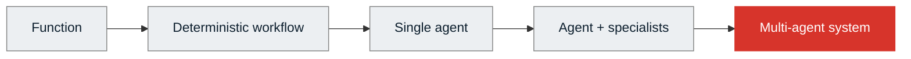

Moving toward the right means gaining flexibility, but also paying in latency, cost, non-determinism, coordination, and observability.

A starting rule can be written as follows:

```python
# [PSEUDOCODE]

def choose_architecture(problem):
    if problem.is_deterministic:
        return "function_or_workflow"

    if problem.path_is_known:
        return "graph_workflow"

    if problem.fits_one_context and problem.needs_one_owner:
        return "single_agent"

    return "consider_multi_agent"
```

This is not a universal formula; it is a safeguard. It serves to avoid the most common mistake: confusing complexity with maturity.

Simon Willison puts it from a very practical perspective: sub-agents are valuable primarily because they preserve the main context and absorb token-heavy operations; breaking every activity down into dozens of specialists, however, can become an expensive indulgence.[^simon-subagents]

### An agent must earn its place

Before adding an agent, try to complete this sentence:

> "This component must be an agent because it needs to ____________."

Plausible responses involve judgment, open-ended planning, dynamic tool use, exploration, or interaction. If the response is "must sort a list," "must check for duplicates," or "must choose a branch by reading a boolean," you are likely promoting what should remain a function to the role of a colleague.

---

## 2. The Spotify monolith

Let's start with the most natural system. An agent receives a request and possesses five tools:

- interpret mood;
- search genres;
- search songs;
- sort results;
- generate playlist.

This version exists and is executable in the lesson repository.

```python
# [VERIFIED IN REPO] - monolith.py

return Agent(
    name="playlist_monolith",
    client=client,
    system_prompt=SYSTEM_PROMPT,
    tools=[
        interpreta_umore,
        cerca_generi_per_mood,
        cerca_canzoni_per_genere,
        ordina_canzoni,
        genera_playlist,
    ],
    max_steps=8,
)
```

The design is almost disarmingly simple:

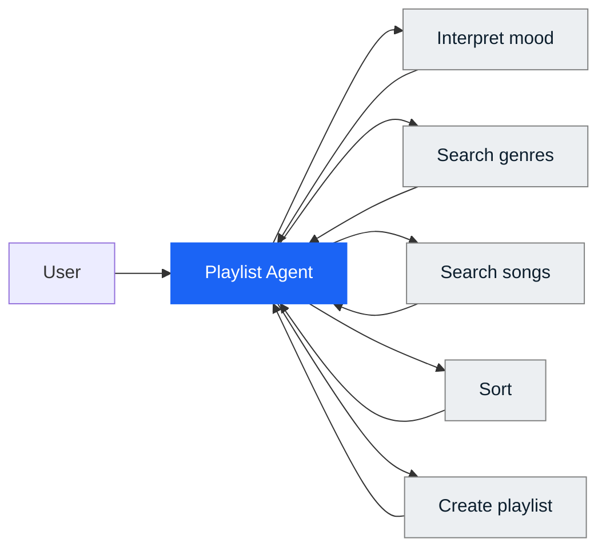

At first glance, everything seems fine. The model reads "tired" and "dancing," finds two compatible genre families, retrieves the tracks, and builds a playlist.

Then you shift your focus, and the crack appears.

In some runs, the agent treats the two signals as independent searches, merges the results, and delivers a playlist containing both party tracks and relaxing tracks without having decided what relationship exists between the current state and the desired one.

The problem isn't that the model didn't understand the words. It understood both. It didn't even choose a blatantly wrong tool. The failure lies elsewhere: **an important decision remained implicit.**

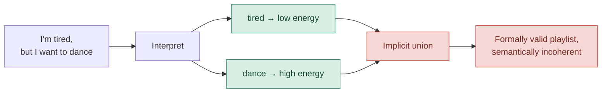

Here we see two different types of ambiguity.

### Decision ambiguity

Who determines if the request describes:

- a contradiction to be clarified;
- a transition from low energy to high energy;
- a deliberately hybrid combination?

### Acceptance ambiguity

Who determines whether the produced playlist is coherent enough to be delivered?

The monolith has a technical stop condition: `max_steps=8` and a final tool. What it lacks is a **definition of done external to its own enthusiasm.**

And this is where multi-agent systems begin. Not because five tools are too many in absolute terms, but because understanding, deciding, executing, and evaluating all coexist in the same decision-making center.

---

## 3. Decomposing the problem before the agent

The temptation at this point is to create four agents:

```text
Mood Agent
Decision Agent
Search Agent
Evaluation Agent
```

It looks orderly. However, visual order does not guarantee good architecture.

First, you must decompose the **work**.

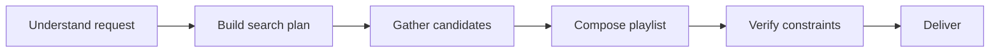

Then, for each step, we ask:

```python
# [PSEUDOCODE]

Task(
    goal=...,
    inputs=...,
    outputs=...,
    tools=...,
    context=...,
    side_effects=...,
    failure_policy=...,
    verification=...,
)
```

Only then do we decide which component should perform it.

```text
Interpret intent             → LLM / agent
Read a boolean               → code
Search catalog               → tool or worker
Sort by energy               → function
Compose playlist             → agent, if judgment is needed
Check duplicates             → function
Judge coherence              → evaluator, if subjectivity remains
```

This distinction is worth pinning down:

> **Task decomposition and agent decomposition are not the same thing.**

In the 2026 Microsoft Agent Framework, this choice is made explicit: workflow executors can be agents or standard application logic. The graph does not require every node to reason; it requires every node to have a clear responsibility.[^microsoft-workflows]

---

## 4. Who decides?

Once the work is represented, we must assign control.

Three patterns are often lumped together: routing, supervisor, and handoff. In reality, they answer different questions.

### Routing: the decision is already in the state

The first step of our running example is to ask the model to produce a typed semantic state.

```python
# [VERIFIED IN REPO] - mood_interpreter.py

class MoodProfile(BaseModel):
    current_energy: float
    desired_energy: float
    intent: Literal["maintain", "shift", "explore"]
    needs_clarification: bool
```

At that point, the branch does not require another inference.

```python
# [VERIFIED IN REPO]

def route(profile: MoodProfile) -> Literal["clarification", "search"]:
    return "clarification" if profile.needs_clarification else "search"
```

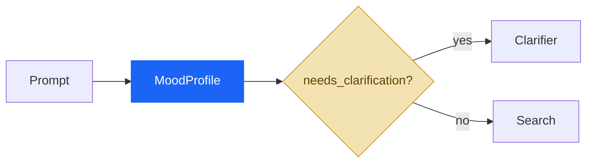

The important move isn't "using Pydantic." It is **making the decision representable**.

As long as the difference between "I'm tired" and "I want to dance" exists only in the text, the control flow remains at the mercy of the model's reasoning. When it becomes `current_energy != desired_energy` and `intent="shift"`, part of the control can move out of the prompt and into the code.

### Supervisor: the decision still requires judgment

A supervisor is needed when reading a field is not enough.

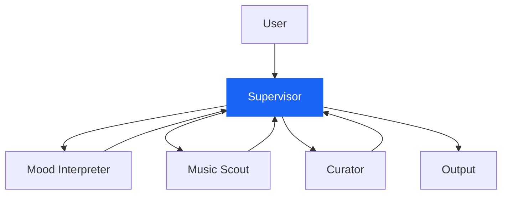

The supervisor maintains the thread of the conversation, decides which specialist to call, receives the result, and can delegate again.

```python
# [PSEUDOCODE]

while not state.done:
    decision = supervisor.decide(
        goal=state.goal,
        current_state=state.summary,
        pending=state.pending,
        available_workers=registry,
    )

    result = await registry[decision.worker].run(decision.task)
    state.record(result)
```

The cost is clear: another inference, another point of non-determinism, and higher latency. Therefore, the right question is not "can I use a supervisor?", but:

> **Is there still something to negotiate?**

If the answer is already inside a schema, the supervisor is just an expensive way to read a field.

### Handoff: changing the owner of the next turn

In delegation, the manager remains the primary contact. In a handoff, control passes to the specialist.

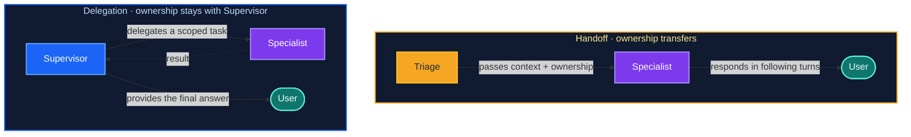

The OpenAI Agents SDK explicitly distinguishes between these two topologies: *agents as tools* when the manager retains control; *handoffs* when the specialist takes charge of the next part of the interaction.[^openai-multi-agent][^openai-handoffs]

You can remember the difference like this:

```text
Delegation → changes who does the work.
Handoff    → changes who owns the control.
```

---

## 5. A handoff is a contract

In diagrams, a handoff is an arrow. In real systems, it is a boundary.

The naive approach is this:

```python
# [ANTI-PATTERN]
await specialist.run(full_history)
```

The designed approach looks more like this:

```python
# [REFERENCE DESIGN]

class HandoffContract(BaseModel):
    goal: str
    reason: str
    relevant_state: dict
    constraints: list[str]
    artifact_refs: list[str]
    expected_output: str
    return_policy: Literal["return_to_supervisor", "own_conversation"]
```

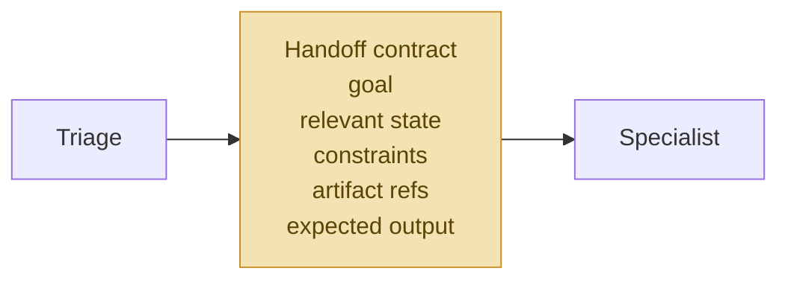

Here, two decisions that are often confused become visible:

1. **who owns the control;**
2. **what information crosses the boundary.**

LangChain/LangGraph treats handoffs as state-driven transitions and allows you to filter what the new agent receives. Subgraphs also have input and output schemas that can be separated from the parent graph's state.[^langchain-handoffs][^langgraph-subgraphs]

The consequence is important: a handoff should not pass "everything, just in case." It should pass what is needed to get the job done without forcing the specialist to reconstruct the world.

---

## 6. Who does what?

At this point, we know who makes the decisions. Now we need to distribute the work.

### Tools, workers, subagents

These are three different things.

A **tool** exposes a capability. It does not have a goal and does not decide the next step.

A **worker** receives a specific task and returns a result.

A **subagent** is a worker with its own reasoning loop, local context, and, often, its own tools.

```mermaid
flowchart TB
    S[Supervisor]
    S --> T[Tool<br/>search_catalog(query)]
    S --> W[Worker<br/>execute defined task]
    S --> A[Subagent<br/>goal + context + tools + loop]
```

This distinction is necessary because a tool does not need a personality, and a subagent should not be used to mask a function we are simply too lazy to write.

### Parallelism: dependencies first

Three searches can only run in parallel if they do not depend on one another.

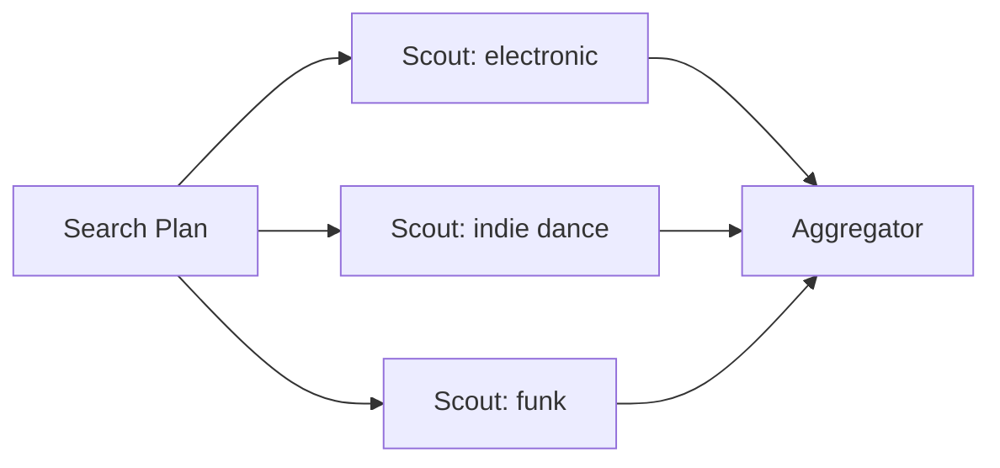

```python
# [REFERENCE DESIGN]

results = await asyncio.gather(
    scout.run(SearchTask(genre="electronic", ...)),
    scout.run(SearchTask(genre="indie-dance", ...)),
    scout.run(SearchTask(genre="funk", ...)),
)

candidates = aggregate(results)
```

If, however, B requires the output of A, the fan-out is merely an aesthetic design.

```text
A → B → C        dependency: sequence

A → {B, C, D}    independence: parallelism possible
```

In February 2026, Anthropic described an experiment with sixteen Claude agents working in parallel on a C compiler. The experiment demonstrates how capacity can scale when work is divisible and a shared environment makes progress and tests visible; it also shows how quickly cost and operational complexity rise.[^anthropic-c-compiler]

The correct takeaway is not "sixteen agents work." It is:

> **What problem structure made it possible for them to work without stepping on each other's toes?**

Simon Willison suggests similar caution: parallelism helps when files or subtasks are independent; subagents remain primarily a mechanism to protect the main context and confine verbose operations.[^simon-subagents]

---

## 7. Who knows what?

Here we arrive at the issue that, in 2026, weighs almost as much as orchestration itself: **context engineering**.

The most convenient mistake is to give every agent the entire conversation, the entire state, and all the tools. It seems prudent. In reality, it shifts the problem: instead of risking missing information, we force every component to distinguish what matters from a mass of details that do not belong to it.

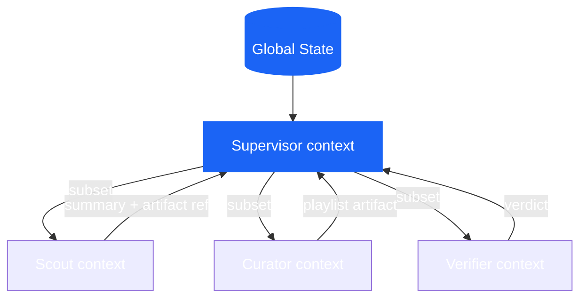

In our example:

```text
SUPERVISOR
──────────
user request
MoodProfile
current plan
worker summaries
global failures

SCOUT
──────────
SearchTask
energy range
excluded genres
catalog tools

CURATOR
──────────
PlaylistRequest
CandidateSet
composition criteria

VERIFIER
──────────
produced playlist
constraints
evaluation rubric
```

The "minimum sufficient context" rule does not mean randomly amputating information. It means recognizing that context is a form of **working memory**: limited, expensive, and noise-sensitive.

Anthropic formalized this idea in 2025 when discussing context engineering: selecting, maintaining, and updating the set of tokens that maximizes the probability of the desired behavior. By 2026, that principle is found within subagents, persistent sessions, artifacts, and long-running harnesses.[^anthropic-context]

### The shared context paradox

Passing too little context produces omissions. Passing too much produces interference.

Jason Liu, describing Cognition's position on multi-agent coding, uses the image of a game of "telephone": every handoff can lose implicit decisions and produce incompatible components. This is a 2025 source, so I would not use it alone to describe the state of the art; however, it remains one of the clearest formulations of the risk of context loss between agents.[^jason-cognition]

The point is not solved by "passing everything to everyone." Parallel workers can still make incompatible decisions, and the global context can become too large. The mature solution consists of making the following explicit:

- the state that must be shared;
- the decisions that must become contracts;
- the information that can remain local;
- the format in which results are reported back.

---

## 8. State, memory, and artifacts

In agent terminology, *memory* is used to mean too many things. It is worth sorting them out.

### Conversation state

This is what is needed to maintain continuity in the interaction: messages, turns, active agent identity, and pending requests.

### Task state

This is the operational state of the work:

```python
# [REFERENCE DESIGN]

class WorkflowState(BaseModel):
    request: PlaylistRequest
    search_plan: SearchPlan | None = None
    candidate_artifacts: list[str] = []
    playlist_artifact: str | None = None
    verification: VerificationResult | None = None
    retries: dict[str, int] = {}
    status: Literal["running", "waiting", "failed", "done"] = "running"
```

### Local state

This belongs to a specialist and does not necessarily need to be persisted:

```python
class ScoutLocalState(BaseModel):
    attempted_queries: list[str]
    visited_track_ids: set[str]
    raw_tool_outputs: list[str]
```

### Artifact

This is a persistent product of the work: a file, report, patch, table, playlist, dataset, or plan.

When the output is large, passing a reference is often healthier than re-injecting everything into the prompt.

```python
# [REFERENCE DESIGN]

return WorkerResult(
    summary="Trovati 84 candidati, 61 dopo i filtri.",
    artifact_ref="artifacts/run-284/candidate_set.json",
    warnings=["catalogo funk poco coperto"],
)
```

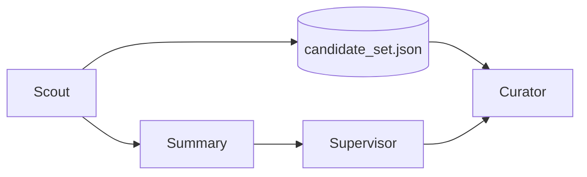

The artifact preserves fidelity. The summary preserves context space.

This is a much more solid balance than attempting to turn every step into an increasingly long message.

---

## 9. Who is in control?

So far, we have distributed the work. Now we must prevent the system from confusing "I produced something" with "I am finished."

Modern verification has at least three layers.

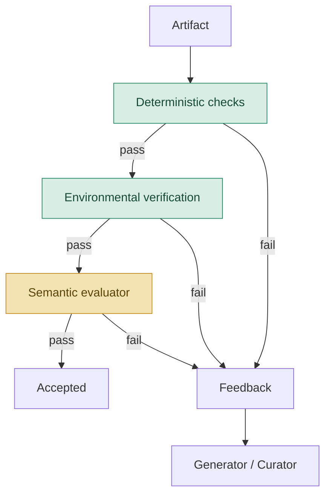

### 9.1 Deterministic checks

If a property can be verified in Python, there is no need to ask an LLM.

```python
# [REFERENCE DESIGN]

def hard_checks(playlist: Playlist, request: PlaylistRequest) -> CheckResult:
    errors = []

    if len(playlist.track_ids) != len(set(playlist.track_ids)):
        errors.append("duplicate_tracks")

    forbidden = set(request.excluded_genres)
    if any(track.genre in forbidden for track in playlist.tracks):
        errors.append("excluded_genre")

    if not energy_curve_matches(
        playlist.tracks,
        start=request.current_energy,
        target=request.desired_energy,
    ):
        errors.append("energy_curve")

    return CheckResult(passed=not errors, errors=errors)
```

### 9.2 Environmental verification

An agent might claim to have created a playlist. The question is whether that playlist actually exists in the external system.

```python
# [PSEUDOCODE]

playlist_id = spotify.create_playlist(payload)

assert spotify.get_playlist(playlist_id).track_ids == payload.track_ids
```

Anthropic makes a precise distinction between *transcript* and *outcome*: the former is what the agent said and did; the latter is the final state of the environment. A robust evaluation tends to prefer the outcome when it is observable.[^anthropic-evals]

### 9.3 Semantic evaluation

Then there remains what cannot be reduced to a clear assertion:

- Does the playlist tell a coherent story?
- Is the selection varied without seeming random?
- Does the result interpret the tension between fatigue and the desire to dance well?

Here, a separate evaluator can add value.

```python
# [REFERENCE DESIGN]

class SemanticEvaluation(BaseModel):
    mood_coherence: float
    transition_quality: float
    rationale: str
    passed: bool
```

The principle is not "you always need two agents." Anthropic, in their March 2026 work on planners, generators, and evaluators, shows that separating the producer from the judge can correct the tendency toward self-complacency. However, the same article also shows something else: the benefit depends on the task and the model, while cost and latency can increase by an order of magnitude.[^anthropic-harness-2026]

In one of the experiments described, the complete system worked for about six hours and consumed about 200 dollars, compared to twenty minutes and 9 dollars for the single agent. The quality was higher, but the bill reminds us that an evaluator must earn its place just like any other agent.[^anthropic-harness-2026]

### A loop needs a brake

```python
# [REFERENCE DESIGN]

for revision in range(MAX_REVISIONS + 1):
    playlist = await curator.run(request, feedback=feedback)

    hard = hard_checks(playlist, request)
    if not hard.passed:
        feedback = hard.to_feedback()
        continue

    semantic = await evaluator.run(playlist, request)
    if semantic.passed:
        return playlist

    feedback = semantic.rationale
```

```python
raise VerificationFailed("revision budget exhausted")
```

Without criteria, budgets, and stop conditions, an evaluator-optimizer is nothing more than a circular conversation between models.

---

## 10. Evals: the system must be measured as a whole

Evaluations for agents cannot be limited to the final response.

Anthropic proposes a useful terminology:

- **task**: the individual test case;
- **trial**: an attempt, which must be repeated because the system is stochastic;
- **grader**: the logic that assigns a judgment;
- **transcript / trace / trajectory**: the complete history of the trial;
- **outcome**: the final state of the environment;
- **evaluation harness**: the infrastructure that executes, records, and evaluates.[^anthropic-evals]

In our running example, a sensible suite shouldn't just ask, "Did it produce a playlist?" It should define different semantics for each request.

```yaml
# [REFERENCE DESIGN]

tasks:
  - id: E01
    prompt: "Sono stanco, ma voglio ballare."
    expected:
      - coherent_shift_or_clarification

  - id: E02
    prompt: "Sorprendimi."
    expected:
      - exploration_branch

  - id: E03
    prompt: "Fammi allenare, ma niente techno."
    expected:
      - no_excluded_genres

  - id: E04
    prompt: "Voglio una playlist energica per la palestra."
    expected:
      - valid_high_energy_playlist

  - id: E05
    prompt: "Che ore sono?"
    expected:
      - out_of_domain
```

Then, you observe different dimensions:

```text
OUTCOME
playlist created?
constraints met?
correct side effect?

TRAJECTORY
correct router?
handoff necessary?
redundant tools?
loop terminated?

EFFICIENCY
latency
cost
tokens
tool calls
retries

RELIABILITY
pass@1
pass^k
recovery rate
silent failures
```

Hamel Husain insists on a distinction that is worth keeping in mind: different errors require different taxonomies. Calling everything an "hallucination" makes the failures that actually matter invisible. Useful practice starts by reading traces, building a vocabulary of errors, and calibrating evaluators against human judgments.[^hamel-evals]

### Do not reward a rigid path

An overly prescriptive eval risks rejecting a valid solution simply because the model found a different path. Whenever possible, verify the outcome and use the trajectory to identify risky behaviors, waste, or policy violations, without turning every tool call into a mandatory script.

---

## 11. Things go wrong

A multi-agent system is not defined only by the "happy path." It is defined by what happens when a node fails to do its job.

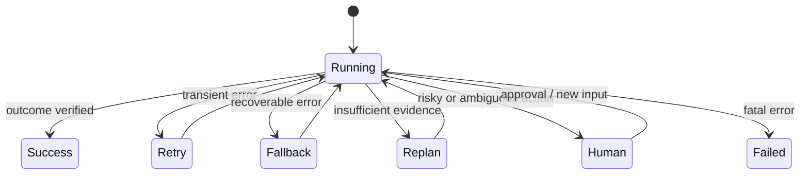

It is worth distinguishing at least these families of errors.

### Formally invalid output

```python
# [PSEUDOCODE]

try:
    profile = await mood_interpreter.run(prompt)
except ValidationError:
    if retry_budget.consume("mood_interpreter"):
        profile = await mood_interpreter.run(prompt, repair=True)
    else:
        return clarification_fallback()
```

### Valid but semantically uncertain output

This is not an exception. It is a state.

```python
if profile.needs_clarification:
    return transition_to("clarifier")
```

### External tool unavailable

```python
try:
    tracks = await remote_catalog.search(query)
except TransientToolError:
    tracks = local_catalog.search(query)
    state.warnings.append("remote_catalog_unavailable")
```

### Partial success

```text
Scout A ✓
Scout B timeout
Scout C ✓
```

The options are not just "everything fails" or "pretend nothing happened."

```python
# [REFERENCE DESIGN]

if successful_workers >= minimum_required:
    continue_with_partial_results(warnings=failed_workers)
elif retry_budget.available:
    retry(failed_workers)
else:
    escalate_or_abort()
```

### Idempotency and side effects

An innocuous retry on a read-only search is different from a retry on creating a playlist.

```python
# [REFERENCE DESIGN]

spotify.create_playlist(
    payload,
    idempotency_key=state.run_id,
)
```

Without idempotency, a network error after the side effect occurs can produce two identical playlists. In multi-agent systems, the problem worsens because multiple workers may believe they are authorized to write.

A simple policy is the **single writer**: many agents can propose, but only one can modify the external state.

---

## 12. Blast radius and human-in-the-loop

When an agent can only read a music catalog, the maximum damage is contained. When an agent can perform a rollback in production, the same architecture becomes a different matter entirely.

Operational risk can be interpreted as:

```text
risk ≈ probability of error × maximum possible damage
```

Improving the model might reduce the first term. Permissions and isolation limit the second.

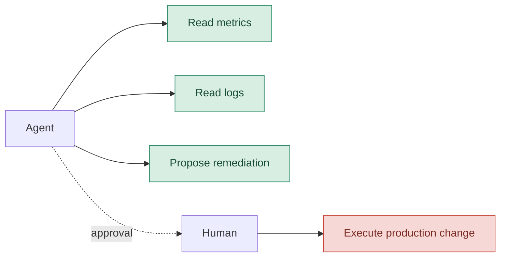

In May 2026, Anthropic described containment as a problem of limiting the blast radius: not just monitoring what the model tends to do, but restricting what the environment materially allows it to do. The article also points out that automatic or distracted approval is a limitation of simple human-in-the-loop systems: too many permission prompts lead to approval fatigue.[^anthropic-containment]

The Microsoft Agent Framework treats approval and information requests as suspendable workflow events; the pending state can be included in checkpoints and re-emitted after recovery.[^microsoft-hitl]

This leads to a rule of thumb:

> **Human oversight should be placed at critical risk points, not distributed as a barrage of modal windows.**

---

## 13. When the work lasts longer than the conversation

Short tasks can live within a single context window. Long tasks cannot.

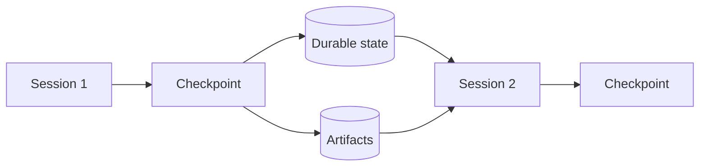

Four different techniques come into play here.

### Compaction

The previous history is summarized, and the same session continues. It maintains continuity, but the summary may lose details, and the context remains a layering of old decisions.

### Context reset

A clean context is started, and a structured handoff is passed. It costs more, but it eliminates the "context anxiety" observed in some models.

### Checkpoint

The operational state is saved so that work can resume after a crash, human pause, or maintenance.

### Artifact persistence

Work is not entrusted solely to conversational memory. Files, tests, plans, and results remain available outside the prompt.

```python
# [REFERENCE DESIGN]

checkpoint = Checkpoint(
    goal=state.goal,
    completed=state.completed_tasks,
    pending=state.pending_tasks,
    decisions=state.key_decisions,
    artifact_refs=state.artifact_refs,
    failures=state.failure_log,
    active_requests=state.pending_human_requests,
)

checkpoint_store.save(checkpoint)
```

In March 2026, Anthropic showcased a three-agent harness for long-running applications: planner, generator, and evaluator, using contracts and files as communication artifacts. An instructive detail is that, with newer models, some parts of the old harness became dead weight and were removed. A harness is not a cathedral: it is a hypothesis about the current model's limitations.[^anthropic-harness-2026]

---

## 14. From agent system to harness

In 2026, the most interesting word is perhaps not *multi-agent*. It is *harness*.

The harness is what surrounds the model and transforms an inference into an operating system:

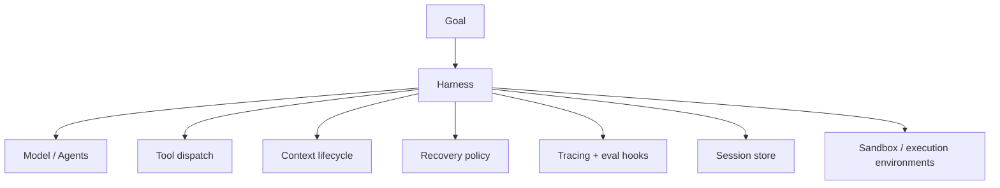

In its work on harness engineering, OpenAI describes a product built with Codex agents, automated tests, model-readable observability, and isolated environments for tasks. The interesting point is not the number of lines produced; it is the shift in roles: humans design the environment, intent, and feedback loops, while agents execute.[^openai-harness]

In April 2026, OpenAI extended the Agents SDK with a more capable harness for file and tool work, native sandboxes, and a separation between harness and compute for security, durability, and scale.[^openai-sdk-2026]

Anthropic, with Managed Agents, proposes a very clear separation:

```text
SESSION
append-only log of what has happened

HARNESS
loop that calls the model and routes tools

SANDBOX
environment where the work is executed
```

This separation allows each element to fail, change, or scale independently. It is the infrastructural version of the same question that has been with us from the beginning: who owns which responsibility?[^anthropic-managed]

### Many brains, many hands

The metaphor used by Anthropic is effective. The "brain" is the model plus the harness; the "hands" are the sandbox and tools. Decoupling them allows multiple harnesses to use different environments, or a single harness to send work to multiple execution environments, without turning every session into an indivisible server.[^anthropic-managed]

This does not imply that every application must build a meta-harness. It means that as soon as the work becomes long-running and operational, the boundary between reasoning, state, and execution stops being a mere detail.

---

## 15. MCP and A2A: two different problems

In the noise of protocols, it is easy to confuse the acronyms.

### MCP

The Model Context Protocol connects a model or an agent to tools, data, and resources. The typical relationship is:[^mcp]

```text
agent ↔ tool / data source
```

### A2A

Agent2Agent concerns interoperability between separate agents or agentic services, involving capability discovery, tasks, and artifact exchange.

```text
agent service ↔ agent service
```

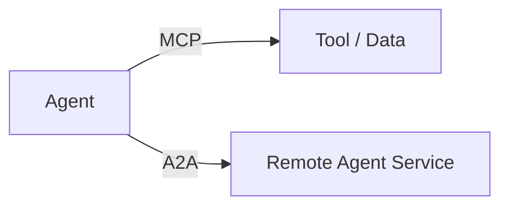

A2A does not make a system within the same process smarter. It solves an organizational and infrastructural boundary: remote agents, different stacks, separate ownership, and non-shared memory.[^a2a]

In the Spotify running example, introducing it now would be complexity paid in advance. It would become relevant if the catalog, the curator, and the playlist creation system were autonomous services managed by different teams or vendors.

---

## 16. When a decision becomes an edge

At a certain point, the system contains:

- typed state;
- nodes;
- conditional transitions;
- fan-out and fan-in;
- revision loops;
- checkpoints;
- human requests;
- stop conditions.

There is no longer a need to look for a metaphor. We have built a graph.

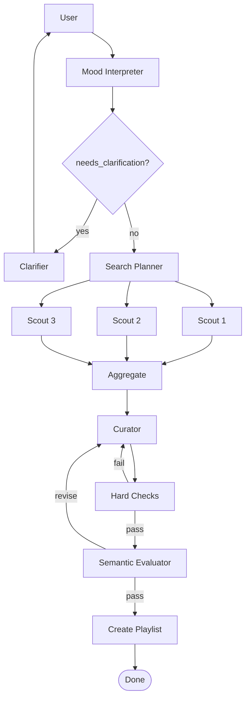

The conceptual transition is this:

```text
Agent thinking:
«Which tool should I call?»

Graph thinking:
«Which node is executable, given the current state?»
```

The two coexist. A graph node can contain an agent, a function, a tool wrapper, or a human request.

The Microsoft Agent Framework exposes workflow graph-based systems with executors, conditional edges, parallelism, checkpoints, and HITL. LangGraph builds around `State`, nodes, edges, reducers, subgraphs, interrupts, and persistence. The APIs change; the grammar remains.[^microsoft-workflows][^langgraph-persistence][^langgraph-interrupts]

---

## 17. The Spotify reference architecture

Now we can put the pieces back together.

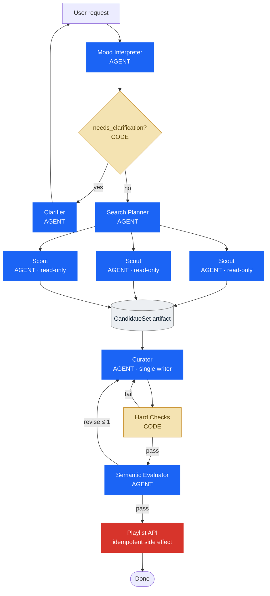

The most important thing about the diagram is not the number of agents.

It is that **not all boxes are agents**.

The gate is code. The hard checks are code. The artifact is persistent state. The scouts are read-only. The curator is the sole writer. The side effect has a boundary and an idempotency policy.

Each component has earned its place because it solves a problem we had already encountered.

### The runtime, in pseudocode

```python
# [REFERENCE DESIGN - PSEUDOCODE]

async def build_playlist(user_request: str) -> Playlist:
    profile = await mood_interpreter.run(user_request)

    if profile.needs_clarification:
        return await clarifier.run(profile)

    request = PlaylistRequest.from_profile(profile)
    plan = await search_planner.run(request)
```

```python
    worker_results = await gather_with_policy(
        tasks=[scout.run(task) for task in plan.independent_tasks],
        minimum_successes=2,
        retry_budget=1,
    )

    candidate_artifact = persist(
        aggregate(worker_results)
    )

    feedback = None
    for revision in range(2):
        playlist = await curator.run(
            request=request,
            candidates=candidate_artifact,
            feedback=feedback,
        )

        hard = hard_checks(playlist, request)
        if not hard.passed:
            feedback = hard.to_feedback()
            continue

        semantic = await evaluator.run(playlist, request)
        if semantic.passed:
            return await create_playlist_idempotently(playlist)

        feedback = semantic.rationale

    raise VerificationFailed()
```

This complete implementation is **not yet in the lesson repository**. The verified repository covers the monolith and structured routing; the rest is a reference architecture consistent with the educational path.

---

## 18. What is converging in 2026

Sources and frameworks do not agree on a single winning architecture. It would be suspicious if they did. However, they are converging on a few principles.

### 1. Simplicity comes before decomposition

Multi-agent systems are not a prize for complexity. Anthropic continues to recommend the simplest solution that improves outcomes; 2026 work on harnesses even shows components being removed when more capable models make them redundant.[^anthropic-harness-2026]

### 2. Context is a design object

Subagents, state schemas, artifacts, and handoffs are not decorations. They are ways to control what each component sees and what is lost during transitions.[^anthropic-context][^simon-subagents]

### 3. Control must be localized

Routers, supervisors, and handoffs are not synonyms. The first reads a state, the second reasons and retains ownership, and the third transfers ownership.

### 4. Verification must touch the environment

Runtime evidence, unit tests, database state, browsers, metrics, and logs are worth more than a model's declaration. OpenAI describes agents that query traces and metrics to verify their own work; Anthropic makes a sharp distinction between transcripts and outcomes.[^openai-harness][^anthropic-evals]

### 5. State must survive the prompt

Checkpoints, append-only sessions, and persistent artifacts make it possible to resume, inspect, and correct long-running work.[^anthropic-managed][^microsoft-hitl]

### 6. Risk is managed with deterministic boundaries

Permissions, read-only workers, single writers, sandboxes, and egress controls limit damage even when the model errs or is deceived.[^anthropic-containment]

### 7. The model and the harness must be evaluated together

When we say "the agent achieved this result," we are measuring the model, prompt, tools, memory, orchestration, and environment. Changing the model without re-examining the harness is as naive as changing the harness without re-running evaluations.[^anthropic-evals][^anthropic-managed]

---

## 19. A grammar for design

Ultimately, patterns are less useful than the questions they prompt.

### Who decides?

- Is the decision already represented in the state? Use code or deterministic routing.
- Does it require judgment based on context? Consider a supervisor.
- Does it need to change the interlocutor? Use a handoff.

### Who knows what?

- What is the minimum sufficient context?
- Which decisions should become typed fields?
- Which details can remain local?
- Which results should bubble up as summaries and which as artifacts?

### Who does what?

- Does this responsibility require autonomy?
- Can it be a function?
- Can it be a tool?
- Are the subtasks independent?
- Is there a single writer for side effects?

### Who controls?

- Which properties are verifiable in code?
- What environment state proves success?
- Where is semantic judgment needed?
- Does the revision cycle have a budget?

### Who keeps the system running?

- How is the state saved?
- How do you resume after a crash or human approval?
- Which retries are idempotent?
- What is the blast radius of each agent?
- Can I reconstruct the entire trajectory?

A minimal checklist can fit in a few lines:

```text
[ ] Each agent has a responsibility that requires autonomy.
[ ] Deterministic decisions are kept out of the prompt.
[ ] Handoffs have a contract.
[ ] Global and local states are separated.
[ ] Parallelism follows dependencies, not enthusiasm.
[ ] Side effects have ownership and idempotency.
[ ] Outcomes are verified in the environment.
[ ] Retries, fallbacks, escalations, and stops are explicit.
[ ] Traces and evals measure the system, not just the last response.
[ ] The harness is simplified whenever the model changes.
```

---

## 20. An interactive lab

To make these trade-offs visible, I have prepared a separate educational simulator. It allows you to adjust path predictability, semantic ambiguity, parallelizability, side-effect risk, duration, and the presence of remote boundaries.

The simulator is not a benchmark. It uses a transparent and intentionally simple model to show how certain choices shift cost, latency, observability, and blast radius.

```html
<iframe
  src="./simulatore_architetture_multiagent.html"
  title="Architecture Lab: where to place autonomy?"
  width="100%"
  height="900"
  loading="lazy"
  style="border:0;border-radius:16px;overflow:hidden"
></iframe>
```

Static fallback:

```mermaid
flowchart LR
    P[Problem] --> Q1{Known path?}
    Q1 -->|yes| W[Workflow]
    Q1 -->|no| Q2{Decision representable?}
    Q2 -->|yes| R[Router + graph]
    Q2 -->|no| S[Supervisor]
    S --> Q3{Ownership changes?}
    Q3 -->|yes| H[Handoff]
    Q3 -->|no| D[Delegation]
```

---

## Conclusion

We started with an agent equipped with five tools. It wasn't a bad architecture; it was simply an architecture where too many decisions remained implicit.

We separated state from text, control from work, verification from generation, and execution from the session. Each time, we added structure only when the previous system showed a crack.

In my opinion, this is the healthiest way to think about multi-agent systems in 2026.

The question is not "how many agents can I get to collaborate?" It is:

> **Where should the intelligence reside, and where is structure needed instead?**

When a decision is known, write it down. When a result is verifiable, test it. When work is independent, parallelize it. When context must cross a boundary, give it a shape. When an agent can cause damage, restrict what it is allowed to do. And when a component no longer adds value, remove it.

The rest is orchestration. And, as often happens, the real challenges emerge precisely in the handoffs between one box and the next.

---

## Sources and reading notes

The sources are ordered by function, not by prestige. Engineering posts and official documentation support the system descriptions; practitioners add field experience; 2025 works are used when they introduce concepts that remain central in 2026.

[^anthropic-engineering]: Anthropic, **Engineering at Anthropic**, updated index of 2024-2026 articles: <https://www.anthropic.com/engineering>
[^anthropic-evals]: Anthropic, **Demystifying evals for AI agents**, January 9, 2026: <https://www.anthropic.com/engineering/demystifying-evals-for-ai-agents>
[^anthropic-harness-2026]: Anthropic, **Harness design for long-running application development**, March 24, 2026: <https://www.anthropic.com/engineering/harness-design-long-running-apps>
[^anthropic-managed]: Anthropic, **Scaling Managed Agents: Decoupling the brain from the hands**, April 8, 2026: <https://www.anthropic.com/engineering/managed-agents>
[^anthropic-containment]: Anthropic, **How we contain Claude across products**, May 25, 2026: <https://www.anthropic.com/engineering/how-we-contain-claude>
[^anthropic-c-compiler]: Anthropic, **Building a C compiler with a team of parallel Claudes**, February 5, 2026: <https://www.anthropic.com/engineering/building-c-compiler>
[^anthropic-context]: Anthropic, **Effective context engineering for AI agents**, September 29, 2025: <https://www.anthropic.com/engineering/effective-context-engineering-for-ai-agents>
[^openai-harness]: OpenAI, **Harness engineering: leveraging Codex in an agent-first world**, February 11, 2026: <https://openai.com/index/harness-engineering/>
[^openai-sdk-2026]: OpenAI, **The next evolution of the Agents SDK**, April 15, 2026: <https://openai.com/index/the-next-evolution-of-the-agents-sdk/>
[^openai-multi-agent]: OpenAI Agents SDK, **Orchestrating multiple agents**: <https://openai.github.io/openai-agents-python/multi_agent/>
[^openai-handoffs]: OpenAI Agents SDK, **Handoffs**: <https://openai.github.io/openai-agents-python/handoffs/>
[^microsoft-workflows]: Microsoft Learn, **Microsoft Agent Framework Workflows**, updated 2026: <https://learn.microsoft.com/en-us/agent-framework/workflows/>
[^microsoft-hitl]: Microsoft Learn, **Human-in-the-loop with Agent Framework Workflows**, updated July 17, 2026: <https://learn.microsoft.com/en-us/agent-framework/workflows/human-in-the-loop>
[^langchain-handoffs]: LangChain, **Handoffs**, multi-agent documentation: <https://docs.langchain.com/oss/python/langchain/multi-agent/handoffs>
[^langgraph-subgraphs]: LangGraph, **Use subgraphs**: <https://docs.langchain.com/oss/python/langgraph/use-subgraphs>
[^langgraph-persistence]: LangGraph, **Persistence**: <https://docs.langchain.com/oss/python/langgraph/persistence>
[^langgraph-interrupts]: LangGraph, **Interrupts**: <https://docs.langchain.com/oss/python/langgraph/interrupts>

[^mcp]: Model Context Protocol, official specification **2026-07-28**: <https://modelcontextprotocol.io/specification/2026-07-28>
[^a2a]: A2A Protocol, official specification **v1.0**: <https://a2a-protocol.org/latest/>
[^simon-subagents]: Simon Willison, **Subagents - Agentic Engineering Patterns**, March 17, 2026: <https://simonwillison.net/guides/agentic-engineering-patterns/subagents/>
[^hamel-evals]: Hamel Husain, **Evals Skills for Coding Agents**, March 3, 2026: <https://hamelhusain.substack.com/p/evals-skills-for-coding-agents>
[^jason-cognition]: Jason Liu, **Why Cognition does not use multi-agent systems**, September 11, 2025: <https://jxnl.co/writing/2025/09/11/why-cognition-does-not-use-multi-agent-systems/>

### Further reading

- OpenAI, **An open-source spec for Codex orchestration: Symphony**, April 27, 2026: <https://openai.com/index/open-source-codex-orchestration-symphony/>
- Anthropic, **AI Organizations Can Be More Effective but Less Aligned than Individual Agents**, 2026: <https://alignment.anthropic.com/2026/ai-organizations/>
- OpenAI Agents SDK, **Tracing**: <https://openai.github.io/openai-agents-python/tracing/>
- LangChain, **Multi-agent patterns**: <https://docs.langchain.com/oss/python/langchain/multi-agent/index>
