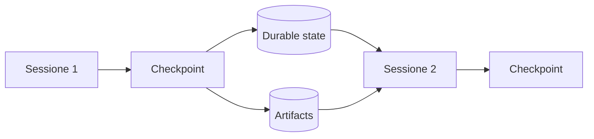
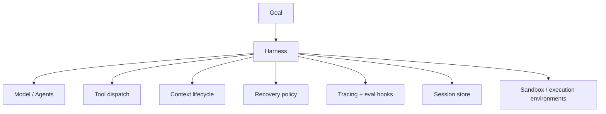
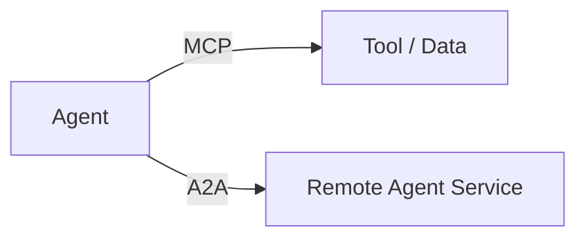
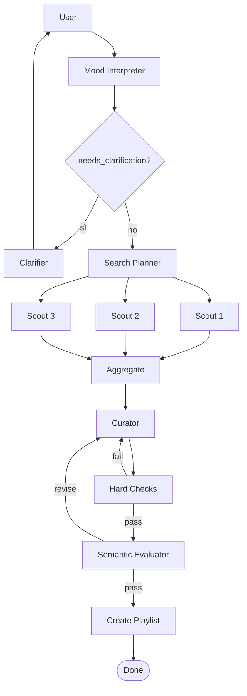
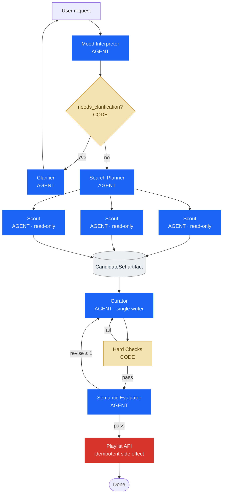
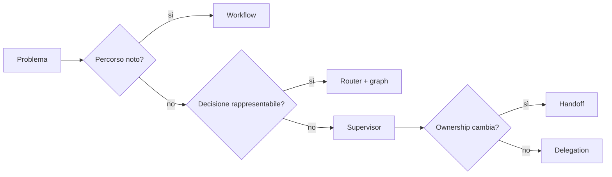

# Progettare sistemi multiagentici nel 2026 — Parte 3

Nei [capitoli precedenti](/blog/it/progettare-sistemi-multiagentici-nel-2026-parte-1/) abbiamo definito quando scomporre il lavoro e come controllare i componenti. Qui completiamo il quadro: un sistema agentico deve continuare a funzionare quando il lavoro dura, il contesto cambia, un processo si interrompe o l'esecuzione tocca sistemi esterni.

## Quando il lavoro dura più della conversazione

I task brevi possono vivere in una singola context window. I task lunghi no.



Qui entrano quattro tecniche differenti.

### Compaction

La storia precedente viene riassunta e la stessa sessione continua. Conserva continuità, ma il riepilogo può perdere dettagli e il contesto resta una stratificazione di decisioni vecchie.

### Context reset

Si avvia un contesto pulito e si passa uno structured handoff. Costa di più, ma elimina residui e «ansia da contesto» osservata in alcuni modelli.

### Checkpoint

Si salva lo stato operativo in modo da poter riprendere dopo crash, pausa umana o manutenzione.

### Artifact persistence

Il lavoro non viene affidato soltanto alla memoria conversazionale. File, test, piani e risultati restano disponibili fuori dal prompt.

```python
# [REFERENCE DESIGN]

checkpoint = Checkpoint(
    goal=state.goal,
    completed=state.completed_tasks,
    pending=state.pending_tasks,
    decisions=state.key_decisions,
    artifact_refs=state.artifact_refs,
    failures=state.failure_log,
    active_requests=state.pending_human_requests,
)

checkpoint_store.save(checkpoint)
```

Anthropic ha mostrato nel marzo 2026 un harness a tre agenti per applicazioni long-running: planner, generator ed evaluator, con contratti e file usati come artefatti di comunicazione. Un dettaglio istruttivo è che, con modelli successivi, alcune parti del vecchio harness sono diventate zavorra e sono state rimosse. L'harness non è una cattedrale: è un'ipotesi sui limiti del modello corrente ([Anthropic — Harness long-running](https://www.anthropic.com/engineering/harness-design-long-running-apps)).

## Dal sistema di agenti all'harness

Nel 2026 la parola più interessante non è forse *multi-agent*. È *harness*.

L'harness è ciò che circonda il modello e trasforma un'inferenza in un sistema operativo:



OpenAI, nel proprio lavoro sull'harness engineering, racconta un prodotto costruito con agenti Codex, test automatizzati, osservabilità leggibile dal modello e ambienti isolati per task. Il punto interessante non è il numero di righe prodotte; è il cambio di mestiere: gli esseri umani progettano ambiente, intenti e feedback loop, mentre gli agenti eseguono ([OpenAI — Harness engineering](https://openai.com/index/harness-engineering/)).

Ad aprile 2026 OpenAI ha esteso Agents SDK con un harness più capace per lavori su file e tool, sandbox native e separazione fra harness e compute per sicurezza, durabilità e scala ([OpenAI — Evoluzione dell’Agents SDK](https://openai.com/index/the-next-evolution-of-the-agents-sdk/)).

Anthropic, con Managed Agents, propone una separazione molto nitida:

```text
SESSION
append-only log di ciò che è accaduto

HARNESS
loop che chiama il modello e instrada i tool

SANDBOX
ambiente in cui il lavoro viene eseguito
```

La separazione consente a ciascun elemento di fallire, cambiare o scalare indipendentemente. È la versione infrastrutturale della stessa domanda che ci accompagna dall'inizio: chi possiede quale responsabilità? ([Anthropic — Managed Agents](https://www.anthropic.com/engineering/managed-agents))

### Molti cervelli, molte mani

La metafora usata da Anthropic è efficace. Il «cervello» è modello più harness; le «mani» sono sandbox e strumenti. Disaccoppiarli consente a più harness di usare ambienti diversi, o allo stesso harness di inviare lavoro a più execution environment, senza trasformare ogni sessione in un server indivisibile ([Anthropic — Managed Agents](https://www.anthropic.com/engineering/managed-agents)).

Questo non implica che ogni applicazione debba costruire un meta-harness. Significa che, appena il lavoro diventa lungo e operativo, il confine fra ragionamento, stato ed esecuzione smette di essere un dettaglio.


## MCP e A2A: due problemi differenti

Nel rumore dei protocolli è facile confondere le sigle.

### MCP

Model Context Protocol collega un modello o un agente a strumenti, dati e risorse ([specifica MCP](https://modelcontextprotocol.io/specification/2026-07-28)). La relazione tipica è:

```text
agent ↔ tool / data source
```

### A2A

Agent2Agent riguarda l'interoperabilità e la comunicazione fra agenti o servizi agentici separati ([documentazione ufficiale A2A](https://a2a-protocol.org/latest/)).

```text
agent service ↔ agent service
```



A2A è un livello di comunicazione tra agenti, non un agent development kit né un protocollo per i subagent interni o per le tool call. Serve a far collaborare agenti indipendenti, anche costruiti con framework diversi, senza imporre la condivisione di memoria, strumenti o logica proprietaria ([specifica A2A](https://a2a-protocol.org/latest/)).

Nel running example Spotify, introdurlo ora sarebbe complessità pagata in anticipo. Diventerebbe pertinente se il catalogo, il curator e il sistema di creazione playlist fossero servizi autonomi gestiti da team o vendor differenti.


## Quando una decisione diventa un edge

A un certo punto il sistema contiene:

- stato tipizzato;
- nodi;
- transizioni condizionali;
- fan-out e fan-in;
- loop di revisione;
- checkpoint;
- richieste umane;
- condizioni di arresto.

Non serve più cercare una metafora. Abbiamo costruito un grafo.



La transizione concettuale è questa:

```text
Agent thinking:
«Quale strumento dovrei chiamare?»

Graph thinking:
«Quale nodo è eseguibile, dato lo stato corrente?»
```

Le due cose convivono. Un nodo del grafo può contenere un agente, una funzione, un tool wrapper o una richiesta umana.

Microsoft Agent Framework documenta workflow funzionali o graph-based, agenti come executor, orchestrazioni sequenziali o concorrenti, checkpoint e HITL. LangGraph documenta state, subgraph, interrupt e persistence. Le API cambiano; la grammatica resta ([Microsoft — Workflows](https://learn.microsoft.com/en-us/agent-framework/workflows/), [LangGraph — subgraphs](https://docs.langchain.com/oss/python/langgraph/use-subgraphs), [LangGraph — persistence](https://docs.langchain.com/oss/python/langgraph/persistence), [LangGraph — interrupts](https://docs.langchain.com/oss/python/langgraph/interrupts)).


## La reference architecture Spotify

Ora possiamo rimettere insieme i pezzi.



La cosa più importante del diagramma non è il numero di agenti.

È che **non tutti i riquadri sono agenti**.

Il gate è codice. I controlli duri sono codice. L'artefatto è stato persistente. Gli scout sono read-only. Il curator è l'unico writer. Il side effect ha un confine e una policy di idempotenza.

Ogni componente si è guadagnato il proprio posto perché risolve un problema che avevamo già incontrato.

### Il runtime, in pseudocodice

```python
# [REFERENCE DESIGN - PSEUDOCODICE]

async def build_playlist(user_request: str) -> Playlist:
    profile = await mood_interpreter.run(user_request)

    if profile.needs_clarification:
        return await clarifier.run(profile)

    request = PlaylistRequest.from_profile(profile)
    plan = await search_planner.run(request)

    worker_results = await gather_with_policy(
        tasks=[scout.run(task) for task in plan.independent_tasks],
        minimum_successes=2,
        retry_budget=1,
    )

    candidate_artifact = persist(
        aggregate(worker_results)
    )

    feedback = None
    for revision in range(2):
        playlist = await curator.run(
            request=request,
            candidates=candidate_artifact,
            feedback=feedback,
        )

        hard = hard_checks(playlist, request)
        if not hard.passed:
            feedback = hard.to_feedback()
            continue

        semantic = await evaluator.run(playlist, request)
        if semantic.passed:
            return await create_playlist_idempotently(playlist)

        feedback = semantic.rationale

    raise VerificationFailed()
```

Questa implementazione completa **non è ancora presente nel repository della lezione**. Il repository verificato copre il monolite e lo structured routing; il resto è una reference architecture coerente con il percorso didattico.


## Cosa sta convergendo nel 2026

Fonti e framework non concordano su un'unica architettura vincente. Sarebbe sospetto il contrario. Stanno però convergendo su alcuni principi.

### La semplicità viene prima della decomposizione

Il multi-agent non è un premio di complessità. Anthropic raccomanda di partire dalla soluzione più semplice e aumentare la complessità solo quando serve; nel case study del 2026 l'autore rimuove poi una struttura a sprint quando un modello più capace la rende superflua ([Anthropic — Building effective agents](https://www.anthropic.com/engineering/building-effective-agents), [Anthropic — Harness long-running](https://www.anthropic.com/engineering/harness-design-long-running-apps)).

### Il contesto è un oggetto di progetto

Subagent, state schema, artifact e handoff non sono decorazioni. Sono modi per controllare ciò che ogni componente vede e ciò che viene perso nei passaggi ([Anthropic — Context engineering](https://www.anthropic.com/engineering/effective-context-engineering-for-ai-agents), [Willison — Subagents](https://simonwillison.net/guides/agentic-engineering-patterns/subagents/)).

### Il controllo deve essere localizzato

Router, supervisor e handoff non sono sinonimi. Il primo legge uno stato, il secondo ragiona e conserva ownership, il terzo trasferisce ownership.

### La verifica deve toccare l'ambiente

Runtime evidence, unit test, stato del database, browser, metriche e log valgono più di una dichiarazione del modello. OpenAI descrive agenti che interrogano trace e metriche per verificare il proprio lavoro; Anthropic distingue nettamente transcript e outcome ([OpenAI — Harness engineering](https://openai.com/index/harness-engineering/), [Anthropic — Evals per agenti](https://www.anthropic.com/engineering/demystifying-evals-for-ai-agents)).

### Lo stato deve sopravvivere al prompt

Checkpoint, sessioni append-only e artefatti persistenti rendono possibile riprendere, ispezionare e correggere il lavoro long-running ([Anthropic — Managed Agents](https://www.anthropic.com/engineering/managed-agents), [Microsoft — HITL nei workflow](https://learn.microsoft.com/en-us/agent-framework/workflows/human-in-the-loop)).

### Il rischio si gestisce con confini deterministici

Permission, read-only worker, single writer, sandbox ed egress control limitano il danno anche quando il modello sbaglia o viene ingannato ([Anthropic — Containment](https://www.anthropic.com/engineering/how-we-contain-claude)).

### Il modello e l'harness vanno valutati insieme

Quando diciamo «l'agente ha ottenuto questo risultato», stiamo misurando modello, prompt, tool, memoria, orchestrazione e ambiente. Cambiare il modello senza riesaminare l'harness è tanto ingenuo quanto cambiare l'harness senza rieseguire gli eval ([Anthropic — Evals per agenti](https://www.anthropic.com/engineering/demystifying-evals-for-ai-agents), [Anthropic — Managed Agents](https://www.anthropic.com/engineering/managed-agents)).


## Una grammatica per progettare

Alla fine, i pattern servono meno delle domande.

### Chi decide?

- La decisione è già rappresentata nello stato? Usa codice o routing deterministico.
- Richiede giudizio sul contesto? Valuta un supervisor.
- Deve cambiare l'interlocutore? Usa un handoff.

### Chi sa cosa?

- Qual è il contesto minimo sufficiente?
- Quali decisioni devono diventare campi tipizzati?
- Quali dettagli possono restare locali?
- Quali risultati devono risalire come summary e quali come artifact?

### Chi fa cosa?

- Questa responsabilità richiede autonomia?
- Può essere una funzione?
- Può essere un tool?
- I sottocompiti sono indipendenti?
- Esiste un solo writer per i side effect?

### Chi controlla?

- Quali proprietà sono verificabili in codice?
- Quale stato dell'ambiente prova il successo?
- Dove serve un giudizio semantico?
- Il ciclo di revisione ha un budget?

### Chi tiene in piedi il sistema?

- Come si salva lo stato?
- Come si riprende dopo un crash o un'approvazione umana?
- Quali retry sono idempotenti?
- Qual è il blast radius di ogni agente?
- Posso ricostruire l'intera traiettoria?

Una checklist minimale può stare in poche righe:

```text
[ ] Ogni agente ha una responsabilità che richiede autonomia.
[ ] Le decisioni deterministiche sono fuori dal prompt.
[ ] Gli handoff hanno un contratto.
[ ] Lo stato globale e quello locale sono separati.
[ ] Il parallelismo segue le dipendenze, non l'entusiasmo.
[ ] I side effect hanno ownership e idempotenza.
[ ] Gli outcome sono verificati nell'ambiente.
[ ] Retry, fallback, escalation e stop sono espliciti.
[ ] Trace ed eval misurano il sistema, non solo l'ultima risposta.
[ ] L'harness viene semplificato ogni volta che il modello cambia.
```


## Un laboratorio interattivo

Il simulatore didattico interattivo arriverà in un aggiornamento successivo. Intanto questo diagramma statico rende visibile la decisione architetturale di base:




## Conclusione

Siamo partiti da un agente con cinque tool. Non era una cattiva architettura. Era semplicemente un'architettura nella quale troppe decisioni rimanevano implicite.

Abbiamo separato lo stato dal testo, il controllo dal lavoro, la verifica dalla generazione e l'esecuzione dalla sessione. Ogni volta abbiamo aggiunto struttura soltanto quando il sistema precedente mostrava una crepa.

Questo, secondo me, è il modo più sano di pensare ai sistemi multiagentici nel 2026.

La domanda non è «quanti agenti posso far collaborare?». È:

> **Dove deve stare l'intelligenza, e dove invece serve struttura?**

Quando la decisione è nota, scrivila. Quando il risultato è verificabile, testalo. Quando il lavoro è indipendente, parallelizzalo. Quando il contesto deve attraversare un confine, dagli una forma. Quando un agente può fare danni, restringi ciò che gli è concesso. E quando un componente non aggiunge più valore, toglilo.

Il resto è orchestrazione. E, come spesso accade, i nodi vengono al pettine proprio nei passaggi fra una scatola e l'altra.

## Fonti e note di lettura

Le fonti sono ordinate per funzione, non per prestigio. Gli engineering post e la documentazione ufficiale sostengono le descrizioni dei sistemi; i practitioner aggiungono esperienza sul campo; i lavori 2025 vengono usati quando introducono concetti ancora centrali nel 2026.

- [Anthropic — Building effective agents](https://www.anthropic.com/engineering/building-effective-agents): guida del 2024 ai pattern routing, chaining, parallelizzazione, orchestrator-workers ed evaluator-optimizer, con la raccomandazione di partire dalla soluzione più semplice.
- [Anthropic — Demystifying evals for AI agents](https://www.anthropic.com/engineering/demystifying-evals-for-ai-agents): definizioni di task, trial, grader, transcript, outcome ed evaluation harness.
- [Anthropic — Harness design for long-running application development](https://www.anthropic.com/engineering/harness-design-long-running-apps): planner, generator, evaluator e trade-off di costo e durata per task lunghi.
- [Anthropic — Scaling Managed Agents](https://www.anthropic.com/engineering/managed-agents): separazione fra sessione, harness, sandbox e ambienti di esecuzione.
- [Anthropic — How we contain Claude across products](https://www.anthropic.com/engineering/how-we-contain-claude): containment, permission e riduzione del blast radius.
- [Anthropic — Building a C compiler with a team of parallel Claudes](https://www.anthropic.com/engineering/building-c-compiler): esperimento con sedici agenti, ambiente condiviso e coordinamento del parallelismo.
- [Anthropic — Effective context engineering for AI agents](https://www.anthropic.com/engineering/effective-context-engineering-for-ai-agents): gestione del contesto, compaction, memoria e subagent.
- [OpenAI — Harness engineering](https://openai.com/index/harness-engineering/): harness, test, osservabilità e ambienti isolati per agenti Codex.
- [OpenAI — The next evolution of the Agents SDK](https://openai.com/index/the-next-evolution-of-the-agents-sdk/): evoluzione dell’SDK, sandbox e separazione fra harness e compute.
- [OpenAI Agents SDK — Agent orchestration](https://openai.github.io/openai-agents-python/multi_agent/): differenza fra orchestrazione via LLM e via codice, agents as tools e handoff.
- [OpenAI Agents SDK — Handoffs](https://openai.github.io/openai-agents-python/handoffs/): configurazione, input e filtri degli handoff.
- [Microsoft Agent Framework — Workflows](https://learn.microsoft.com/en-us/agent-framework/workflows/): workflow funzionali o graph-based, agenti come executor, orchestrazioni sequenziali/concorrenti, checkpoint e HITL.
- [Microsoft Agent Framework — Human in the loop](https://learn.microsoft.com/en-us/agent-framework/workflows/human-in-the-loop): richieste sospendibili, approvazioni e ripristino del workflow.
- [LangChain — Handoffs](https://docs.langchain.com/oss/python/langchain/multi-agent/handoffs): transizioni guidate dallo stato; nei subgraph il contesto trasferito va scelto esplicitamente.
- [LangGraph — Use subgraphs](https://docs.langchain.com/oss/python/langgraph/use-subgraphs): input, output e stato dei subgraph.
- [LangGraph — Persistence](https://docs.langchain.com/oss/python/langgraph/persistence): persistenza dello stato e checkpoint.
- [LangGraph — Interrupts](https://docs.langchain.com/oss/python/langgraph/interrupts): interruzioni controllate e ripresa dei grafi.
- [Model Context Protocol — specifica](https://modelcontextprotocol.io/specification/2026-07-28): protocollo per collegare agenti a tool, dati e risorse.
- [A2A Protocol — specifica](https://a2a-protocol.org/latest/): interoperabilità e comunicazione fra agenti indipendenti, senza imporre la condivisione di memoria, strumenti o logica proprietaria.
- [Simon Willison — Subagents](https://simonwillison.net/guides/agentic-engineering-patterns/subagents/): esperienza pratica su isolamento del contesto e parallelismo.
- [Hamel Husain — Evals Skills for Coding Agents](https://hamelhusain.substack.com/p/evals-skills-for-coding-agents): tassonomie di errore, trace ed evaluator calibrati con giudizi umani.
- [Jason Liu — Why Cognition does not use multi-agent systems](https://jxnl.co/writing/2025/09/11/why-cognition-does-not-use-multi-agent-systems/): critica pratica al context loss nei sistemi multi-agent.

### Altre letture utili

- [OpenAI — Symphony](https://openai.com/index/open-source-codex-orchestration-symphony/): specifica open source per l’orchestrazione di Codex.
- [Anthropic — AI Organizations](https://alignment.anthropic.com/2026/ai-organizations/): ricerca su efficacia e allineamento delle organizzazioni di agenti.
- [OpenAI Agents SDK — Tracing](https://openai.github.io/openai-agents-python/tracing/): trace e osservabilità dell’esecuzione.
- [LangChain — Multi-agent patterns](https://docs.langchain.com/oss/python/langchain/multi-agent/index): panoramica dei pattern multi-agent supportati dal framework.
