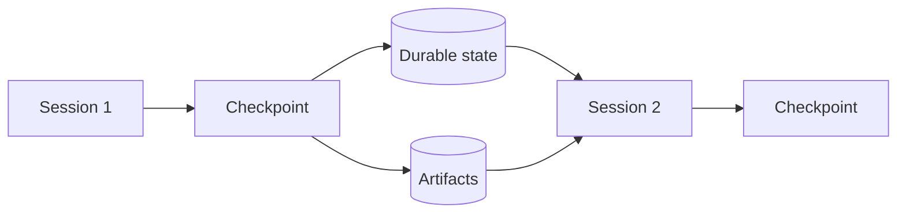
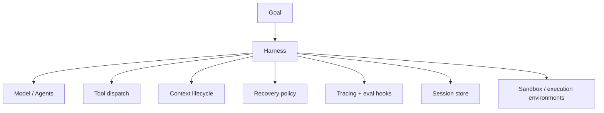
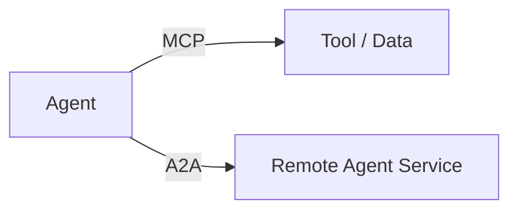
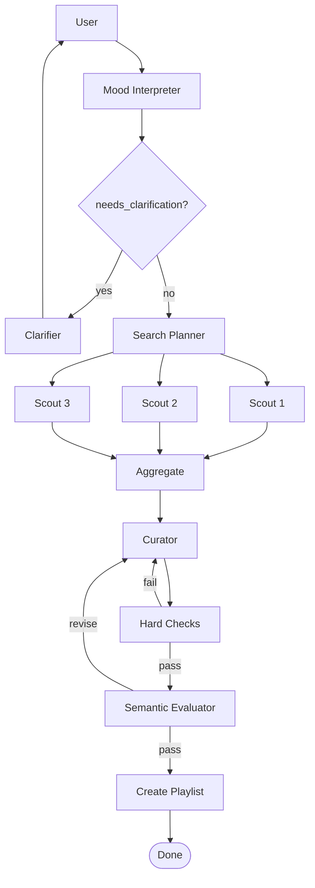
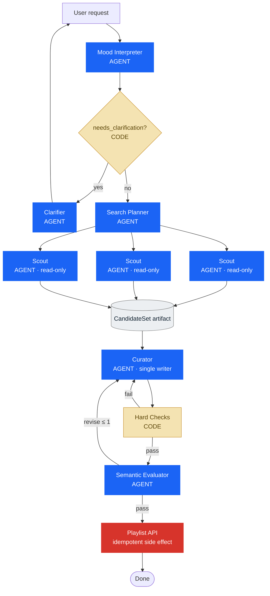
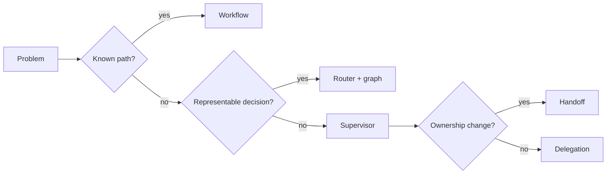

# Designing multi-agent systems in 2026 — Part 3

In the [previous chapters](/blog/en/progettare-sistemi-multiagentici-nel-2026-parte-1/), we defined when to decompose work and how to govern its components. Here we complete the picture: an agentic system must keep working when work is long-running, context changes, a process is interrupted, or execution reaches external systems.

## When work outlasts the conversation

Short tasks can live within a single context window. Long tasks cannot.



Four different techniques come into play here.

### Compaction

The previous history is summarized, and the same session continues. This maintains continuity, but the summary may lose details, and the context remains a layering of old decisions.

### Context reset

A clean context is started, and a structured handoff is passed. This costs more, but it eliminates residue and the "context anxiety" observed in some models.

### Checkpoint

The operational state is saved so that work can resume after a crash, a human pause, or maintenance.

### Artifact persistence

Work is not entrusted solely to conversational memory. Files, tests, plans, and results remain available outside the prompt.

```python
# [REFERENCE DESIGN]

checkpoint = Checkpoint(
    goal=state.goal,
    completed=state.completed_tasks,
    pending=state.pending_tasks,
    decisions=state.key_decisions,
    artifact_refs=state.artifact_refs,
    failures=state.failure_log,
    active_requests=state.pending_human_requests,
)

checkpoint_store.save(checkpoint)
```

In March 2026, Anthropic showcased a three-agent harness for long-running applications: planner, generator, and evaluator, using contracts and files as communication artifacts. An instructive detail is that, with subsequent models, some parts of the old harness became dead weight and were removed. The harness is not a cathedral; it is a hypothesis about the limits of the current model ([Anthropic — Harness long-running](https://www.anthropic.com/engineering/harness-design-long-running-apps)).

## From agent systems to harnesses

In 2026, the most interesting word is perhaps not *multi-agent*. It is *harness*.

The harness is what surrounds the model, transforming an inference into an operating system:



In its work on harness engineering, OpenAI describes a product built with Codex agents, automated testing, model-readable observability, and task-specific isolated environments. The interesting point is not the number of lines produced; it is the shift in roles: humans design the environment, intent, and feedback loops, while agents perform the execution ([OpenAI — Harness engineering](https://openai.com/index/harness-engineering/)).

In April 2026, OpenAI expanded its Agents SDK with a more capable harness for file and tool operations, native sandboxing, and a separation between harness and compute to ensure security, durability, and scale ([OpenAI — The next evolution of the Agents SDK](https://openai.com/index/the-next-evolution-of-the-agents-sdk/)).

Anthropic, with its Managed Agents, proposes a very clear separation:

```text
SESSION
append-only log of what has occurred

HARNESS
loop that calls the model and routes tools

SANDBOX
environment where the work is executed
```

This separation allows each element to fail, change, or scale independently. It is the infrastructure-level version of the same question that has been with us from the beginning: who holds which responsibility? ([Anthropic — Managed Agents](https://www.anthropic.com/engineering/managed-agents))

### Many brains, many hands

The metaphor used by Anthropic is effective. The "brain" is the model plus the harness; the "hands" are the sandboxes and tools. Decoupling them allows multiple harnesses to use different environments, or the same harness to send work to multiple execution environments, without turning every session into an indivisible server ([Anthropic — Managed Agents](https://www.anthropic.com/engineering/managed-agents)).

This does not imply that every application needs to build a meta-harness. It means that as soon as the work becomes long-running and operational, the boundary between reasoning, state, and execution ceases to be a mere detail.

## MCP and A2A: two different problems

Amidst the noise of protocols, it is easy to confuse the acronyms.

### MCP

The Model Context Protocol connects a model or an agent to tools, data, and resources ([MCP specification](https://modelcontextprotocol.io/specification/2026-07-28)). The typical relationship is:

```text
agent ↔ tool / data source
```

### A2A

Agent2Agent concerns interoperability and communication between separate agents or agentic services ([A2A official documentation](https://a2a-protocol.org/latest/)).

```text
agent service ↔ agent service
```



A2A is a communication layer between agents, not an agent development kit, nor a protocol for internal sub-agents or tool calls. It is used to enable collaboration between independent agents—even those built with different frameworks—without requiring the sharing of memory, tools, or proprietary logic ([A2A specification](https://a2a-protocol.org/latest/)).

In our running Spotify example, introducing this now would be premature complexity. It would only become relevant if the catalog, the curator, and the playlist creation system were autonomous services managed by different teams or vendors.

## When a decision becomes an edge

At a certain point, the system contains:

- typed state;
- nodes;
- conditional transitions;
- fan-out and fan-in;
- review loops;
- checkpoints;
- human requests;
- stop conditions.

There is no need to search for a metaphor anymore. We have built a graph.



The conceptual transition is this:

```text
Agent thinking:
"Which tool should I call?"

Graph thinking:
"Which node is executable, given the current state?"
```

The two coexist. A graph node can contain an agent, a function, a tool wrapper, or a human request.

The Microsoft Agent Framework documents functional or graph-based workflows, agents as executors, sequential or concurrent orchestrations, checkpoints, and HITL. LangGraph documents state, subgraphs, interrupts, and persistence. APIs change; the grammar remains ([Microsoft — Workflows](https://learn.microsoft.com/en-us/agent-framework/workflows/), [LangGraph — subgraphs](https://docs.langchain.com/oss/python/langgraph/use-subgraphs), [LangGraph — persistence](https://docs.langchain.com/oss/python/langgraph/persistence), [LangGraph — interrupts](https://docs.langchain.com/oss/python/langgraph/interrupts)).

## The Spotify reference architecture

Now we can put the pieces back together.



The most important thing about this diagram is not the number of agents.

It is that **not all boxes are agents**.

The gate is code. The hard checks are code. The artifact is persistent state. The scouts are read-only. The curator is the sole writer. The side effect has a boundary and an idempotency policy.

Each component earned its place because it solves a problem we had already encountered.

### The runtime, in pseudocode

```python
# [REFERENCE DESIGN - PSEUDOCODE]

async def build_playlist(user_request: str) -> Playlist:
    profile = await mood_interpreter.run(user_request)

    if profile.needs_clarification:
        return await clarifier.run(profile)

    request = PlaylistRequest.from_profile(profile)
    plan = await search_planner.run(request)

    worker_results = await gather_with_policy(
        tasks=[scout.run(task) for task in plan.independent_tasks],
        minimum_successes=2,
        retry_budget=1,
    )

    candidate_artifact = persist(
        aggregate(worker_results)
    )

    feedback = None
    for revision in range(2):
        playlist = await curator.run(
            request=request,
            candidates=candidate_artifact,
            feedback=feedback,
        )

        hard = hard_checks(playlist, request)
        if not hard.passed:
            feedback = hard.to_feedback()
            continue

        semantic = await evaluator.run(playlist, request)
        if semantic.passed:
            return await create_playlist_idempotently(playlist)

        feedback = semantic.rationale

    raise VerificationFailed()
```

This complete implementation is **not yet in the course repository**. The verified repository covers the monolith and structured routing; the rest is a reference architecture consistent with the educational path.

## What is converging in 2026

Sources and frameworks do not agree on a single winning architecture. It would be suspicious if they did. However, they are converging on a few principles.

### Simplicity comes before decomposition

Multi-agent is not a prize for complexity. Anthropic recommends starting with the simplest solution and increasing complexity only when necessary; in the 2026 case study, the author removes a sprint structure when a more capable model makes it redundant ([Anthropic — Building effective agents](https://www.anthropic.com/engineering/building-effective-agents), [Anthropic — Harness long-running](https://www.anthropic.com/engineering/harness-design-long-running-apps)).

### Context is a design object

Subagents, state schemas, artifacts, and handoffs are not decorations. They are ways to control what each component sees and what is lost during transitions ([Anthropic — Context engineering](https://www.anthropic.com/engineering/effective-context-engineering-for-ai-agents), [Willison — Subagents](https://simonwillison.net/guides/agentic-engineering-patterns/subagents/)).

### Control must be localized

Routers, supervisors, and handoffs are not synonyms. The first reads a state, the second reasons and retains ownership, and the third transfers ownership.

### Verification must touch the environment

Runtime evidence, unit tests, database state, browser interactions, metrics, and logs are worth more than any model statement. OpenAI describes agents that query traces and metrics to verify their own work; Anthropic draws a sharp distinction between transcripts and outcomes ([OpenAI — Harness engineering](https://openai.com/index/harness-engineering/), [Anthropic — Evals for agents](https://www.anthropic.com/engineering/demystifying-evals-for-ai-agents)).

### State must survive the prompt

Checkpoints, append-only sessions, and persistent artifacts make it possible to resume, inspect, and correct long-running work ([Anthropic — Managed Agents](https://www.anthropic.com/engineering/managed-agents), [Microsoft — HITL in workflows](https://learn.microsoft.com/en-us/agent-framework/workflows/human-in-the-loop)).

### Manage risk with deterministic boundaries

Permissions, read-only workers, single writers, sandboxes, and egress controls limit damage even when the model makes a mistake or is tricked ([Anthropic — Containment](https://www.anthropic.com/engineering/how-we-contain-claude)).

### Evaluate the model and the harness together

When we say "the agent achieved this result," we are measuring the model, prompt, tools, memory, orchestration, and environment. Changing the model without re-examining the harness is just as naive as changing the harness without re-running evaluations ([Anthropic — Evals for agents](https://www.anthropic.com/engineering/demystifying-evals-for-ai-agents), [Anthropic — Managed Agents](https://www.anthropic.com/engineering/managed-agents)).

## A grammar for design

Ultimately, patterns matter less than the questions you ask.

### Who decides?

- Is the decision already represented in the state? Use code or deterministic routing.
- Does it require context-based judgment? Evaluate a supervisor.
- Does the interlocutor need to change? Use a handoff.

### Who knows what?

- What is the minimum sufficient context?
- Which decisions should become typed fields?
- Which details can remain local?
- Which results should be bubbled up as summaries, and which as artifacts?

### Who does what?

- Does this responsibility require autonomy?
- Can it be a function?
- Can it be a tool?
- Are the subtasks independent?
- Is there a single writer for side effects?

### Who controls?

- Which properties are verifiable in code?
- What environmental state proves success?
- Where is semantic judgment needed?
- Does the review cycle have a budget?

### Who keeps the system running?

- How is state saved?
- How do you resume after a crash or human approval?
- Which retries are idempotent?
- What is the blast radius of each agent?
- Can I reconstruct the entire trajectory?

A minimal checklist can fit in a few lines:

```text
[ ] Each agent has a responsibility that requires autonomy.
[ ] Deterministic decisions are kept outside the prompt.
[ ] Handoffs have a contract.
[ ] Global and local state are separated.
[ ] Parallelism follows dependencies, not enthusiasm.
[ ] Side effects have ownership and idempotency.
[ ] Outcomes are verified in the environment.
[ ] Retries, fallbacks, escalations, and stops are explicit.
[ ] Traces and evals measure the system, not just the last response.
[ ] The harness is simplified every time the model changes.
```

## An interactive lab

The interactive educational simulator will arrive in a future update. In the meantime, this static diagram visualizes the core architectural decision:



## Conclusion

We started with an agent with five tools. It wasn't a bad architecture; it was simply an architecture where too many decisions remained implicit.

We separated state from text, control from work, verification from generation, and execution from the session. Each time, we added structure only when the previous system showed a crack.

This, in my opinion, is the healthiest way to think about multi-agent systems in 2026.

The question isn't "how many agents can I get to collaborate?" It is:

> **Where should the intelligence reside, and where is structure needed instead?**

When the decision is known, write it down. When the result is verifiable, test it. When the work is independent, parallelize it. When context must cross a boundary, give it a shape. When an agent can cause damage, restrict what it is allowed to do. And when a component no longer adds value, remove it.

The rest is orchestration. And, as often happens, the real challenges emerge precisely in the handoffs between one box and the next.

## Sources and further reading

Sources are ordered by function, not by prestige. Engineering posts and official documentation support the system descriptions; practitioner insights add field experience; 2025 works are included when they introduce concepts that remain central in 2026.

- [Anthropic — Building effective agents](https://www.anthropic.com/engineering/building-effective-agents): A 2024 guide to routing, chaining, parallelization, orchestrator-workers, and evaluator-optimizer patterns, with a recommendation to start with the simplest solution.
- [Anthropic — Demystifying evals for AI agents](https://www.anthropic.com/engineering/demystifying-evals-for-ai-agents): Definitions of tasks, trials, graders, transcripts, outcomes, and evaluation harnesses.
- [Anthropic — Harness design for long-running application development](https://www.anthropic.com/engineering/harness-design-long-running-apps): Planners, generators, evaluators, and the cost/duration trade-offs for long-running tasks.
- [Anthropic — Scaling Managed Agents](https://www.anthropic.com/engineering/managed-agents): Separation between sessions, harnesses, sandboxes, and execution environments.
- [Anthropic — How we contain Claude across products](https://www.anthropic.com/engineering/how-we-contain-claude): Containment, permissions, and blast radius reduction.
- [Anthropic — Building a C compiler with a team of parallel Claudes](https://www.anthropic.com/engineering/building-c-compiler): An experiment involving sixteen agents, a shared environment, and parallel coordination.
- [Anthropic — Effective context engineering for AI agents](https://www.anthropic.com/engineering/effective-context-engineering-for-ai-agents): Context management, compaction, memory, and subagents.
- [OpenAI — Harness engineering](https://openai.com/index/harness-engineering/): Harnesses, testing, observability, and isolated environments for Codex agents.
- [OpenAI — The next evolution of the Agents SDK](https://openai.com/index/the-next-evolution-of-the-agents-sdk/): SDK evolution, sandboxes, and the separation between harnesses and compute.
- [OpenAI Agents SDK — Agent orchestration](https://openai.github.io/openai-agents-python/multi_agent/): Differences between LLM-based and code-based orchestration, agents as tools, and handoffs.
- [OpenAI Agents SDK — Handoffs](https://openai.github.io/openai-agents-python/handoffs/): Handoff configuration, inputs, and filters.
- [Microsoft Agent Framework — Workflows](https://learn.microsoft.com/en-us/agent-framework/workflows/): Functional or graph-based workflows, agents as executors, sequential/concurrent orchestrations, checkpoints, and HITL.
- [Microsoft Agent Framework — Human in the loop](https://learn.microsoft.com/en-us/agent-framework/workflows/human-in-the-loop): Suspendable requests, approvals, and workflow resumption.
- [LangChain — Handoffs](https://docs.langchain.com/oss/python/langchain/multi-agent/handoffs): State-driven transitions; in subgraphs, the transferred context must be explicitly selected.
- [LangGraph — Use subgraphs](https://docs.langchain.com/oss/python/langgraph/use-subgraphs): Inputs, outputs, and state management for subgraphs.
- [LangGraph — Persistence](https://docs.langchain.com/oss/python/langgraph/persistence): State persistence and checkpoints.
- [LangGraph — Interrupts](https://docs.langchain.com/oss/python/langgraph/interrupts): Controlled interruptions and graph resumption.
- [Model Context Protocol — specification](https://modelcontextprotocol.io/specification/2026-07-28): A protocol for connecting agents to tools, data, and resources.
- [A2A Protocol — specification](https://a2a-protocol.org/latest/): Interoperability and communication between independent agents without requiring shared memory, tools, or proprietary logic.
- [Simon Willison — Subagents](https://simonwillison.net/guides/agentic-engineering-patterns/subagents/): Practical experience with context isolation and parallelism.
- [Hamel Husain — Evals Skills for Coding Agents](https://hamelhusain.substack.com/p/evals-skills-for-coding-agents): Error taxonomies, traces, and evaluators calibrated with human judgment.
- [Jason Liu — Why Cognition does not use multi-agent systems](https://jxnl.co/writing/2025/09/11/why-cognition-does-not-use-multi-agent-systems/): A practical critique of context loss in multi-agent systems.

### Further reading

- [OpenAI — Symphony](https://openai.com/index/open-source-codex-orchestration-symphony/): Open-source specification for Codex orchestration.
- [Anthropic — AI Organizations](https://alignment.anthropic.com/2026/ai-organizations/): Research on the effectiveness and alignment of agent organizations.
- [OpenAI Agents SDK — Tracing](https://openai.github.io/openai-agents-python/tracing/): Execution tracing and observability.
- [LangChain — Multi-agent patterns](https://docs.langchain.com/oss/python/langchain/multi-agent/index): Overview of multi-agent patterns supported by the framework.
