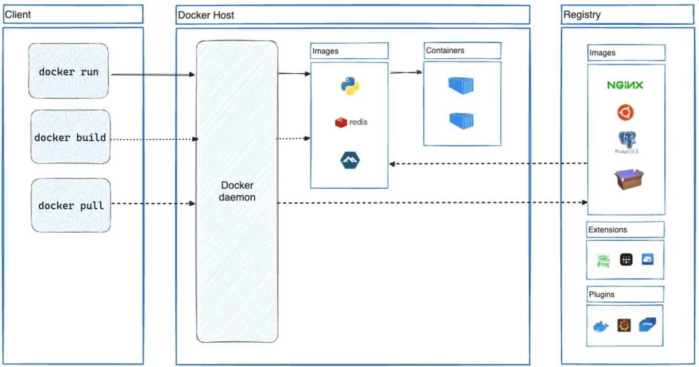
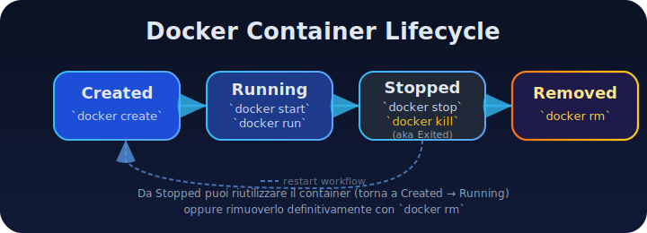

# Deep dive in Docker

<details class="post-warning">
<summary><strong>Articolo in revisione</strong> (clicca per aprire)</summary>

Questo articolo è ancora in lavorazione e sotto revisione editoriale. Alcuni paragrafi potrebbero risultare incompleti o cambiare in modo significativo nelle prossime settimane.

</details>

## Abstract
Eccoci arrivati al secondo episodio della serie "Docker per sviluppatori". Dato che il primo articolo è stato apprezzato, direi che possiamo andare deep questa volta analizzando i concetti chiave di Docker in modo accessibile a tutti. Cerchiamo di capire cosa fa Docker concettualmente, senza ancora scrivere codice o configurare nulla.

## 1\. Concetti fondamentali



_Figura 1: Architettura Docker - Il client invia comandi al demone Docker, che gestisce immagini e container. Le immagini (es. Python, Redis) risiedono in registri come Docker Hub, da cui possono essere scaricate ("pull"). I container sono istanze runtime create a partire dalle immagini, eseguite isolate sul Docker Host._

Partiamo da una delle definizioni principali in questo campo, cos'è un'**immagine Docker**.

**Immagini Docker:** Un'_immagine_ Docker è essenzialmente un **template in sola lettura** che descrive tutto il necessario per creare un container. [Nel sito ufficiale](https://docs.docker.com/get-started/docker-overview/) possiamo vederlo come uno _snapshot_ del filesystem e della configurazione di un sistema minimale. 
Attenzione però, un'immagine può basarsi su un'altra. Per esempio si può partire da Ubuntu aggiungendo poi un server Apache, l'applicazione e le configurazioni necessarie. 

Una cosa da tenere a mente è che le immagini sono costruite in modo incrementale e composito: ognuna **è composta da più strati (layer)** di filesystem impilati (concetto che approfondiremo più avanti). 
Un'altra cosa **importante**: un'immagine di per sé è **statica e immutabile**. Questo significa che **non cambia mai durante l'esecuzione**, fungendo da modello da cui avviare i container.

Un momento ma cos'è un container docker?

**Container Docker:** Un _container_ è invece una **istanza runtime di un'immagine**, o meglio [così viene definito ufficialmente](https://docs.docker.com/get-started/docker-overview/#containers). Se l'immagine è il modello, il container è l'oggetto concreto in esecuzione. 

In pratica, un container non è altro che un processo isolato che gira sulla macchina host, con il suo filesystem, la sua rete e il suo spazio di processi separati. [Qui sto citando testualmente](https://docs.docker.com/engine/containers/run/#:~:text=Docker%20runs%20processes%20in%20isolated,tree%20separate%20from%20the%20host). 

Docker utilizza l'immagine come base e crea un ambiente isolato in cui l'applicazione può girare. Possiamo pensare al container come a un *"contenitore"* (da cui ovviamente il nome) che racchiude l'applicazione e le sue dipendenze, garantendo che questa giri sempre nello stesso ambiente, a prescindere da dove il container viene eseguito. 

Un'analogia utile è con la programmazione a oggetti: **l'immagine è come una classe, mentre il container è un'istanza (un oggetto) di quella classe**
 - l'immagine definisce
 - il container esegue. 
 
 Inoltre, più container possono essere creati dalla stessa immagine (come oggetti multipli da una singola classe) senza influenzarsi a vicenda, ciascuno col proprio stato temporaneo.

 Dato che non c'è due senza tre, voglio dare una terza definizione molto importante.

**Registry (Registro di immagini):** Un [_registry_](https://docs.docker.com/get-started/docker-overview/#docker-registries) è un servizio centralizzato per conservare e condividere immagini container. Il registro pubblico predefinito (e aggiungo largamente utilizzato) è **Docker Hub**, a cui Docker si rivolge di default per scaricare immagini che non vengono trovate in locale. 

Esistono anche registri alternativi pubblici o privati: ad esempio GitHub Container Registry, AWS ECR di Amazon, Google GCR, Azure ACR, o soluzioni self-hosted come Harbor. In un registro (da ora mi permetto di tradurlo in italiano), le immagini sono organizzate in repository (ad esempio nomeutente/nomeimmagine su Docker Hub identifica un repository). La differenza tra registro pubblico e privato sta principalmente nei controlli di accesso: un **registro pubblico** (come Docker Hub) **mette a disposizione immagini a chiunque**, spesso con una libreria di immagini ufficiali; un **registro privato** invece è accessibile solo a **utenti autorizzati**, utile per mantenere immagini aziendali o interne non visibili pubblicamente. In entrambi i casi, Docker può autenticarsi al registry se necessario e poi effettuare _pull_ (nel senso di scaricare) e _push_ (qui invece nel senso di caricare) delle immagini.

Ora che abbiamo capito dato alcune definizioni, possiamo iniziare a mettere le mani in pasta, magari partendo da come si crea un'immagine.

**Come si crea un'immagine (build):** Le immagini Docker si creano tipicamente con un processo di _build_ basato su un [**Dockerfile**](https://docs.docker.com/get-started/docker-overview/#:~:text=You%20might%20create%20your%20own,compared%20to%20other%20virtualization%20technologies), che è un file di testo che contiene istruzioni su come costruire l'immagine a partire da una base. Ogni istruzione nel Dockerfile (es. FROM, RUN, COPY, ecc.) viene eseguita in sequenza dal demone Docker durante il build, producendo a sua volta uno strato di filesystem aggiuntivo sull'immagine. 

Ad esempio, un Dockerfile potrebbe iniziare definendo l'immagine base Ubuntu con:
```docker
FROM ubuntu:22.04
```
poi per installare Python, creando un nuovo layer con questi file aggiunti
```docker
RUN apt-get install -y python3
```
quindi per copiare il codice dell'applicazione dentro l'immagine:
```docker
COPY . /app
```
e così via. Docker esegue il build passando per ognuna di queste istruzioni e "impilando" i risultati nell'immagine definitiva. 

Questo processo sfrutta la cache: se ricostruiamo un'immagine senza modificare certe istruzioni, Docker riutilizzerà i layer esistenti senza ricalcolarli, rendendo il build molto veloce. Per sfruttare al meglio la cache, vi lascio direttamente [il codice ufficiale](https://docs.docker.com/build/cache/) per sfruttare la cache.

```docker
# syntax=docker/dockerfile:1
FROM ubuntu:latest

RUN apt-get update && apt-get install -y build-essentials
COPY main.c Makefile /src/
WORKDIR /src/
RUN make build
```

Alla fine del build, otteniamo un'immagine identificata da un **ID univoco (un hash)**, che possiamo eseguire o distribuire. Possiamo creare immagini nostre da zero (ad es. partendo da scratch, un'immagine vuota) o basarci su immagini altrui, il che incentiva il riuso di componenti comunemente usate (es. una base Linux standard) invece di reinventare tutto.

Concludiamo questa sezione parlando di due comandi di cui abbiamo in parte già parlato.

**Pull e Run:** Due comandi fondamentali per lavorare con le immagini sono `docker pull` e `docker run`.

- **Docker Pull.** Il comando `docker pull <nome:tag>` scarica un'immagine dal registro. Dietro le quinte il client Docker contatta il registry via HTTP(S), richiede il manifesto dell'immagine (il file che elenca i layer) e scarica ogni layer — il cosiddetto _blob_ — che non ha già in cache, spesso in parallelo, salvandolo in locale. [Se volete approfondire](https://www.redhat.com/en/blog/pull-container-image#:~:text=When%20you%20initiate%20a%20pull%2C,a%20manifest%20from%20the%20registry). Ad esempio `docker pull nginx:latest` recupera da Docker Hub la lista dei layer di Nginx, li scarica uno alla volta e, al termine, rende l'immagine pronta sull'host.

- **Docker Run.** Il comando `docker run` avvia un container a partire da un'immagine. In un solo passo esegue l'eventuale `docker pull` (se l'immagine manca in locale) e crea/avvia il nuovo container. Se lanci `docker run ubuntu:22.04 echo "ciao"`, Docker verifica la presenza dell'immagine `ubuntu:22.04`, la scarica se necessario, **crea un container** (allocando risorse, preparando il filesystem, assegnando un ID) e **lo avvia** eseguendo `echo "ciao"` al suo interno. Una volta che il comando è terminato, il container può essere fermato e rimosso oppure riutilizzato. In sintesi, `docker run` gestisce l'intero ciclo di vita: download (se serve) e esecuzione del processo nel container.

## 2\. Ciclo di vita di un container

### Dal build all'esecuzione (dietro `docker run`):

Dopo aver costruito un'immagine (la fase di _build_ che abbiamo appena visto), possiamo passare alla fase di _run_, ossia creare ed eseguire container basati su quell'immagine. 

Quando eseguiamo `docker run`, come abbiamo già visto, Docker potrebbe prima scaricare l'immagine (se non già presente). 

Successivamente effettua internamente un'operazione equivalente a `docker container create`: in questa fase il container entra nello stato **"Created" (creato)**. In questa fase le risorse necessarie vengono allocate, viene assegnato un ID e predisposto il filesystem specifico del container.

Subito dopo, Docker avvia il container (equivalente a `docker container start`), lanciando il processo principale definito dall'immagine. 

A questo punto il container passa allo stato **"Running" (in esecuzione)** ed esegue il suo workload all'interno dell'ambiente isolato. Il container rimarrà in esecuzione finché il suo processo principale (o main process) è attivo. Se quel processo termina (o per uscita volontaria o crash) o se inviamo un comando di stop, Docker ferma il container, che entra nello stato **"Stopped" o "Exited" (fermato/uscito)**. Un container **stopped** conserva ancora lo stato del suo filesystem isolato, i log, e può essere riavviato se serve (in questo caso tornerà "Running"). 

Infine, se decidiamo di liberare completamente le risorse, possiamo rimuovere il container con `docker rm`: a quel punto esso passa allo stato **"Removed" (rimosso)**, venendo cancellato dal sistema. Il [ciclo di vita](https://last9.io/blog/docker-container-lifecycle/#:~:text=Every%20container%20typically%20goes%20through,general%20flow%20stays%20the%20same) tipico dunque è: **Created → Running → Stopped/Exited → Removed**. 



_Figura 4: Il ciclo di vita di un container Docker, con i comandi principali che lo accompagnano dalla creazione alla rimozione definitiva._

> **Nota bene**: Docker prevede anche uno stato **"[Paused](https://last9.io/blog/docker-container-lifecycle/#:~:text=The%20Paused%20State)" (in pausa)**, in cui i processi del container sono congelati tramite cgroups freezer, senza terminarli. Mettere in pausa un container consente di riservare CPU temporaneamente, ma è usato più raramente. Ovviamente un container deve essere in stato Running per poter essere messo in pausa, e va poi "unpaused" per riprendere.

**Stati del container:** Riassumendo, ecco i [principali stati](https://last9.io/blog/docker-container-lifecycle/#:~:text=Every%20container%20typically%20goes%20through,general%20flow%20stays%20the%20same) in cui un container Docker può trovarsi durante il suo ciclo di vita:

- **Created:** il container è stato definito e le risorse allocate, ma il processo al suo interno non è ancora in esecuzione. Si ottiene, ad esempio, con un docker create senza start, oppure subito dopo un docker run prima che il processo parta. In questo stato il container ha un ID, un filesystem pronto, ma consuma risorse minime (nessun processo attivo).
- **Running:** il container è avviato e il suo processo principale (PID 1 nel container) sta girando. Il container è attivo: potrebbe esporre porte di rete, utilizzare CPU/RAM, effettuare operazioni I/O, ecc. Questo è lo stato che si ha quando utilizziamo il servizio o l'applicazione contenuta nel container.
- **Stopped/Exited:** il container ha eseguito il suo processo ed esso è terminato, oppure è stato fermato manualmente. Il container non esegue nulla, ma esiste ancora nel sistema con il suo filesystem integro e lo stato che aveva al momento dello stop. Possiamo ispezionarlo, leggere i log, o eventualmente riavviarlo.
- **Removed:** il container è stato eliminato dal Docker host (tipicamente con `docker rm` o tramite opzioni `--rm`). In questo stato il container non occupa più spazio (salvo eventuali volumi persistenti separati) e non appare più in `docker ps -a`. Ogni modifica non conservata fuori dal container è persa definitivamente a questo punto.

### Copy-on-write e filesystem dei container

Uno degli aspetti chiave di Docker è come gestisce il filesystem dei container con un meccanismo di **copy-on-write**. Alla creazione di un container, Docker allestisce per esso un **filesystem unito ([_union file system_](https://www.digitalocean.com/community/tutorials/working-with-docker-containers#overview))**, composto da **tutti** i layer in **sola lettura** dell'immagine di base _più_ un **layer scrivibile** specifico per il container. 

In pratica, il container "vede" un unico filesystem completo (chiamato _root filesystem_ del container) che unisce gli strati dell'immagine al suo layer scrivibile. 

Quando un processo nel container modifica o crea un file, ecco che entra in gioco il copy-on-write: se il file esisteva già in uno dei layer di sola lettura dell'immagine, Docker ne fa **una copia nel layer scrivibile del container** e applica lì le modifiche, lasciando intatto il file originale dell'immagine. Il risultato è che dentro il container sembra che il file sia cambiato, ma all'esterno l'immagine rimane immutata.

Ogni container ha il suo layer scrivibile, quindi le modifiche fatte in un container **non sono visibili in altri container** che usano la stessa immagine. Inoltre, se cancelliamo un container, perdiamo il suo layer scrivibile e con esso tutte le modifiche fatte in quell'ambiente (a meno di non averle salvate in volumi persistenti o _committate_ in una nuova immagine).

Questo design copy-on-write rende i container **leggeri** ma anche **effimeri**. Infatti, condividono tra loro i layer immutabili (risparmiando spazio e memoria) e ognuno aggiunge solo le differenze necessarie. Ad esempio, se avviamo 5 container dall'immagine ubuntu, sul disco avremo una sola copia dei layer di Ubuntu, usata in comune, più 5 piccoli layer separati per le differenze di ciascun container.

## 3\. Architettura interna

### Isolamento con namespaces e cgroups (kernel Linux)

Docker realizza l'isolamento dei container sfruttando funzionalità native del kernel Linux, principalmente _namespaces_ e _cgroups_. 

Bene, li abbiamo citati in precedenza ma non mi sono dimenticato di spiegarli.

#### Namespaces
I **namespaces** sono meccanismi che il kernel fornisce per isolare views e risorse di sistema tra i vari gruppi di processi. In sostanza, quando Docker crea un container, [dietro le quinte](https://docs.docker.com/get-started/docker-overview/#:~:text=The%20underlying%20technology) il kernel assegna al container una serie di namespaces dedicati. Ciascun namespace isola un aspetto: ad esempio, il _PID namespace_ fa sì che il container abbia la propria numerazione di processi (il processo "1" del container è il processo principale dell'app, e [non vede i processi fuori dal container](https://blog.nginx.org/blog/what-are-namespaces-cgroups-how-do-they-work#:~:text=The%20crucial%20thing%20to%20notice,isolated%20within%20my%20own%20namespace)).

Il _network namespace_ fornisce al container la sua interfaccia di rete virtuale, con indirizzo IP separato, isolando il traffico di rete. 

Il _mount namespace_ dà al container la propria visione del filesystem (vedremo a breve il root filesystem specifico), separata da quella host. 

Grazie ai namespaces, ogni container vive in una sorta di "bolla" logica: **dall'interno vede solo risorse proprie**, e non quelle degli altri container o dell'host. 

#### Cgroups
Oltre ai namespace, Docker utilizza i [**cgroups**](https://blog.nginx.org/blog/what-are-namespaces-cgroups-how-do-they-work#:~:text=What%20Are%20cgroups?) (_control groups_) per limitare e monitorare l'uso di risorse (CPU, RAM, I/O) da parte dei container. 

I cgroups permettono al sistema di [impostare quanta CPU o memoria massima può consumare un container](https://blog.nginx.org/blog/what-are-namespaces-cgroups-how-do-they-work#:~:text=A%20control%20group%20,of%20a%20collection%20of%20processes), garantendo che uno non saturi tutte le risorse a scapito degli altri. 

Inoltre forniscono accounting (tracciamento) dei consumi e possono anche congelare o terminare in blocco tutti i processi di un container. 

> In sintesi, **namespaces** serve per l'isolamento (container per processi, rete, filesystem, ecc.), **cgroups** = controllo risorse e quote. Docker combina questi meccanismi in modo da creare container che si comportano come ambienti separati, pur girando tutti sullo stesso kernel Linux sottostante.

### Curiosità: Root filesystem e OverlayFS

All'interno di ciascun container, il processo vede un **root filesystem isolato**, cioè la directory del container contiene solo i file dell'immagine più le eventuali modifiche locali, e non i file dell'host. 

Come accennato, questo è realizzato tramite un union filesystem con meccanismo di copy-on-write. Su Docker è consigliato usare [**OverlayFS**](https://www.adaltas.com/en/2021/06/03/linux-overlay-filesystem-docker/#:~:text=Docker%20supports%20multiple%20storage%20drivers,storage%20driver) (nella variante _overlay2_) per implementare questa funzionalità. 

OverlayFS consente di unire più directory ("lower dirs" in sola lettura + "upper dir" in scrittura) presentandole come un'unica directory montata. 

Nel contesto di Docker, i **layer dell'immagine** sono le lower dirs (read-only) e la **cartella "diff" del container** è l'upper dir (read-write); quando il container viene avviato, Docker monta un filesystem di tipo overlay che unisce tutti questi livelli e lo imposta come root filesystem del container (usando chiamate come [chroot](https://docs.docker.com/get-started/docker-concepts/building-images/understanding-image-layers/#:~:text=chroot) o namespace mount). 

Ad esempio, un'immagine Ubuntu può essere composta da diversi layer (uno per la base di OS minimal, uno per alcune librerie, ecc.). 
Quando eseguiamo un container da tale immagine, Docker [crea una nuova dir](https://www.adaltas.com/en/2021/06/03/linux-overlay-filesystem-docker/#:~:text=Docker%20uses%20the%20overlay%20filesystem,%20top%20of%20the%20image%20layers) per il layer superiore del container e poi monta un overlay FS: il risultato è una cartella merged che rappresenta la vista unificata di Ubuntu base + modifiche. 

**OverlayFS** è molto efficiente in quanto evita duplicazione di dati tra container multipli e rende immediato l'avvio di nuovi container (basta aggiungere un nuovo layer in scrittura sopra i layer esistenti). 

L'uso di un filesystem a strati è un concetto cruciale: è ciò che rende le immagini Docker composte da **layer riutilizzabili** e i container istanze leggere che sfruttano quei layer condivisi.

## 4\. Immagini Docker come strati: i layers

### Layer: cos'è e come viene memorizzato
Un'immagine Docker non è un singolo blob monolitico, ma è costituita da una **serie ordinata di strati** impilati. Come ben descritto sul [nella documentazione ufficiale](https://docs.docker.com/get-started/docker-concepts/building-images/understanding-image-layers/#:~:text=Each%20layer%20in%20an%20image,look%20at%20a%20theoretical%20image), ogni _layer_ rappresenta un insieme di **modifiche al filesystem** rispetto al layer sottostante. Ad [esempio](https://docs.docker.com/get-started/docker-concepts/building-images/understanding-image-layers/#:~:text=Each%20layer%20in%20an%20image,look%20at%20a%20theoretical%20image), immaginiamo di creare un'immagine per una applicazione Python. I layer potrebbero essere così strutturati:

- **Layer 1:** sistema base minimal (es. comandi di base e package manager apt su Ubuntu).
- **Layer 2:** installazione dell'interprete Python e di pip.
- **Layer 3:** aggiunta del file requirements.txt dell'applicazione.
- **Layer 4:** installazione dei pacchetti Python specifici dell'app (dipendenze listate in requirements.txt).
- **Layer 5:** copia del codice sorgente dell'applicazione nella destinazione prevista.


_Figura 5: Il diagramma a piramide mostra la progressione dei layer dal sistema base fino al codice applicativo._

Ogni layer aggiunge dunque file o apporta modifiche (installazioni, copie, configurazioni). In termini di Dockerfile, queste corrisponderebbero rispettivamente a istruzioni come `FROM ubuntu:22.04`, `RUN apt-get install python3 pip`, `COPY requirements.txt .`, `RUN pip install -r requirements.txt`, `COPY src/` . e così via. Docker durante il build [crea un layer per ciascuna istruzione](https://docs.docker.com/get-started/docker-overview/#:~:text=You%20might%20create%20your%20own,compared%20to%20other%20virtualization%20technologies). 

### Come vengono memorizzati?
Internamente, Docker salva ciascun layer come un [archivio compresso](https://www.adaltas.com/en/2021/06/03/linux-overlay-filesystem-docker/#conclusion) (tipicamente una tarball) e lo identifica con un hash univoco (un digest SHA256). 

I layer sono **immutabili**: una volta creato un layer, non viene più modificato (qualsiasi cambiamento avviene creando un nuovo layer sopra). Questo approccio dei [layers immutabili](https://docs.docker.com/get-started/docker-overview/#:~:text=with%20a%20simple%20syntax%20for,compared%20to%20other%20virtualization%20technologies) significa anche che, se aggiorniamo un'immagine ricostruendola, Docker può riutilizzare i layer precedenti che non sono cambiati e rigenerare anche solo i nuovi.

### Caching e riuso dei layer

Uno dei vantaggi chiave di avere immagini a strati è la possibilità di **riusare** layer comuni tra immagini diverse e tra build successivi. Ad [esempio](https://docs.docker.com/get-started/docker-concepts/building-images/understanding-image-layers/#:~:text=This%20is%20beneficial%20because%20it,look%20similar%20to%20the%20following), se due diverse immagini Docker entrambe partono da ubuntu:22.04, il layer di base di Ubuntu può essere condiviso: Docker lo scarica o costruisce una volta e poi lo riutilizza per tutte le immagini derivate. 


_Figura 6: Due applicazioni differenti riusano lo stesso layer di base (Debian + Python/pip) mantenendo solo i layer finali specifici._

Questo riduce enormemente lo spazio utilizzato e banda di download necessaria, oltre ad accelerare i tempi di build. Durante la creazione di un'immagine tramite Dockerfile, Docker costruisce in ordine le istruzioni e memorizza l'hash del contenuto generato ad ogni passo. Se ricostruiamo la stessa immagine senza modifiche a un certo passo, Docker riconosce che esiste già un layer identico in cache e lo riutilizza senza rieseguire i comandi (vedremo messaggi tipo "Using cache" nel output di docker build). Ad esempio, se il Dockerfile non cambia tra un build e l'altro, Docker riuserà tutti i layer dalla cache, producendo l'immagine quasi istantaneamente. Se modifichiamo solo le ultime istruzioni (es. il codice applicativo), gli strati iniziali rimangono cacheati e Docker ricalcola solo quelli nuovi o modificati. 

Oltre al caching locale, il design a layer facilita il **pull incrementale**: quando facciamo docker pull di un'immagine aggiornata, Docker scarica solo i nuovi layer non presenti e salta quelli già scaricati in passato (ad esempio passando da v1 a v2 di un'immagine che differisce solo nell'ultimo layer, Docker scaricherà solo quel layer aggiuntivo). In scenari di distribuzione, questo comporta notevoli risparmi di tempo e larghezza di banda.

### Esempio pratico di layer (Dockerfile)

Prendiamo un Dockerfile semplice per illustrare i layer:

```docker
FROM ubuntu:22.04  
RUN apt-get update && apt-get install -y nginx  
COPY index.html /usr/share/nginx/html/index.html
```

Quando costruiamo questa immagine, Docker esegue:

- `FROM ubuntu:22.04`: questo istruisce Docker a usare l'immagine di base **Ubuntu 22.04**. Tale immagine di base già consiste di **alcuni layer** (minimali di Ubuntu). Tutti insieme questi layer diventano i **layer iniziali** della nostra nuova immagine.
- `RUN apt-get update && apt-get install -y nginx`: Docker avvia un container temporaneo da Ubuntu base e esegue i comandi. Le modifiche risultanti (pacchetti Nginx installati, file di configurazione aggiunti) costituiscono un **nuovo layer** che si piazza sopra quelli di Ubuntu. Questo layer contiene solo le differenze, ovvero i file aggiunti/modificati rispetto alla base.
- `COPY index.html`: Docker copia il file locale index.html nel filesystem del container temporaneo (nella posizione specificata). Ciò aggiunge/aggiorna quel file nel container, e queste modifiche diventano un ulteriore **layer finale**.

L'immagine risultante ha quindi: i layer di Ubuntu, un layer per l'installazione di Nginx, e un layer per la copia del file HTML. Se volessimo creare un'altra immagine simile (ad esempio un altro sito statico basato sempre su Ubuntu e Nginx), Docker riutilizzerà i layer di Ubuntu e Nginx già esistenti, dovendo aggiungere solo il layer con i nuovi file specifici. Questo mostra come i layer permettono di **estendere immagini esistenti** aggiungendo solo ciò che serve in più. In fase di esecuzione dei container, i layer in sola lettura dell'immagine Nginx appena creata possono essere condivisi tra tutti i container che l'utilizzano, mentre eventuali file differenti tra container (es. magari personalizzazioni fatte in runtime) restano confinati nei rispettivi layer scrivibili. In definitiva, l'architettura a strati delle immagini Docker è un elemento fondamentale per la **portabilità** (posso scaricare solo ciò che serve), la **consistenza** (ogni layer è immutabile e riproducibile) e l'**efficienza** (massimo riuso di componenti comuni).

## 5\. Registri e distribuzione

### Cosa succede con docker pull

Abbiamo visto che docker pull scarica un'immagine da un registro, ma analizziamo brevemente il processo. Quando eseguiamo `docker pull nome:tag`, il client Docker si connette al registry (per default Docker Hub, o un altro se specificato nel nome o nella config) e compie una serie di chiamate API HTTP. 

In primo luogo, richiede il **manifest** dell'immagine.

> Il manifest è un documento (in formato JSON) che elenca i digest di tutti i layer dell'immagine e i metadati (come l'hash del config JSON dell'immagine, architettura, etc.). 

Il registry risponde con il manifest, che può essere di [due tipi](https://www.redhat.com/en/blog/pull-container-image#:~:text=There%20are%20currently%20two%20types,and%20a%20manifest): 
- un _manifest list_: indice multi-architettura contenente riferimenti a manifest per diverse piattaforme
- oppure un manifest singolo per una specifica piattaforma.

Il client Docker, se riceve una manifest list, sceglierà il manifest adatto al [sistema host](https://www.redhat.com/en/blog/pull-container-image#:~:text=Suppose%20a%20client%20chooses%20the,architecture%20and%20the%20manifest%20digest) (es. scegliendo i layer linux/amd64 se stiamo su un PC x86_64). 

Ottenuto il manifest specifico, Docker procede a **scaricare i layer** elencati: per ciascun digest di layer effettua una richiesta GET al registry per recuperare il blob corrispondente. 

I layer sono scaricati in parallelo (per velocizzare il processo) e salvati nella cache locale (tipicamente su linux è `/var/lib/docker/` nel driver di storage in uso). Se alcuni layer erano già presenti (perché magari comuni con altre immagini), Docker li salta. 

Terminato il download di tutti i blob, Docker compone o aggiorna l'immagine localmente (scrivendo il config JSON che descrive l'immagine e referenziando i layer locali). A questo punto l'immagine è disponibile per essere eseguita. 

In sintesi, docker pull è un processo di **download dei componenti immagine** orchestrato tramite chiamate REST: prima il manifest (o un indice multi-arch), poi i blob dei layer. Dal nostro punto di vista (intendo dire quello dell'utente), questo si traduce in messaggi "Pull complete" per ogni layer e infine "Downloaded newer image for 'nome del tag'".

### Registri pubblici vs privati
I _container registry_ possono essere pubblici (aperti a tutti) o privati. Un **registro pubblico** come Docker Hub permette a chiunque di scaricare immagini pubblicate lì (e spesso anche di pubblicarne di proprie, con dei limiti per gli account free). 

Docker Hub contiene migliaia di immagini, incluse le _Docker Official Images_ (immagini ufficiali per software comuni, mantenute dalla community o dai produttori stessi, es. nginx, mysql, etc.). Altri registri pubblici includono il GitHub Container Registry (GHCR), Google Artifact Registry, Red Hat Quay, etc., dove spesso troviamo immagini relative a progetti open source o prodotti specifici. 

Un **registro privato**, invece, è accessibile solo a utenti o sistemi autenticati e autorizzati. Può essere un servizio cloud (ad esempio Amazon ECR per AWS, GitLab Container Registry integrato in GitLab, DigitalOcean Container Registry, etc.) oppure un'istanza di registro self-hosted che l'azienda gestisce in-house (come Harbor o un'istanza privata di Nexus/Artifactory con supporto Docker). Dal punto di vista di Docker, interagire con un registro privato o pubblico è simile, tranne per il fatto che per quelli privati spesso dobbiamo effettuare login (docker login) per ottenere un token di accesso.

Ok ma quali sono le **differenze principali**? I registri pubblici sono utili per la distribuzione open e la condivisione comunitaria (con possibili limitazioni di banda o storage per livello free), mentre i registri privati garantiscono riservatezza e controllo su chi può scaricare le immagini. Questi sono fondamentali quando si lavora con immagini contenenti codice proprietario o che non vogliamo rendere pubbliche.

Docker Hub di default cerca solo immagini pubbliche (se non trova col tag specifico, assume libreria ufficiale se esiste), ma possiamo specificare un registro alternativo nei nomi delle immagini (es. myregistry.example.com:5000/mio-team/mia-immagine:1.0). 

In contesti enterprise, l'uso di registri privati consente anche di collegare pipeline CI/CD per pubblicare automaticamente nuove build di immagini in un luogo sicuro e di controllare le versioni in produzione. In breve, **pubblico vs privato** si riduce a open vs access-restricted, ma tecnologicamente [entrambi](https://docs.docker.com/get-started/docker-concepts/the-basics/what-is-a-registry/#:~:text=An%20image%20registry%20is%20a,and%20is%20the%20default%20registry) forniscono le stesse API di distribuzione di layer.

### Versionamento delle immagini: tag e digest 
Le immagini Docker vengono identificate in due modi: tramite _tag_ umano leggibile (es. `nginx:1.25`) o tramite _digest_ criptografico (es. `nginx@sha256:&lt;hash&gt;`). 

Il **tag** è essenzialmente un *alias* che punta a una specifica versione di un'immagine all'interno di un repository del registro. Ad esempio `nginx:latest` è un tag convenzionale che indica "l'ultima versione disponibile di Nginx" (nel momento in cui viene aggiornato dal manutentore). 

> I tag sono comodi ma **mutabili**: chi pubblica immagini può spostare un tag su una nuova build (ad esempio aggiornare latest a una nuova versione). 

Il **digest**, invece, è un identificatore univoco calcolato sul contenuto dell'immagine: Docker utilizza digest SHA-256, rappresentati come un hash esadecimale lungo. Ogni immagine (che usa il [formato immagine v2 o superiore](https://docs.docker.com/engine/containers/run/#:~:text=Images%20using%20the%20v2%20or,the%20digest%20value%20is%20predictable)) che viene mandata su un registro avrà un digest proprio (visualizzabile ad esempio dopo un pull come `Digest: sha256:&lt;...&gt;`). Quel digest cambia se e solo se cambia qualunque byte dell'immagine (layer o metadata). 

**Usare il digest** garantisce di riferirsi esattamente a una data build immutabile, ad es. si può fare docker `pull nginx@sha256:abcdef...` per scaricare esattamente quell'immagine, a prescindere dai tag. Perciò, mentre i tag servono per convenienza (es. 1.0, 2.0, latest), i digest servono per **immutabilità e verificabilità**. 

Molti flussi CI/CD promuovono l'uso dei digest per fissare versioni esatte, evitando sorprese qualora un tag venga riutilizzato per una versione diversa. In ambienti Kubernetes, ad esempio, si può specificare un'immagine col suo digest per assicurarsi che il deploy non consideri una versione inattesa più recente con lo stesso tag.

**Firma delle immagini (security):** Oltre a tag e digest, Docker supporta anche la **firma crittografica delle immagini** tramite una funzionalità chiamata Docker Content Trust (basata su un progetto open source chiamato Notary). Abilitando Content Trust, ogni push di un'immagine viene firmato digitalmente dal publisher, e ogni pull verifica la firma, assicurando che l'immagine non sia stata alterata e provenga effettivamente dal publisher dichiarato[\[42\]](https://help.sonatype.com/en/docker-content-trust.html#:~:text=Docker%20Content%20Trust). In pratica, viene utilizzato un sistema di chiavi private/pubbliche: chi costruisce l'immagine la firma con la sua chiave privata; chi scarica, se ha abilitato la verifica, userà la chiave pubblica corrispondente per controllare che il digest dell'immagine corrisponda a quello firmato dal produttore. Questo previene attacchi di _man-in-the-middle_ o l'uso involontario di immagini manomesse. Docker Hub supporta Content Trust, così come altri registri (o lo si può implementare in pipeline interne). Inoltre sono emerse tecnologie alternative come **Sigstore Cosign** (progetto open source CNCF) per firmare e verificare container in maniera ancora più integrata nelle pipeline cloud-native. L'aspetto importante da capire concettualmente è: il digest assicura **integrità** (rileva modifiche non autorizzate al contenuto, poiché l'hash non combacia più), mentre la firma digitale aggiunge anche **autenticità** (garantisce chi ha prodotto quell'immagine, ovvero che l'hash corrisponde a un'immagine firmata dal detentore di una chiave privata fidata)[\[43\]](https://www.cncf.io/blog/2021/07/28/enforcing-image-trust-on-docker-containers-using-notary/#:~:text=match%20at%20L267%20thus%20improving,container%20image%20trust%20using%20Docker)[\[42\]](https://help.sonatype.com/en/docker-content-trust.html#:~:text=Docker%20Content%20Trust). In contesti dove la sicurezza della supply chain è critica, verificare le firme delle immagini prima di eseguirle è altamente consigliabile.

## 6\. Demo concettuale: cosa succede con docker run nginx

Per consolidare i concetti, facciamo una **narrazione passo-passo** di cosa accade quando eseguiamo un comando Docker concreto. Immaginiamo di lanciare:

docker run nginx

Cosa succede "dietro le quinte" quando premiamo Invio?

- **Risoluzione dell'immagine:** Il client Docker interpreta il nome nginx come nginx:latest sul registro predefinito (Docker Hub). Contatta quindi Docker Hub per verificare se c'è un'immagine nginx:latest. A meno che non esista già localmente una copia aggiornata, il demone Docker procede a scaricare l'immagine Nginx[\[9\]](https://docs.docker.com/get-started/docker-overview/#:~:text=1,manually). Sul terminale vedremmo l'avanzamento del download dei vari layer di Nginx (ad esempio un layer base di Debian, layer con i binari di Nginx, etc., ciascuno con il suo ID). Dopo pochi secondi, l'immagine nginx:latest è presente sul nostro host.
- **Creazione del container:** Completato (eventualmente) il pull, Docker prepara un nuovo container basato su quell'immagine. Questo equivale all'esecuzione interna di docker container create nginx:latest. In questo passo Docker alloca uno spazio per il container: crea una directory per il layer scrivibile del container, associa al container un identificatore univoco (un hash breve, ad es. d64f1abcbc23), apre le porte di rete necessarie (per Nginx la 80 di default, anche se non esposta verso l'host finché non pubblichiamo una porta), e imposta i parametri di esecuzione (entrypoint, variabili d'ambiente di default, working directory, ecc. come definiti dall'immagine). Il container è ora nello stato _Created_: esiste ma nulla è stato eseguito ancora[\[44\]](https://last9.io/blog/docker-container-lifecycle/#:~:text=The%20Created%20State). In questa fase Docker ha già costruito il filesystem del container unendo i layer di Nginx con un nuovo layer vuoto in scrittura.
- **Isolamento e risorse:** Prima di avviare il processo Nginx, Docker configura l'isolamento. Applica un PID namespace per il container (il processo Nginx avrà PID 1 all'interno del container), un network namespace (crea un'interfaccia virtuale eth0 nel container collegata tramite un bridge alla rete host, in modo che Nginx possa comunicare solo attraverso questo canale isolato), un mount namespace (il container vedrà come filesystem root i layer predisposti, e non i file dell'host), e così via[\[13\]](https://docs.docker.com/get-started/docker-overview/#:~:text=The%20underlying%20technology). Contestualmente, abilita i limiti di cgroup di default (se non diversamente specificato, di solito significa che il container può usare tutte le risorse host, ma comunque tracciate in un suo cgroup separato). In sostanza Docker crea un _ambiente separato_ dove verrà eseguito Nginx: è come se mettesse Nginx in una stanza dove ha solo la sua vista di sistema, isolata dalle altre.
- **Avvio del processo nel container:** Docker ora _avvia_ il container, equivalente a eseguire docker start. Questo comporta l'esecuzione del comando principale definito nell'immagine Nginx. L'immagine ufficiale di Nginx ha come **entrypoint** (punto di ingresso) il demone Nginx stesso (in modalità foreground). Quindi Docker esegue, all'interno del container isolato, il binario nginx con i parametri previsti (spesso nginx -g "daemon off;" per farlo restare in primo piano). Dal punto di vista dell'host, un nuovo processo appare (visibile ad es. con ps -ef come qualcosa tipo nginx: master process nginx -g 'daemon off;' con un PID arbitrario, es. 4721, appartenente all'utente root se l'immagine gira come root). Ma quel processo è speciale: è ancorato ai namespace dedicati, quindi sul host ha PID 4721, ma dentro al container è PID 1. Nginx parte e legge la sua configurazione (in /etc/nginx/nginx.conf dentro il container), apre la porta 80 _all'interno_ del container. Docker, non avendo opzioni di porta in questo comando, non pubblica la porta 80 sul host - quindi Nginx risponde solo alle richieste fatte dal container stesso o su quel network isolato. (Se avessimo eseguito docker run -p 8080:80 nginx, Docker avrebbe creato un inoltro dalla porta 8080 del host alla porta 80 del container).
- **Container in esecuzione:** A questo punto il container Nginx è in pieno **stato Running**. Possiamo verificarlo con docker ps: vedremo il container nginx attivo con un ID (gli stessi 12 caratteri circa creati prima) e status "Up X seconds". Nginx sta girando come se fosse su una sua mini macchina: se apriamo una shell dentro (docker exec -it &lt;container&gt; bash) e diamo comandi, vedremo che il filesystem ha solo le directory di Nginx, i processi attivi sono solo quelli di Nginx (es. il master e i worker), l'hostname è qualcosa come il ID abbreviato del container, la rete è un'altra (indirizzo probabilmente 172.17.x.y). Insomma, il servizio web Nginx è operativo nel suo container. Se ora un altro sviluppatore lanciasse sul suo computer docker run nginx, otterrebbe lo stesso identico ambiente in pochi secondi, a dimostrazione della portabilità.
- **Arresto e rimozione:** Quando decidiamo di fermare il container, abbiamo due possibilità: mandare un segnale di stop (es. docker stop, che tipicamente invia SIGTERM al processo PID1 nel container - Nginx intercetterà il segnale e terminerà graziemente) oppure semplicemente docker rm -f che forza la terminazione. Supponiamo di fare docker stop: Docker segnala Nginx di fermarsi; Nginx chiude le connessioni e si termina. Il container passa in stato Exited. A questo punto possiamo riavviarlo (docker start &lt;ID&gt;) se vogliamo far ripartire Nginx, magari perché abbiamo bisogno di fare debug o verificare qualcosa. Se invece facciamo docker rm sul container fermato, Docker eliminerà quel container: il processo era già terminato, quindi ora vengono liberati il layer scrivibile e le meta-informazioni. L'immagine nginx:latest però resta nella cache locale, pronta per eseguire altri container in futuro senza dover essere scaricata di nuovo.

**Analogia finale:** Come accennato, un container Docker è concettualmente **simile a un'istanza runtime di un'applicazione preconfezionata**, così come un oggetto è un'istanza di una classe in un programma. L'immagine fa da "classe" o modello (ad esempio definisce che ci sarà un server Nginx con certi file), il container è l'istanza concreta e in esecuzione di quel modello[\[45\]](https://circleci.com/blog/docker-image-vs-container/#:~:text=When%20a%20Docker%20user%20runs,though%2C%20most%20images%20include%20some). Proprio come più oggetti di una stessa classe possono esistere contemporaneamente con stati diversi, possiamo lanciare più container dalla stessa immagine Nginx (ognuno avrà magari differente indirizzo IP o differenti file temporanei creati durante l'esecuzione, ma tutti partono dallo stesso contenuto di base immutabile). Un'altra analogia efficace è quella del _container_ in termini fisici: l'immagine è come il **progetto di un container** standard (es. un container navale con specifiche di cosa contiene), mentre il container Docker runtime è come un **container spedito** realmente, con dentro i "carichi" (processi e risorse) pronti all'uso. Ovunque lo porti (sia sul mio PC, sul server di produzione, o su un cloud), quel container avrà sempre dentro le stesse cose e funzionerà allo stesso modo, finché il container rimane intatto. Docker fornisce quindi agli sviluppatori un modo per ottenere ambienti consistenti e replicabili: se funziona dentro un container sul mio laptop, funzionerà in un container su qualsiasi altra macchina con Docker - perché **"ciò che c'è dentro il container"** (sistema operativo minimale, dipendenze, configurazioni, applicazione) **rimane identico**[\[46\]](https://circleci.com/blog/docker-image-vs-container/#:~:text=Think%20of%20a%20container%20as,containers%20to%20run%20the%20applications). Questo secondo episodio ha mostrato come Docker, attraverso immagini a strati, container isolati tramite funzionalità del kernel e una gestione efficiente dei filesystem, riesca a mettere "un'applicazione in una scatola" garantendo portabilità e consistenza. Nel prossimo episodio, potremmo approfondire come orchestrare più container assieme o come debug e configurare i container in scenari reali, continuando il nostro viaggio nel mondo di Docker.

**Riferimenti:** Docker Docs, CNCF, Red Hat, DigitalOcean, _et al._ - per definizioni e approfondimenti sui concetti di container, immagini, copy-on-write, namespaces/cgroups, e best practice nell'uso di Docker[\[6\]](https://docs.docker.com/get-started/docker-overview/#:~:text=Docker%20registries)[\[1\]](https://docs.docker.com/get-started/docker-overview/#:~:text=)[\[12\]](https://www.digitalocean.com/community/tutorials/working-with-docker-containers#:~:text=Images%20come%20to%20life%20with,are%20taken%20to%20preserve%20them)[\[16\]](https://blog.nginx.org/blog/what-are-namespaces-cgroups-how-do-they-work#:~:text=What%20Are%20cgroups%3F)[\[21\]](https://aws.amazon.com/compare/the-difference-between-containers-and-virtual-machines/#:~:text=Containers%20virtualize%20the%20operating%20system,give%20some%20more%20differences%20below). Questa guida ha citato alcune fonti autorevoli lungo il testo per fornire conferma e ulteriori dettagli su ciascun argomento trattato. Buona esplorazione con Docker!

[\[1\]](https://docs.docker.com/get-started/docker-overview/#:~:text=) [\[2\]](https://docs.docker.com/get-started/docker-overview/#:~:text=You%20might%20create%20your%20own,compared%20to%20other%20virtualization%20technologies) [\[3\]](https://docs.docker.com/get-started/docker-overview/#:~:text=) [\[6\]](https://docs.docker.com/get-started/docker-overview/#:~:text=Docker%20registries) [\[8\]](https://docs.docker.com/get-started/docker-overview/#:~:text=When%20you%20run%20this%20command%2C,using%20the%20default%20registry%20configuration) [\[9\]](https://docs.docker.com/get-started/docker-overview/#:~:text=1,manually) [\[13\]](https://docs.docker.com/get-started/docker-overview/#:~:text=The%20underlying%20technology) [\[30\]](https://docs.docker.com/get-started/docker-overview/#:~:text=with%20a%20simple%20syntax%20for,compared%20to%20other%20virtualization%20technologies) [\[31\]](https://docs.docker.com/get-started/docker-overview/#:~:text=it,compared%20to%20other%20virtualization%20technologies) What is Docker? | Docker Docs

<https://docs.docker.com/get-started/docker-overview/>

[\[4\]](https://docs.docker.com/engine/containers/run/#:~:text=Docker%20runs%20processes%20in%20isolated,tree%20separate%20from%20the%20host) [\[40\]](https://docs.docker.com/engine/containers/run/#:~:text=Images%20using%20the%20v2%20or,the%20digest%20value%20is%20predictable) [\[41\]](https://docs.docker.com/engine/containers/run/#:~:text=) Running containers | Docker Docs

<https://docs.docker.com/engine/containers/run/>

[\[5\]](https://circleci.com/blog/docker-image-vs-container/#:~:text=An%20image%20is%20a%20snapshot,a%20container%20runs%20the%20software) [\[20\]](https://circleci.com/blog/docker-image-vs-container/#:~:text=Since%20the%20container%20runs%20natively,you%20configure%20it%20that%20way) [\[45\]](https://circleci.com/blog/docker-image-vs-container/#:~:text=When%20a%20Docker%20user%20runs,though%2C%20most%20images%20include%20some) [\[46\]](https://circleci.com/blog/docker-image-vs-container/#:~:text=Think%20of%20a%20container%20as,containers%20to%20run%20the%20applications) Docker image vs container: What are the differences? | CircleCI

<https://circleci.com/blog/docker-image-vs-container/>

[\[7\]](https://www.redhat.com/en/blog/pull-container-image#:~:text=When%20you%20initiate%20a%20pull%2C,a%20manifest%20from%20the%20registry) [\[33\]](https://www.redhat.com/en/blog/pull-container-image#:~:text=There%20are%20currently%20two%20types,and%20a%20manifest) [\[34\]](https://www.redhat.com/en/blog/pull-container-image#:~:text=Pull%20a%20manifest) [\[35\]](https://www.redhat.com/en/blog/pull-container-image#:~:text=Instead%20of%20blobs%2C%20the%20client,its%20operating%20system%20and%20architecture) [\[36\]](https://www.redhat.com/en/blog/pull-container-image#:~:text=Suppose%20a%20client%20chooses%20the,architecture%20and%20the%20manifest%20digest) [\[37\]](https://www.redhat.com/en/blog/pull-container-image#:~:text=A%20Podman%20or%20Docker%20,image%20manifest%20is%20being%20pulled) What happens when you pull a container image?

<https://www.redhat.com/en/blog/pull-container-image>

[\[10\]](https://last9.io/blog/docker-container-lifecycle/#:~:text=Every%20container%20typically%20goes%20through,general%20flow%20stays%20the%20same) [\[11\]](https://last9.io/blog/docker-container-lifecycle/#:~:text=The%20Paused%20State) [\[44\]](https://last9.io/blog/docker-container-lifecycle/#:~:text=The%20Created%20State) Docker Container Lifecycle: Key States and Best Practices | Last9

<https://last9.io/blog/docker-container-lifecycle/>

[\[12\]](https://www.digitalocean.com/community/tutorials/working-with-docker-containers#:~:text=Images%20come%20to%20life%20with,are%20taken%20to%20preserve%20them) Working with Docker Containers | DigitalOcean

<https://www.digitalocean.com/community/tutorials/working-with-docker-containers>

[\[14\]](https://blog.nginx.org/blog/what-are-namespaces-cgroups-how-do-they-work#:~:text=Namespaces%20and%20Containers) [\[15\]](https://blog.nginx.org/blog/what-are-namespaces-cgroups-how-do-they-work#:~:text=The%20crucial%20thing%20to%20notice,isolated%20within%20my%20own%20namespace) [\[16\]](https://blog.nginx.org/blog/what-are-namespaces-cgroups-how-do-they-work#:~:text=What%20Are%20cgroups%3F) [\[17\]](https://blog.nginx.org/blog/what-are-namespaces-cgroups-how-do-they-work#:~:text=A%20control%20group%20,of%20a%20collection%20of%20processes) [\[18\]](https://blog.nginx.org/blog/what-are-namespaces-cgroups-how-do-they-work#:~:text=,cgroup%20with%20a%20single%20command) What Are Namespaces and cgroups, and How Do They Work? - NGINX Community Blog

<https://blog.nginx.org/blog/what-are-namespaces-cgroups-how-do-they-work>

[\[19\]](https://aws.amazon.com/compare/the-difference-between-containers-and-virtual-machines/#:~:text=Containers%20virtualize%20the%20operating%20system,give%20some%20more%20differences%20below) [\[21\]](https://aws.amazon.com/compare/the-difference-between-containers-and-virtual-machines/#:~:text=Containers%20virtualize%20the%20operating%20system,give%20some%20more%20differences%20below) Containers vs VM - Difference Between Deployment Technologies - AWS

<https://aws.amazon.com/compare/the-difference-between-containers-and-virtual-machines/>

[\[22\]](https://www.adaltas.com/en/2021/06/03/linux-overlay-filesystem-docker/#:~:text=Docker%20supports%20multiple%20storage%20drivers,storage%20driver) [\[23\]](https://www.adaltas.com/en/2021/06/03/linux-overlay-filesystem-docker/#:~:text=Storage%20Driver%3A%20overlay2) [\[25\]](https://www.adaltas.com/en/2021/06/03/linux-overlay-filesystem-docker/#:~:text=Docker%20uses%20the%20overlay%20filesystem,top%20of%20the%20image%20layers) [\[26\]](https://www.adaltas.com/en/2021/06/03/linux-overlay-filesystem-docker/#:~:text=echo%20%27Add%20a%20new%20line%27,1) [\[27\]](https://www.adaltas.com/en/2021/06/03/linux-overlay-filesystem-docker/#:~:text=The%20original%20file%20present%20inside,layer%60%20is%20created) [\[29\]](https://www.adaltas.com/en/2021/06/03/linux-overlay-filesystem-docker/#:~:text=Docker%20uses%20the%20overlay%20filesystem,top%20of%20the%20image%20layers) Desacralizing the Linux overlay filesystem in Docker | Adaltas

<https://www.adaltas.com/en/2021/06/03/linux-overlay-filesystem-docker/>

[\[24\]](https://docs.docker.com/get-started/docker-concepts/building-images/understanding-image-layers/#:~:text=1,chroot) [\[28\]](https://docs.docker.com/get-started/docker-concepts/building-images/understanding-image-layers/#:~:text=Each%20layer%20in%20an%20image,look%20at%20a%20theoretical%20image) [\[32\]](https://docs.docker.com/get-started/docker-concepts/building-images/understanding-image-layers/#:~:text=This%20is%20beneficial%20because%20it,look%20similar%20to%20the%20following) Understanding the image layers | Docker Docs

<https://docs.docker.com/get-started/docker-concepts/building-images/understanding-image-layers/>

[\[38\]](https://docs.docker.com/get-started/docker-concepts/the-basics/what-is-a-registry/#:~:text=An%20image%20registry%20is%20a,and%20is%20the%20default%20registry) [\[39\]](https://docs.docker.com/get-started/docker-concepts/the-basics/what-is-a-registry/#:~:text=While%20Docker%20Hub%20is%20a,Artifactory%2C%20GitLab%20Container%20registry%20etc) What is a registry? | Docker Docs

<https://docs.docker.com/get-started/docker-concepts/the-basics/what-is-a-registry/>

[\[42\]](https://help.sonatype.com/en/docker-content-trust.html#:~:text=Docker%20Content%20Trust) Docker Content Trust

<https://help.sonatype.com/en/docker-content-trust.html>

[\[43\]](https://www.cncf.io/blog/2021/07/28/enforcing-image-trust-on-docker-containers-using-notary/#:~:text=match%20at%20L267%20thus%20improving,container%20image%20trust%20using%20Docker) Enforcing image trust on Docker containers using Notary | CNCF

<https://www.cncf.io/blog/2021/07/28/enforcing-image-trust-on-docker-containers-using-notary/>
